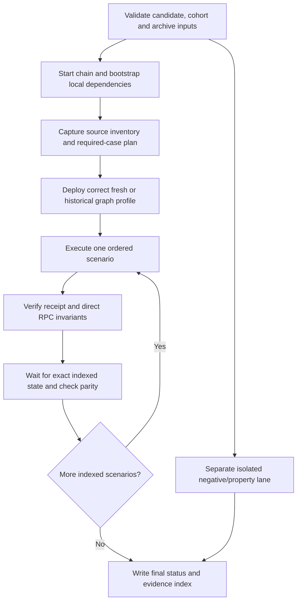

# Index DTF v6 — implementation handoff

This is the execution companion to the [integration contract](index-dtf-v6-integration.md). Read that contract first. The [test catalog](index-dtf-v6-test-catalog.md) specifies concrete test recipes; the [cohort](index-dtf-v6-cohort.json) fixes the real source DTFs. These documents form one handoff. They do not authorize production writes or claim implementation completion.

**Initial implementation status: S0 not started.** Earlier work audited code and ran scoped existing tests. No three-chain source inventory, new fork suite, SDK migration, v6 Register path, package publication or production upgrade has been completed under this plan.

The work breakdown contains **69 numbered tasks** across S0–S7, with S3 split into reads, preparation and writes. Each packet has an owner, inputs, outputs and exit evidence; the catalog provides 146 concrete cases to assign to fixtures and execution lanes.

## 1. First session: exact starting procedure

1. Open the interface hub. Read its AGENTS.md and the owning repo routers/configs. Attempt the protocol/product context paths; if still absent, use the fallback references named in the contract and record the limitation.
2. Read the contract, this runbook, test catalog and cohort. Do not refresh the ranking automatically. Ten primary identities and two Ethereum supplements are already selected.
3. Check branch, HEAD and full tracked/untracked status in `register/`, `sdk/`, `index-protocol/` and `index-subgraph/`. Compare with the contract baseline. Existing dirty SDK/protocol/subgraph files are part of the input, not disposable generated clutter.
4. Assign one implementation owner per repo. If isolating worktrees, preserve/import the inspected dirty input deliberately; a worktree at HEAD alone omits it. Do not stash, restore, reset, commit or move another worker's changes implicitly.
5. Record the candidate identity: HEAD, relevant diff, hashes of untracked source, lockfiles and generated ABI provenance. Exclude credentials and fork databases. Store command logs and artifact links under a run-specific ignored directory.
6. Discover the installed sandbox skill directory and run its `scripts/sandbox.sh doctor` from the hub. The current skill runner is Mainnet-only and read-only `doctor` does not certify live chain health or test behavior.
7. Audit available archive providers without printing secrets. Check chain ID, block/hash availability, historical contract calls and log access. Select per-chain finalized/pinned blocks that contain all source DTFs on that chain. Do not reuse block numbers between chains.
8. Inventory all 12 source identities at those blocks. Resolve blockers before labeling a fixture executable. Use the S0 checklist below.
9. Choose **BSC CMC20** as the first execution candidate because Register already has a captured launch fixture for it. This is an implementation starting choice, not an assertion about its current version or eligibility. If pinned inventory makes it unsuitable, document why and choose the simplest eligible cohort member; retain CMC20 as required.
10. Implement one complete baseline fork scenario with its current-version Register preparation path, actual fills and independent balance checks. Add one deliberately failing variant. Preserve the inputs and receipt evidence for S2 differential testing.
11. Stop this slice at the first reproducible complete case and its evidence. Do not begin mass consumer replacement while the first execution oracle is still unproven.

### First-session outputs

- Candidate identity record and source preservation notes.
- Per-chain fork selection and successful archive-read checks.
- Source inventory with version/governance/asset capabilities for the 12 DTFs.
- Hook/call-site compatibility ledger, including known missing exports/semantics.
- One full baseline scenario, its failed negative counterpart and a repeatable command.
- Exact next unfinished task, blockers and owner; no blanket “environment ready” claim.

## 2. Repo ownership and code locations

Paths in the tables are relative to the named repository. **Existing** files were inspected; **proposed** paths describe outputs to add and must not be treated as available commands/APIs.

### SDK

| Existing location                                                                                          | Responsibility / expected edit                                                                                |
| ---------------------------------------------------------------------------------------------------------- | ------------------------------------------------------------------------------------------------------------- |
| `packages/sdk/src/index-dtf/namespace.ts`, `ref.ts`, `index.ts`, `packages/sdk/src/index.ts`               | Public client/ref/barrel exposure; preserve import consistency                                                |
| `packages/sdk/src/index-dtf/dtf/basket/start-rebalance.ts`, `rebalance-args.ts`, `types.ts`                | Basket input validation, existing-version/v6 start arguments, exact units                                     |
| `packages/sdk/src/index-dtf/governance/propose/basket.ts`, `calls.ts`, `settings.ts`, `revenue.ts`         | Proposal generation, versioned setters, deadlines and immutable-recipient handling                            |
| `packages/sdk/src/index-dtf/governance/propose/settings-dtf.ts`, `settings-types.ts`, `settings-shared.ts` | Add v6 schema/change detection/version resolution/call assembly together, including `hasIndexDtfSettingsCall` |
| `packages/sdk/src/index-dtf/rebalance/current.ts`, `open-auction.ts`, `execution.ts`, `types.ts`           | Block-consistent context, auction math/calls, active state, bid/close/end                                     |
| `packages/sdk/src/index-dtf/deploy/index.ts`                                                               | Add actual v6 deployment plans; ABI generation alone is insufficient                                          |
| `packages/sdk/src/index-dtf/abis/`, `packages/sdk/scripts/sync-index-dtf-v6-abis.mjs`                      | Reviewed ABI provenance and reproducible regeneration                                                         |
| `packages/sdk/src/types/index-dtf.ts`, `packages/sdk/src/index-dtf/subgraph/dtf.graphql`                   | Version-aware public model and indexed query shape                                                            |
| `packages/react-sdk/src/hooks.ts`, `index-dtf-extra-hooks.ts`, `index.ts`                                  | Existing hook implementations and public exports; add missing consumer seams                                  |
| `packages/react-sdk/src/query.ts`, `query-keys.ts`, `query-options.ts`, `index-dtf-query-options.ts`       | Query identity, block-aware parameters, freshness and receipt invalidation                                    |
| `packages/sdk/src/index-dtf/fork-smoke-fixture.ts`, `fork-smoke-fixture.test.ts`, `fork-smoke.test.ts`     | Preserve old manifest/readback lane; add explicit new-schema support and evidence assertions                  |
| `packages/sdk/package.json`, `packages/react-sdk/package.json`, `.changeset/`, `pnpm-lock.yaml`            | Candidate packaging, linked versions, peers and math-library resolution                                       |

### Register

| Existing location                                                                                                                                    | Migration responsibility                                                                                                                                      |
| ---------------------------------------------------------------------------------------------------------------------------------------------------- | ------------------------------------------------------------------------------------------------------------------------------------------------------------- |
| `src/state/dtf/atoms.ts`, `reset-index-dtf-atoms.ts`                                                                                                 | Remove fabricated/stale version readiness; migrate role-derived action gates carefully                                                                        |
| `src/state/chain/index.tsx`, `src/utils/rpc-urls.ts`, `vite.config.ts`                                                                               | Same fork identity for wagmi/SDK; local package dedupe and test transport configuration                                                                       |
| `src/state/chain/atoms/chainAtoms.ts`, `src/utils/constants.ts`                                                                                      | Redirect remaining Index Graph clients and separate Reserve API/zap API URLs; Yield-only `VITE_SUBGRAPH_URL` is insufficient                                  |
| `src/views/index-dtf/auctions/updater.tsx`, `atoms.ts`                                                                                               | History queries, chain-aware keys, proposal linkage and version decisions                                                                                     |
| `src/views/index-dtf/auctions/views/rebalance/hooks/`                                                                                                | Current/initial state, parameters, auctions, prices, liquidity and completion consumers                                                                       |
| `src/views/index-dtf/auctions/views/rebalance/updaters/`                                                                                             | Historical weights and metrics; replace protocol derivation without moving UI policy into SDK                                                                 |
| `src/views/index-dtf/auctions/views/rebalance/atoms.ts`                                                                                              | Current auction/eligibility derived state; distinguish unavailable from no activity                                                                           |
| `src/views/index-dtf/auctions/views/rebalance/utils/transforms.ts`, `get-rebalance-open-auction.ts`                                                  | Delete the v5 duplicate after covered SDK adoption. Keep the v4 branch (Register-local by decision) behind an explicit version switch; unknown version blocks |
| `src/views/index-dtf/auctions/views/rebalance/components/launch-auctions-button.tsx`, `community-launch-auctions-button.tsx`                         | Send SDK-prepared calls, refreshed permissions/windows, receipt refresh                                                                                       |
| `src/views/index-dtf/auctions/views/rebalance/components/manage-weights/`, `cowbot/`                                                                 | Preserve product controls; audit trusted-fill integration and remaining protocol math                                                                         |
| `src/views/index-dtf/governance/views/propose/basket/atoms.ts` and sibling components                                                                | SDK basket proposal/preview with immutable nonce/deadline                                                                                                     |
| `src/hooks/use-rebalance-basket-preview.ts`, `src/views/index-dtf/governance/components/proposal-preview/`                                           | Historical calldata decoding and v6 settings/proposal previews                                                                                                |
| `src/hooks/use-asset-prices-with-snapshot.ts`                                                                                                        | Currently assigns the current API price to both current and snapshot fields; implement explicit historical provenance where the chosen price mode requires it |
| `src/views/index-dtf/governance/views/propose/components/propose-index-upgrade.tsx`, `src/views/index-dtf/governance/views/propose/upgrade-banners/` | Distinct protocol-v6 path and actual supported historical ladder                                                                                              |
| `src/views/index-dtf/settings/`, governance DTF-settings proposal files                                                                              | V6 settings display/edit, permission gating and immutable-recipient preservation                                                                              |
| `src/views/index-dtf/deploy/steps/confirm-deploy/manual/`, `simple/`                                                                                 | Governed/ungoverned × manual/zap creation, approvals and receipt discovery                                                                                    |
| `src/views/index-dtf/deploy/steps/create-dao/index.tsx`, `src/utils/addresses.ts`                                                                    | Governance-token/vault prerequisite and verified versioned deployer addresses; approval spender must match                                                    |
| `src/views/index-dtf/index-dtf-container.tsx`                                                                                                        | Fresh/unlisted DTF and same-address upgrade loading; avoid remount-only correctness                                                                           |
| `e2e/helpers/`, `e2e/tests/`, `playwright.config.ts`, `.github/workflows/playwright.yml`                                                             | Retain strict offline suite; add separately isolated real-fork configuration                                                                                  |
| `e2e/TEST_MAP.md`, area `AGENTS.md`, `docs/wiki/sdk.md`, `docs/plans/FOLLOWUPS.md`                                                                   | Update coverage and ownership claims when implementation actually lands                                                                                       |

Scan the affected areas for direct `dtf-rebalance-lib`, vendored Folio ABI, `readContract`/multicall, raw `/rebalance` fetches and `useDtfSdk` before and after migration. The scan output is a review list, not a license to remove unrelated legacy/Yield behavior.

### Protocol / subgraph

| Repo / existing location                                                                                  | Responsibility                                                                                                         |
| --------------------------------------------------------------------------------------------------------- | ---------------------------------------------------------------------------------------------------------------------- |
| Protocol `script/sandbox/run.sh`, `MainnetAnvilSandbox.s.sol`, `UpgradeSpell_6_0_0.sol`, `README.md`      | Bootstrap and actor/governance fixtures; remove chain-1 assumptions through reviewed configuration; preserve spell pin |
| Protocol `test/sandbox/MainnetAnvilSandbox.t.sol`                                                         | Existing selector/source checks; supplement with behavior, not more selector-only assertions                           |
| Protocol `contracts/Folio.sol`, `contracts/utils/RebalancingLib.sol`, `contracts/interfaces/IFolio.sol`   | Read-only authority for behavior, limits, rounding and errors                                                          |
| Protocol `contracts/deployer/FolioDeployer.sol`, `contracts/interfaces/IFolioDeployer.sol`                | Read-only v6 deployment/governance struct authority                                                                    |
| Subgraph `docker-compose.fork.yml`, `docker-compose.fork-ci.yml`                                          | Fork/indexer isolation, chain network name, ports, resource limits and storage identity                                |
| Subgraph `scripts/prepare-mainnet-fork.js`, `parse-template.js`                                           | Per-chain generated manifests and fresh/source-history profiles                                                        |
| Subgraph `schema.graphql`, `src/dtf/hydration.ts`, `handlers.ts`, `mappings.ts`, `src/deploy/handlers.ts` | V6 model, initialization/upgrade replay, fees/allowlist and history                                                    |
| Subgraph `scripts/check-fork-parity.js`, `tests/v6-hydration.test.ts`, `tests/rebalance.test.ts`          | Versioned manifest adapters, event/state reconciliation and boundary fixtures                                          |

### Proposed test-runner layout

Adopt these responsibilities; final filenames can follow nearby conventions after S0 review:

- Protocol `script/sandbox/`: one configurable chain bootstrap and reviewed historical artifacts; produces addresses/actors/provenance.
- SDK `packages/sdk/scripts/fork/` **proposed**: scenario planner/executor using the actual candidate public SDK; serializes operations and artifacts. Keep this tooling out of the published runtime barrel.
- SDK fork tests: read resulting receipts/RPC state and test independent expected values. Negative isolated scenarios may execute through the same runner with a fresh snapshot/process.
- Register `e2e/fork/docker/` **scaffolded**: per-chain Compose stack (Anvil + Graph Node + Postgres + IPFS), `chains/<chainId>.env`, CI tmpfs override and `fork.sh` (`up`/`down`/`doctor`/`logs`/`reset`). Operator/agent procedure: `.claude/skills/fork-e2e/SKILL.md`. Register `e2e/fork/tests/` and `playwright.fork.config.ts` **proposed**: connected wallet adapter, local transport configuration, browser-owned transaction flows, UI assertions and traces.
- Subgraph existing fork scripts: own manifest generation/index readiness/GraphQL parity. They consume the runner manifest; they do not initiate competing writes.
- A repository-owned orchestration entrypoint joins the above. Do not make CI depend on a developer's personal skill installation. Keep the existing skill wrapper usable for local operators.

## 3. Produced/consumed contracts to finalize in S0–S2

These are required semantics, not claims that the named records currently exist. Use existing exported types where possible; document any breaking change and its consumer migration.

### 3.1 Compatibility ledger

One row per observed contract version × operation, with:

- Exact version string and implementation code hash, chain/fixture evidence.
- Read ABI, write ABI, argument/result differences and method support.
- Existing core export, React export, installed-package status and planned consumer.
- Live vs historical read support, block parameter and query-key identity.
- Public validation errors, role requirements, simulation and execution evidence.
- Case IDs and status: `present-unverified`, `missing`, `implemented-unverified`, `verified`, or `unsupported-with-reason`.

Minimum operations: discovery/detail, version/roles/config, basket/assets/effective supply, historical rebalance/auction, current rebalance, active/biddable auction, quote/bid, restricted/unrestricted open, close/end, start/basket proposal, every v6 setting, revenue/fee recipients, mint/redeem, governance read/actions, upgrade registry/preflight/proposal, deploy/receipt parsing and refresh primitives. Unknown observed versions remain blocked for writes until explicitly admitted.

### 3.2 Source inventory

One record per `(chainId, sourceAddress)`:

| Fields       | Requirements                                                                                                                                           |
| ------------ | ------------------------------------------------------------------------------------------------------------------------------------------------------ |
| Identity     | Symbol is display only; address + chain identify the fixture; retain cohort rank/selection reason                                                      |
| Pinned chain | Fork block/hash/timestamp, source deployment block, implementation/proxy admin addresses and code hashes                                               |
| Governance   | All governor/timelock/vault addresses, topology and selector registry, clock mode, delay/period/quorum/threshold, actor voting/delegation capabilities |
| Roles        | Complete admin, rebalance manager, launcher and relevant guardian/proposer sets; do not infer from UI metadata                                         |
| Basket       | Ordered addresses, decimals, balances, effective supply, token transfer restrictions, repeatable actor funding source                                  |
| Rebalance    | Versioned control, nonce, token membership, limits/prices/caps, windows, latest auction and active trusted filler                                      |
| Settings     | Fees/recipients, bids/filler config, v6 allowlist/duration/self fee where supported; missing getters marked version-inapplicable                       |
| Upgrade      | Registry and target availability; accepted hop list/artifact identity; blocked preconditions and faithful remediation                                  |
| History      | Initial snapshot/event blocks and access method; indexed discovery method and replay starting block                                                    |
| Tests        | Required lifecycle and semantic-control assignments, funding/permission blockers and linked evidence                                                   |

### 3.2a Exact version and unit differences

| Operation / input               | V4                                                                                  | V5                                                  | V6                                                                       |
| ------------------------------- | ----------------------------------------------------------------------------------- | --------------------------------------------------- | ------------------------------------------------------------------------ |
| `getRebalance`                  | Ten top-level outputs; separate token/weight/price/membership arrays and timestamps | Six outputs with token structs and timestamp struct | Same output shape as v5                                                  |
| `startRebalance`                | Six arguments: assets, weights, prices, limits, launcher window, TTL                | Four: token structs, limits, window, TTL            | Six: expected next nonce, token structs, limits, window, TTL, deadline   |
| `openAuction`                   | Five arguments using applicable version semantics                                   | Five arguments                                      | Five plus per-auction length in seconds                                  |
| Current SDK start version union | Not admitted by design; Register-local encoder behind an explicit version switch    | `5.0.0`                                             | `6.0.0`                                                                  |
| Current SDK open calculation    | None by design; Register-local (`transforms.ts` v4 import stays)                    | V5 library math                                     | V5-equivalent calculation with separate v6 call encoding; must be proven |

Do not cast v4 outputs into the six-field mapper. Explicitly pass historical block options to each SDK ref read: constructing a ref with an identity does not make future calls persistently historical. Current API-backed `getBasketSnapshot` is different from RPC `getBasket`; the former has no identified public basket-snapshot hook and must have its provenance verified if used. The current issuance-state helper also lacks comprehensive block-pinned inputs; extend it before using it as a snapshot oracle.

Register's `use-asset-prices-with-snapshot.ts` currently fetches only current prices and assigns each to both `currentPrice` and `snapshotPrice`. Its name is not evidence of historical data. S2/S3 must establish the required historical observation source and block/time identity; RB-02.01 and RB-04.03 must use deliberately different observations so this existing behavior cannot pass accidentally. If an observation is unavailable, block only the dependent calculation with an explicit reason.

The existing prepared-call shape is `ContractCall`: `chainId`, `to`, `data`, `value`, and `contract` containing `address`, `abi`, `functionName`, `args`. Reuse it. Existing approval plans distinguish `call` from `approval-required`; do not create a competing transaction model.

Unit rules to pin in tests:

- Basket proposal `share` is human percent (`50`); normalized internal fraction is D18 (`0.5e18`).
- Human token `units` such as `"1"` USDC differ from raw `1000000` quanta.
- Current high-level settings `auctionLength` is minutes, validates 15–1440, then multiplies by 60; raw setters use seconds. New v6 protocol min/max and product defaults need an explicit contract, not implicit reuse of that field.
- V6 `additionalDetails` uses `maxAuctionLength`, mutable and immutable recipients, `tvlFee`, `mintFee`, `folioFeeForSelf`, and `mandate`.
- V6 governed deployment uses one `govParams` containing standard and optimistic parameters, selectors, proposers, guardians, timelock delay and throttle capacity; do not reuse two legacy owner/trading structs.

V4 has no per-token auction-size caps or per-auction traded-cap accounting. Its baseline oracle must omit those clamps; v5/v6 controls exercise them explicitly. See the test catalog's two arithmetic branches and distinct hand-calculated results.

### 3.3 Rebalance preparation boundary

Required input groups are specified in the contract. At this boundary:

1. Normalize addresses once without changing canonical token order.
2. Require identity/version readiness and one pinned live block. Bind current nonce, permissions, balance/supply and auction state to that block.
3. Keep historical initial state separate and explicitly block/version-pinned. Preserve both timestamps and price-observation timestamps.
4. Validate all required token metadata, membership, ordered array lengths, finite price/percentage inputs and exact raw amounts. An omitted asset is not automatically a zero-balance asset.
5. Produce one structured prepared call/proposal plus preview/context provenance. Do not send internally.
6. On refresh, regenerate unsigned candidates only. Already submitted proposal bytes are immutable.
7. At the wallet handler compare chain/account/Folio/intent identity, refresh relevant state, simulate exact bytes, and invalidate stale preview when economic intent changes.

Errors must separate unsupported version, unavailable data, stale context, bad input, missing role, protocol revert, wallet rejection, transport failure and indexed-history lag. UI may group messages, but tests and logs must preserve the reason. Never translate all errors into `[]`, zero or “no active rebalance.”

### 3.4 Cache invalidation contract

Implement via public React SDK primitives and actual canonical keys; this table describes effects rather than inventing function names.

| Confirmed operation          | Invalidate/refetch at minimum                                                                                       | Additional behavior                                                                    |
| ---------------------------- | ------------------------------------------------------------------------------------------------------------------- | -------------------------------------------------------------------------------------- |
| Start/proposal execution     | Current rebalance, current/latest auction, assets/supply, proposal state/history, rebalance list                    | Preserve receipt-derived pending-index state                                           |
| Open/replacement             | Current/latest auction, rebalance windows/limits, bid quote, auction history                                        | Old auction quote/action invalid immediately                                           |
| Bid/trusted fill/close       | Affected token balances, quote/caps, effective supply when relevant, current auction/rebalance, bid/auction history | Separate RPC completion from indexed analytics                                         |
| End                          | Current rebalance eligibility and history                                                                           | Do not clear still-running auction merely because rebalance ended                      |
| Mint/redeem/fee distribution | Wallet allowances/balances, DTF assets/effective supply, rebalance calculation inputs, fee state                    | Recompute sizing; historical initial snapshot remains immutable                        |
| Settings/roles               | Relevant config/roles/governance and current preparation context                                                    | Existing preview may become invalid even without nonce change                          |
| Upgrade                      | Version/implementation, all version-dependent live reads/config/roles, builders and proposal preview caches         | Same address must not preserve old write readiness; retain block-keyed historical data |
| Deploy                       | Receipt-derived address data, permissions/basket/supply; discovery only when available                              | Deep-link/read new DTF without waiting for curated listing                             |
| Account/chain/address change | Cancel/ignore outdated live requests and clear prepared action identity                                             | Never invalidate immutable history globally as a shortcut                              |

Tests inspect both the effective UI result and the request/key identities. A call to `invalidateQueries` alone does not prove the correct cache was refreshed.

Current keys are operation-first (for example `['dtf','index','current-rebalance', params]`), not address-prefix trees. An invented address-prefix invalidation will match nothing. Reuse `normalize-query-key.ts` for address/bigint handling and preserve token-array order.

### 3.5 Public-hook acceptance inventory

Confirm the exact declarations in the built candidate; this table records the existing parameter patterns, not newly invented exports.

| Existing hook / family                                                   | Identity/extra inputs to verify                                    | Required proof                                                                                    |
| ------------------------------------------------------------------------ | ------------------------------------------------------------------ | ------------------------------------------------------------------------------------------------- |
| `useIndexDtfVersion`, `useIndexDtfTotalAssets`, `useIndexDtfTotalSupply` | Address, chain, optional historical block                          | Disabled with unresolved identity; block in key/read; no stale same-address version after upgrade |
| `useIndexDtfCurrentRebalance`                                            | Address, chain, optional block                                     | Correct v5/v6 mapping; v4 returns a typed unsupported-version result (Register-local read stays)  |
| `useIndexDtfLatestAuction`, `useIndexDtfActiveAuction`                   | Address, chain, optional block                                     | Inclusive end, atomic timestamp, nonce identity and warmup semantics                              |
| `useIndexDtfBidQuote`                                                    | Auction ID, sell/buy token, max sell amount plus identity/block    | Canonical ordered token identities, exact quantities and invalidation after fill                  |
| `useIndexDtfRebalance`                                                   | Chain plus ID, or address/nonce                                    | Same-block/history correctness and absence/error separation                                       |
| `useIndexDtfRebalanceAuctions`                                           | Chain and rebalance ID                                             | Complete pages, ordered events/bids, index lag                                                    |
| `useIndexDtfCompletedRebalance`                                          | Identity and nonce                                                 | Nonce zero handled, incomplete analytics do not masquerade as zero                                |
| `useIndexDtfRebalanceLiquidity`                                          | Chain, native price and trades                                     | Validated payload, no fabricated price, product policy stays in Register                          |
| `useBuildIndexDtfBasketProposal`                                         | Basket/start inputs, governance, windows/TTL, deadline/description | Versioned full bytes, submitted nonce/deadline fixed, explicit units                              |
| Existing settings/governance hooks                                       | Versioned settings/targets and governor identity                   | V6 detection/schema/call assembly all updated, roles and proposal kind correct                    |

For each new async read/builder, update core module → namespace/ref → core barrel → React key/options/hook → React barrel → public-package consumer test. Add parameters to derived method types where needed. Pure call builders remain direct imports from react-sdk's reexports. A missing API-backed basket snapshot hook, coherent issuance-state block support or upgrade preflight read is an upstream gap, not justification for a Register direct-client escape.

### 3.6 Exact browser/deployment integration seams

The existing Playwright configuration owns Vite port **3005**, sets offline `VITE_E2E` behavior and clears `VITE_MAINNET_URL`; do not inherit it blindly for real-fork tests or take Luis's port 3000 server. A dedicated fork config must set all three RPC endpoints and matching SDK/legacy Index Graph endpoints. Record actual SDK/wagmi/wallet/receipt destinations in startup evidence.

Create DAO currently calls legacy `deployGovernedStakingToken` and parses `DeployedGovernedStakingToken`. Inventory `deploy/steps/governance/` choices (existing vote-lock, existing ERC20 requiring vault creation, explicit owner wallet) and validate the resulting vault's v6 governance compatibility before Folio deployment.

Simple deployment call chain:

1. `src/views/index-dtf/deploy/steps/confirm-deploy/simple/atoms.ts` constructs governed/ungoverned payload.
2. `simple/index.tsx` chooses endpoint and debounces form intent; `src/hooks/useZapDeployQuery.ts` POSTs and refreshes every 12 seconds while not sending.
3. Endpoint helpers and legacy payload types currently live in `src/views/yield-dtf/issuance/components/zapV2/api/index.ts` and `types.ts`: `/api/zapper/{chainId}/deploy?chainId={chainId}` and `/deploy-ungoverned?chainId={chainId}`.
4. `simple/simple-deploy-button.tsx` approves returned `approvalAddress`/amount, sends returned `tx.to/data/value`, then parses deployment events.

The handoff must identify the backend/router owner and pin request/response version, chain/address allowlist, quote identity and actual resulting Folio version. Quote success is not sufficient. Revalidate returned target/spender/value and identity after form/account/chain changes; persist exact approved input/output/refund expectations in tests. Do not assign this to react-zapper without confirming a real dependency.

Cowbot `use-cowbot-query.ts` calls `processFolioAuctions` for active unlisted DTFs. `use-is-listed-dtf.ts` currently checks address without chain and treats absent list data as false. Add a controlled local submission boundary, unknown-listing state and chain-aware tests before running native-fork pages. Blocking public egress must produce a deliberate test signal, not an ignored request while the test still claims the fill executed.

Current mounted upgrade banners are v4 and v5; the v5 optimistic-governor banner exists but is unmounted/commented. The older `propose-index-upgrade.tsx` component's presence does not establish reachability. S5 adds the explicit protocol-v6 route using SDK eligibility/preparation; it does not equate a governance-only upgrade with Folio v6.

## 4. Fork runner and artifact contract

### 4.1 Chain isolation

Required chains: Ethereum `1`, Base `8453`, BSC `56`. Proposed local defaults after parameterization: RPC 8545/8546/8547; Graph HTTP 18000/18100/18200; Graph admin 18020/18120/18220; status 18030/18130/18230; IPFS 15001/15101/15201. Every port is configurable and bound to loopback. These are **proposed** defaults; the current runner only supports the first Mainnet profile.

Each chain uses a unique Compose project and state directory: `e2e/fork/docker/fork.sh <chainId> up` names the project `reserve-fork-<chainId>`, loads `chains/<chainId>.env` for the port block and Graph network name (`mainnet`/`base`/`bsc`, matching the subgraph manifests), and stores state under `e2e/fork/.state/<chainId>/` (ignored). One worker owns time advancement and all transactions. Default to sequential chain jobs locally until resource measurements support parallelism. No shared Graph/Postgres chain store between fork identities. A `doctor`/preflight command must detect port collisions, wrong genesis/fork identity, stale stores and missing archive capability before mutation.

Existing assumptions to remove in S1: chain-1 guards in shell/Solidity/skill/parity readers; Ethereum registry/deployer/token constants; chain-1 manifest output; fixed protocol `.fork/sandbox-stage` directory even when state directory changes; bootstrap reuse based only on code existence; completion shortcuts based on nonzero nonce/auction counter. The current skill validator additionally requires two execution tokens, nonce 1, auction ID 0 and a deadline after final state time. These are smoke-profile constraints, not valid source-history/multiple-round/expiry constraints.

Existing environment names: `RESERVE_SANDBOX_ROOT`, `MAINNET_RPC_URL` (bridged to protocol `FORK_RPC_MAINNET`), `FORK_BLOCK`, `ANVIL_PORT`, `SANDBOX_RPC_URL`, `SANDBOX_STATE_DIR`, `SANDBOX_FIXTURE`, `SANDBOX_BOOTSTRAP`, `SANDBOX_SCENARIOS`, `FORK_SUBGRAPH_URL`, Graph/IPFS port variables, `INDEX_DTF_FORK_MANIFEST`, `INDEX_DTF_FORK_RPC_URL`. The chain-1 default block is `25834864`; it must not silently override S0's per-chain source-compatible selections. Introduce versioned chain configuration with explicit mapping rather than misleadingly passing Base/BSC URLs as Mainnet.

Runner phases:



At S0/S1, legacy Register preparation is the baseline producer. At S2 onward, the candidate SDK must produce the tested operations. At S3 onward, browser cases must generate and send them from Register. A helper that independently reconstructs the expected write and submits it cannot stand in for the production seam.

### 4.2 Fixture schema evolution

Introduce explicit schema-v2 support for source-origin/multichain scenarios. Retain the existing v1 adapter and v1 tests. Reject unknown versions. Never reinterpret a source deployed before the fork as a synthetic post-fork deployment merely to pass old validation.

| Record         | Required contents                                                                                                                                                                  |
| -------------- | ---------------------------------------------------------------------------------------------------------------------------------------------------------------------------------- |
| Run identity   | Schema version, run ID, start/end timestamps, candidate digest, cohort digest, tool/container identities                                                                           |
| Chain identity | Numeric supported chain ID, fork block/hash/timestamp, local RPC label, state directory identity, graph deployment/network identity                                                |
| Candidate      | Per-repo HEAD + relevant dirty digest, artifact checksums, lockfile digest, paired package versions, ABI/spell source/code hashes                                                  |
| Fixture        | Source/native/control kind, source and local addresses, original/current version, topology, settings and funding/actor provenance                                                  |
| Scenario       | Stable ID, prerequisites, test family, applicability reason, owner lane, status and execution bounds                                                                               |
| Operation      | Ordered index, producer (`register-baseline`, `sdk-candidate`, `register-candidate`), actor/role, target/value/full calldata, input-context digest, simulation and receipt details |
| Transition     | Block/hash/timestamp, before/after state snapshots, emitted events with transaction/log identity, nonce/auction/proposal IDs                                                       |
| Assertion      | Expected/actual raw values, units and rationale for tolerance, oracle source, passed/failed result                                                                                 |
| Index proof    | Target block/hash, Graph deployment ID, indexed block/hash, health/errors, queried entities and parity result                                                                      |
| Failure        | Stage/operation/assertion, decoded error, trace/log artifacts, reproducible command and seed; no secrets                                                                           |

Serialize onchain integers as decimal strings; addresses and hashes as validated hex; chain IDs and schema numbers as JSON integers. Existing v1 numeric block fields require an explicit checked adapter. Validate safe bounds when converting a block for GraphQL `Int`. Represent “not applicable,” “not observed” and zero distinctly.

Write each confirmed transition atomically. Reuse a supposedly completed scenario only after verifying candidate/fixture identity, receipt canonical block hashes, expected code and current invariants. State advanced since the last checkpoint is not proof that the checkpoint ran. If compatibility cannot be established, archive that run and start a clean isolated run.

### 4.3 Required-case accounting

Generate the complete required-case set **before execution** from cohort + inventory + stage + semantic-control matrix. Unavailable credentials, unsupported source behavior or failed bootstrap remain `blocked`/`failed`; they do not delete a case. Use the same execution key as the catalog: `(caseId, chainId, fixtureId, versionStage, variant)`. Detect duplicate and missing results, including parameterized variants.

For each of 12 sources, baseline and candidate-existing-version lifecycles are mandatory. Add post-upgrade lifecycle for every required supported ladder; if already v6, test native/current-v6 behavior and record upgrade inapplicability with observed evidence. Add the four per-chain controls from the contract. Semantic tests may reuse controls where their declared preconditions match; never replace a source lifecycle with its control equivalent.

Status categories: `planned`, `running`, `passed`, `failed`, `blocked`, `inapplicable`. Release passes only when all required applicable cases are `passed`; each inapplicable entry has a reviewed protocol/fixture reason. Empty collections and zero-test subprocesses are hard failures. This status index is the source for CI summaries and release receipts.

### 4.4 Artifact layout and retention

Proposed ignored run layout:

```text
<run-root>/<run-id>/
  candidate.json
  cohort.json
  required-cases.json
  results.json
  chains/<chain-id>/
    inventory.json
    fixture.json
    bootstrap/
    cases/<case-id>/
      inputs.json
      prepared-call.json
      before.json
      receipts.json
      after.json
      assertions.json
      index-parity.json
      trace.json
      browser-trace.zip
      logs/
```

Artifacts required for a particular lane are validated; browser trace is not expected for an SDK-only case. Summaries link exact artifacts rather than only printing “PASS.” Preserve failed-run state/logs before cleanup. CI retention and resource budgets are measured and fixed in S1; candidate certification is invalid when its referenced evidence is missing.

## 5. Stage work packets

Each packet names input, tasks, output and exit evidence. All tasks start pending. A stage is complete only when its contract and applicable test-catalog cases pass on its recorded candidate.

### S0 — first executable baseline

**Owner:** test coordinator, with protocol and Register owners. **Input:** frozen cohort and inspected dirty repository state.

- [ ] S0.1 Record source/package/tool/ABI provenance and check archive access on all chains.
- [ ] S0.2 Capture the 12-source inventory and explicit supported-version/upgrade topology matrix.
- [ ] S0.3 Enumerate every affected Register call site and actual installed/candidate SDK export; record missing semantics separately from missing names.
- [ ] S0.3a Isolate Cowbot/external zap-order boundaries before opening native/unlisted fork pages; configure all RPC/Graph/API clients, not just wagmi.
- [ ] S0.4 Select first source; capture its original proposal/auction calculation inputs from the actual existing Register path.
- [ ] S0.5 Implement repeatable funding, real authority execution, exact timing and one full baseline lifecycle with at least one nonzero fill.
- [ ] S0.6 Add a wrong-bound/nonce/role negative case with exact expected failure and unchanged relevant state.
- [ ] S0.7 Save command, inputs, receipts, before/after balances and independent expectations; replay after reset.
- [ ] S0.8 Bring up the Register-owned fork stack for the first chain from `e2e/fork/docker/fork.sh <chainId> up` with a pinned archive block; `doctor` passes (loopback, Anvil identity, chain ID, fork block, healthy Graph Node). Record the resolved nonsecret env in the run artifacts.

**Output:** inventory + compatibility ledger + first executable command/case. **Exit:** first happy/negative pair reproducible; no unknown execution dependency hidden in the next packet.

### S1 — make the regression foundation mandatory

**Owner:** test coordinator; one owner per repo. **Input:** S0 case and manifests.

- [ ] S1.1 Parameterize chain IDs, addresses, network names, graph endpoints and state identity across every producer/consumer.
- [ ] S1.2 Add source-history discovery/replay and v1/v2 manifest adapters; prove fresh creation and source histories independently.
- [ ] S1.3 Execute complete current-version lifecycle on all 12 original proxies with faithful funding/roles/assets.
- [ ] S1.4 Add independent integer/cap/target oracles, control fixtures and cases applicable to current versions; define exact tolerances.
- [ ] S1.5 Add receipt provenance, case-count enforcement, failure traces, retry policy and mutation probes.
- [ ] S1.6 Cover v4/legacy controls through the Register-local v4 path, restricted assets and governance capability differences; record unsupported hops instead of normalizing them away.
- [ ] S1.7 Implement CI lanes and measure clean/cached runtimes and resource use. Establish three complete reset passes.
- [ ] S1.8 All three chains run from `e2e/fork/docker/` as separate Compose projects with the CI tmpfs override; the subgraph fork scripts and the SDK runner consume its endpoints. Update `.claude/skills/fork-e2e/SKILL.md` with the measured resource budgets and the scenario-adding recipe so the next fork-backed suite reuses this stack.

**Output:** reusable harness, baseline corpus, required-case index and CI checks. **Exit:** required current-version matrix passes without silent skips. V6-specific cases remain scheduled for S4+, never represented as S1 passes.

### S2 — SDK existing-version parity and React contract

**Owner:** SDK. **Input:** fixed baseline corpus and consumer ledger.

- [ ] S2.1 Reproduce the active-auction end/atomic/nonce defect at the public read/hook seam; fix against protocol, including warmup semantics.
- [ ] S2.2 Admit exactly `5.0.0`/`6.0.0` in every SDK version union; reject every other version with a typed error and delete the `?? "5.0.0"` default in `start-rebalance.ts`. Do not add a v4 adapter: v4 operations stay in Register.
- [ ] S2.3 Complete coherent current/historical context and price/metadata primitives. Preserve policy in Register.
- [ ] S2.4 Move only protocol preparation/validation/math into SDK, with explicit existing-version ABI behavior and price-mode intent.
- [ ] S2.5 Add missing public React read/async-builder/refetch/invalidation primitives and query-option exports; render actual consumers in tests.
- [ ] S2.6 Resolve peer and rebalance-library version differences before interpreting differential results. Document any intentional semantic correction against independent evidence.
- [ ] S2.7 Build both packages, test public built exports and candidate-generated calls on the full existing-version cohort, then package rehearsal.

**Output:** usable candidate SDK/React pair, export ledger and evidence. **Exit:** no migrated caller requires private/direct client access; full original-version behavior proven; all new contracts reviewed before consumption.

### S3a — move reads and remove stale readiness

**Owner:** Register. **Input:** S2 built artifacts.

- [ ] S3a.1 Fix unresolved version/identity states and audit every consumer before removing the old default/reset exemption.
- [ ] S3a.2 Migrate list/history and initial/current rebalance consumers; complete pagination and error semantics.
- [ ] S3a.3 Move live role/window/auction gates to fresh RPC-backed hooks; retain indexed history for display.
- [ ] S3a.4 Migrate prices/liquidity transports and preserve product thresholds/curated hybrid policy.
- [ ] S3a.5 Prove delayed responses, chain/address collisions, historical pre-upgrade reads and direct-admin history visibility.
- [ ] S3a.6 Update necessary offline fixtures without changing the behavioral assertions; visually compare desktop/mobile and unavailable states.

**Output:** SDK-backed reads with old write path still independently usable. **Exit:** every source renders/preview inputs match the baseline; a stale indexer cannot enable/disable an onchain action incorrectly.

### S3b — move preparation and previews

**Owner:** Register, SDK fixes upstream. **Input:** S3a data boundary.

- [ ] S3b.1 Replace local basket/start calculation with public SDK proposal preparation for v5/v6; v4 keeps its Register-local branch. Turn the `startsWith('5') ? 5 : 4` fallback into an exhaustive `4 | 5 | 6 | unknown` switch whose unknown arm blocks the write. Preserve exact ordered preview/submission data.
- [ ] S3b.2 Replace local launcher transforms and open-auction calculations for v5/v6; retain the v4 branch and the percent/preset controls in Register.
- [ ] S3b.3 Run shadow calculation against identical snapshots without a second submission; persist all mismatches for adjudication.
- [ ] S3b.4 Cover invalid/missing price and metadata, zero supply, basket additions/exits, large amounts and historical versions.
- [ ] S3b.5 Deliberately bypass the SDK at the production wiring seam and prove an integration test fails.

**Output:** one SDK-owned calculation path. **Exit:** reviewed parity or intentional corrections backed by independent execution; no snapshot refresh as a substitute for fixing a mismatch.

### S3c — move transaction submission

**Owner:** Register. **Input:** verified SDK-prepared calls.

- [ ] S3c.1 Route restricted and unrestricted launch, supported bid/fill actions, close/end and basket proposal writes through SDK preparation.
- [ ] S3c.1a Inventory actually exposed UI controls. The current rebalance UI has launch/community actions, bid history and Cowbot, not direct bid/close/end buttons. Exercise those latter operations in the SDK scenario runner; do not invent product controls during migration.
- [ ] S3c.2 Keep wallet/chain validation, confirmations and receipt UI in existing transaction components.
- [ ] S3c.3 Add send-time identity/preflight checks and receipt invalidation; submitted governance bytes remain fixed.
- [ ] S3c.4 Run real browser→fork transactions on every chain; run all-source candidate execution and read/preview coverage.
- [ ] S3c.5 Remove migrated v5 encoders/math/raw fetches and obsolete atoms only after a consumer scan. The v4 encoder/ABI branch is not migrated and stays. Keep dependencies still used elsewhere (`dtf-rebalance-lib` remains for v4).
- [ ] S3c.6 Test rejected/reverted/duplicate/in-flight navigation cases and no fallback to old encoders after errors.

**Output:** existing-version SDK migration. **Exit:** complete unchanged-version regression before enabling any v6-specific UI.

### S4 — v6 rebalance and settings behavior

**Owner:** SDK + Register; paired subgraph output. **Input:** S3c and locally bootstrapped native-v6 controls.

- [ ] S4.1 Prove nonce/deadline, six-argument open and versioned input shape through actual governance/auction execution.
- [ ] S4.2 Add live v6 settings/read model and preview constraints: max duration, allowlist, self fee, recipients and permissions.
- [ ] S4.3 Prove NONE/PARTIAL/ATOMIC, token membership, replacement, buffers, caps, fees and complete close/end behavior.
- [ ] S4.4 Add v6 UI controls/gates and decoded error/recovery states; do not change original-version product semantics.
- [ ] S4.5 Pair schema/query/generated types and index parity; explicitly test old endpoint/schema compatibility during release sequencing.
- [ ] S4.6 Run all three native controls plus all old source regressions. Include nonzero fee/immutable settings and new basket-token acquisition/exit.

**Output:** fork-proven v6 rebalance vertical. **Exit:** v6 behavioral catalog passes; v6 deployment product path can still be pending until S6.

### S5 — upgrades, from eligibility to post-upgrade operation

**Owner:** SDK + Register; protocol reviewer. **Input:** S4, source inventory and reviewed spells.

- [ ] S5.1 Pin exact artifacts/code hashes and supported hops for every source version; supply per-chain local registry setup separately.
- [ ] S5.2 Build registry/topology/preflight SDK contract and public React consumption; identify each blocked precondition.
- [ ] S5.3 Generate exact standard-governance upgrade proposal for two/four-call v5→v6 paths and approved legacy hop sequence.
- [ ] S5.4 Preview, vote, queue and execute through the actual Governor/timelock, including optimistic-capable topology; test failure atomicity.
- [ ] S5.5 Assert intermediate/post-state invariants and invalidate same-address version/config/roles without losing history. Normalize filler settlement before strict preservation snapshots, and separately execute UP-01.17 with an inactive unclosed filler and settlement-aware expectations.
- [ ] S5.6 Run first v6 rebalance, mint/redeem and ordinary governance after each applicable source upgrade.
- [ ] S5.7 Test stale preflight and pending old-version proposal/auction history, and explain required recreation when old bytes are no longer executable.

**Output:** full supported upgrade journeys. **Exit:** all required source ladders and both control topologies per chain pass; production enablement still requires production artifact/registration evidence.

### S6 — complete native-v6 creation

**Owner:** SDK + Register; zap API/router owner when required. **Input:** S4 plus deployer contract semantics.

- [ ] S6.1 Implement v6 seed/config/governance structs, approvals and deployment/receipt helpers through SDK.
- [ ] S6.1a Verify existing-vault, new DAO/staking-token and explicit-wallet ownership branches before confirming each deployment mode; adapt Create DAO preparation/receipt handling where required.
- [ ] S6.2 Implement manual governed/ungoverned paths and first-address loading without API/catalog listing.
- [ ] S6.3 Resolve simple/zap API/router/deployer version compatibility and both governance modes; never assume endpoint output is v6.
- [ ] S6.4 Test nonzero immutable/self-fee configuration, token decimals/order and insufficient balance/allowance; preserve allowance sequencing.
- [ ] S6.5 Execute every exposed creation mode on each supported chain, verify deployed version/roles/seed amounts, then full first-use flows.
- [ ] S6.6 Test new basket-asset metadata/pricing/allowlist, acquisition and later exit independently of DTF creation.

**Output:** four-mode creation matrix with exact dependency status. **Exit:** unresolved modes stay explicitly pending and gated; S6 cannot be called complete until required mode matrix closes.

### S7 — candidate certification and release handoff

**Owner:** integration coordinator. **Input:** S5/S6 and exact built artifacts.

- [ ] S7.1 Recheck current top-ten ranking deliberately; retain the original cohort plus newly qualifying members for this candidate.
- [ ] S7.2 Rehearse from packed SDK/React artifacts, resolve peers, restore exact release pins and remove local-link state from the release candidate.
- [ ] S7.3 Run full per-repo gates and regression of all touched cross-feature flows; fresh visual/browser evidence on realistic states.
- [ ] S7.4 Run complete required cohort/control/case matrix three times from clean reset with zero critical retries.
- [ ] S7.5 Complete Intent/Engineering Risk review, contract/foundation review where required, and protocol/SDK engineer review.
- [ ] S7.6 Verify planned schema/package/app rollout order and per-chain deployment/registry readiness; record capability gates and recovery procedure.
- [ ] S7.7 Produce release receipt with exact candidate digests and artifacts. Publishing/deployment remains a separate authorized action.

**Output:** reviewable release candidate and evidence receipt. **Exit:** every release checkbox in the contract has a concrete evidence pointer.

## 6. Existing commands and planned commands

Run commands from the stated repository. These checks exist at the audit baseline; read each repo's current config again before execution. A package script changing since the audit is a reason to update the runbook, not silently skip its proof.

### Existing SDK checks

```sh
pnpm --filter @reserve-protocol/sdk typecheck
pnpm --filter @reserve-protocol/react-sdk typecheck
pnpm --filter @reserve-protocol/react-sdk test
pnpm --filter @reserve-protocol/sdk exec vitest run src/index-dtf/rebalance src/index-dtf/governance/propose src/index-dtf/deploy src/index-dtf/fork-smoke-fixture.test.ts src/index-dtf/dtf/issuance-calls.test.ts src/index.test.ts
pnpm abi:index-v6:check-generated
pnpm graphql:codegen:check
pnpm exec turbo run build --force
pnpm --filter @reserve-protocol/docs check:sdk-bundle
pnpm typecheck
pnpm lint
pnpm format:check
pnpm exec turbo run test --force
pnpm docs:links
pnpm --filter @reserve-protocol/dtf-catalog check:restricted
pnpm --filter @reserve-protocol/dtf-catalog check:tokenlists
```

The existing fork smoke command is `pnpm --filter @reserve-protocol/sdk test:smoke:index:fork` with `INDEX_DTF_FORK_MANIFEST` and `INDEX_DTF_FORK_RPC_URL` pointing at a valid existing local fixture. It attests fixture state; it does not create the required new execution suite.

### Existing Register checks and local SDK link

```sh
pnpm typecheck
pnpm lint
pnpm test:run
pnpm exec vitest run e2e/helpers/tests
pnpm e2e:check
pnpm e2e:smoke
pnpm e2e:full
pnpm e2e:mobile
pnpm build:no-seo
node scripts/llm-workflow/wiki-lint.mjs
```

Focused existing rebalance checks:

```sh
pnpm exec vitest run src/views/index-dtf/auctions/views/rebalance/tests src/views/index-dtf/auctions/views/rebalance/components/manage-weights src/hooks/tests/use-rebalance-basket-preview.test.tsx src/views/index-dtf/governance/components/proposal-preview/tests/rebalance-preview-unavailable.test.tsx src/views/index-dtf/auctions/views/rebalance-list/hooks/tests/use-rebalance-metrics.test.ts
pnpm exec vitest run src/state/dtf/tests src/hooks/tests/use-asset-prices-with-snapshot.test.ts src/hooks/tests/use-active-chain-switch.test.tsx
pnpm exec vitest run src/views/index-dtf/deploy
pnpm exec playwright test --project=smoke --project=full e2e/tests/smoke/auctions.spec.ts e2e/tests/flows/auctions.spec.ts e2e/tests/flows/auctions-multichain.spec.ts e2e/tests/index-dtf/auctions
pnpm exec playwright test --project=mobile e2e/tests/index-dtf/auctions/lifecycle.spec.ts
```

Run browser commands sequentially because the current suite owns one server. Include smoke and full projects when targeting existing launch tests; tags otherwise filter out coverage. These remain offline regression commands and do not replace the new fork project.

For local development, `docs/local-sdk-development.md` uses `pnpm add @reserve-protocol/react-sdk@link:../sdk/packages/react-sdk`, followed by building both packages through `pnpm --dir ../sdk build`. This changes dependency files; record it as development state and replace it with the exact approved release pin before release. One linked React package resolves core from its workspace; verify actual resolution/dedupe, not the number of link commands.

### Register fork stack (scaffolded, not yet exercised)

```sh
# archive RPC + pinned block come from the environment, never from the repo
FORK_RPC_URL=<archive url> FORK_BLOCK=<pinned block> e2e/fork/docker/fork.sh 56 up
e2e/fork/docker/fork.sh 56 doctor      # loopback, chain id, fork block, container health
e2e/fork/docker/fork.sh 56 logs graph-node
e2e/fork/docker/fork.sh 56 down        # keeps state
e2e/fork/docker/fork.sh 56 reset       # archives state dir, then down -v
```

`CI=1` adds the tmpfs override. `docker compose config` validation is not proof the stack works; S0.8 is the first real run.

### Existing subgraph checks

`pnpm prepare:fork`, `parse:fork`, `codegen:fork`, `build:fork`, `create-local:fork`, `deploy-local:fork` and `test:fork:parity` exist for the current Mainnet profile. **`create-local:fork` and `deploy-local:fork` mutate the local Graph stack.** Set reviewed local endpoint variables; do not run generic production deploy scripts for fork setup. `pnpm test` invokes mapping tests. Adapt the new chain/profile commands explicitly in S1; current scripts are not already multichain.

### Existing protocol and sandbox commands

From the protocol repo, `forge test --match-path test/Folio.t.sol`, `test/Allowlist.t.sol`, `test/FolioDeployer.t.sol`, and `test/sandbox/MainnetAnvilSandbox.t.sol` are relevant existing tests (repeat the `forge test --match-path` prefix for each). The last currently proves only source/selectors.

The current installed skill command sequence from the hub is `doctor` → `up` → `bootstrap` → `graph-deploy` → `scenarios` → `executions` → `verify-protocol` → `test-subgraph` → `test-sdk`; `all` performs its ordered environment workflow. Resolve the skill's installed path before calling `scripts/sandbox.sh`. All steps after doctor may start services, write local chain/indexer state or run against it; they are the existing Mainnet smoke workflow, not the new multichain certification command. `status`, `logs`, `down` and guarded archival `reset` also exist. Do not invoke protocol-only reset under a live indexer.

### Planned runner command contract — not implemented

Implement discoverable equivalents of: `doctor`, `inventory`, `bootstrap`, `prepare-index`, `run-case`, `run-stage`, `verify-state`, `verify-index`, `report`, `archive/reset`. Every invocation accepts a run config/identity, logs its resolved nonsecret inputs and exits nonzero on required failure. `run-case` supports a stable case ID; `run-stage` enumerates expected cases before execution. Print commands in the receipt so a future engineer can reproduce a single failure.

The new fork browser command must use a dedicated config and local build, not existing offline fixture interception. The new CI aggregate must fail for absent/zero-test results even if a nested historical script uses `--passWithNoTests`.

## 7. Release dependencies and rollback operations

| Producer                 | Consumer                                             | Readiness evidence before consumer activation                                                                                         |
| ------------------------ | ---------------------------------------------------- | ------------------------------------------------------------------------------------------------------------------------------------- |
| Protocol release         | SDK/config and local/production deployment inventory | Reviewed ABI/spell/code hashes, per-chain target registration and capability evidence                                                 |
| Subgraph schema/mappings | SDK indexed queries, Register history                | Old queries remain valid; new queried fields deployed where used or explicitly version-gated; generated types/codegen and parity pass |
| Core SDK                 | React SDK                                            | Paired version and build, public contract tests, one resolved core instance                                                           |
| React SDK                | Register                                             | Exact version/artifact pin, peer-compatible React/Query/viem, rendered consumer and fork tests                                        |
| Zap API/router/deployer  | Register simple creation                             | Versioned request/response contract and executed v6 output in both governance modes                                                   |
| All dependencies         | Production v6 capability gate                        | Full candidate matrix + chain-specific availability + engineer approval                                                               |

Install/use local artifacts during development; build and package-rehearse before authorized publication; pin the published pair exactly in Register and rerun candidate-consumption tests. Report `source changed`, `built`, `packed`, `published`, `Register pinned`, and `verified` separately. No step implies the next.

Rollback receipt must identify the last verified package/app/subgraph combination, capability gate to disable, and state it supports. For upgraded proxies keep v6-compatible reads and supported redemption available; disable affected v6 writes if necessary. Do not submit old calldata, attempt an unreviewed downgrade or reuse old cached pre-upgrade context. Preserve failed receipts/logs for diagnosis.

## 8. Failure triage and resume

| Symptom                        | First evidence to inspect                                                                  | Required response                                                               |
| ------------------------------ | ------------------------------------------------------------------------------------------ | ------------------------------------------------------------------------------- |
| No fixtures/cases ran          | Required-case index, subprocess exit/log and env resolution                                | Fail the job; never treat absent tests as success                               |
| Wrong-chain call               | Provider/SDK/wallet resolved endpoints, request trace, chain/address key                   | Stop sends, fix one transport identity and rerun chain-switch tests             |
| Archive/history error          | Requested block/hash, upstream error, source deployment/initial block                      | Classify infrastructure blocker; retain fixture; do not fall back to latest     |
| SDK vs legacy mismatch         | Identical input digests, resolved library versions, independent vector and contract result | Determine actual defect before updating baseline                                |
| Generic revert                 | Exact calldata/sender/context, trace/error selector, relevant before state                 | Distinguish input/permission/timing/transport; preserve negative-case isolation |
| Graph lag/fatal error          | Deployment identity, target/current block/hash, fatal status/logs                          | Fail parity; do not use current API or old subgraph data as substitute          |
| Token funding/transfer blocked | Actual token implementation/policy, named funding source/counterparty                      | Keep source case blocked; devise faithful path, not unrestricted mocks          |
| UI success but stale data      | Receipt, invalidation keys, refetch request block, index state                             | Fix cache/identity contract; a full reload alone is not proof                   |
| Rerun differs                  | Candidate, fork hash, seed, prices, timestamps, persisted store IDs                        | Identify drift; do not rebaseline blindly                                       |

At interruption, write: active stage/task; exact repository state/digests; completed cases/artifacts; running services and mutation owner; last confirmed block/hash; next command; blockers and review status. On resume, verify those facts before continuing. A failed assertion or partially mined operation must never be marked complete solely because a manifest contains a transaction hash.

## 9. Definition of a complete handoff from each stage

- Concrete behavior produced and source files changed, with candidate identity.
- Public exports/fields added or changed and all consumers migrated or explicitly pending.
- Tests by stable ID, commands, passed/failed/blocked counts and evidence paths.
- Preserved assumptions, intentional behavior corrections and exact remaining limitations.
- Package/indexer/protocol dependency status and next required owner action.
- Independent/engineer review disposition and fixes, without claiming an unavailable review passed.
- Updated coverage map, wiki and this plan if reality invalidated them.
- A next task that can start without reading the original chat.
