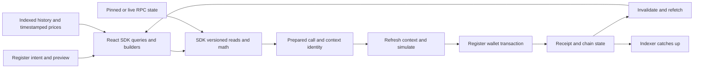

# Index DTF 6.0 — SDK verification and Register integration

**Planning baseline: 2026-09-15. Status: implementation specification; implementation and release approval pending.**

## Handoff navigation

- **This document:** goals, architecture, scope, stage dependencies and release acceptance.
- **[Implementation handoff](index-dtf-v6-handoff.md):** first-session procedure, repo/file map, interface and manifest requirements, numbered work packets, runnable versus proposed commands, rollout and recovery.
- **[Detailed test catalog](index-dtf-v6-test-catalog.md):** stable concrete case IDs, setup/actions/assertions, exact protocol errors, independent arithmetic, governance/upgrade/native-creation recipes and infrastructure fault injection.
- **[Frozen cohort](index-dtf-v6-cohort.json):** ranked real DTF identities, basket assets and selection provenance.

Read all four for implementation. Start at **S0; no implementation stage is complete**. Source paths and test commands below reflect the dated audit; revalidate them against the actual candidate before building. The detailed catalog expands the test families here and does not replace the mandatory real-source cohort with synthetic controls.

## Goal

Make Register support Index DTF 6.0 through `@reserve-protocol/react-sdk`, including rebalances, supported upgrades, and newly deployed DTFs, while preserving existing-version behavior on Ethereum, Base, and BSC.

**The rebalance regression suite is the first deliverable and the release gate.** Build executable evidence before moving the existing flow. A passing ABI/unit test, mocked browser transaction, or auction-open transaction alone does not certify a rebalance.

The user selected the **top 10 currently listed Index DTFs by market cap** as the primary real-world cohort. Preserve all ten; add Ethereum coverage and synthetic controls for mechanics absent from that cohort. This plan covers both meanings of “new token”: a newly deployed v6 DTF and a newly added basket asset.

### Recommended approach

1. Freeze inputs and establish a three-chain regression baseline.
2. Prove and complete the SDK's existing rebalance surface for v5, including React consumption. V4 stays Register-local (see settled decisions).
3. Migrate Register's existing-version reads, calculations, and transactions in green batches.
4. Prove v6 rebalances, then integrate the full upgrade and native-deployment journeys.
5. Release only when the complete pinned cohort, all three chains, and the critical failure cases pass against the actual candidate packages.

**Verdict: continue, as a co-paired engineering effort.** Confidence is high in the integration direction, not in present v6 readiness. Luis owns SDK/API decisions; protocol maintainers review spell and economic invariants; Register engineers own the UI and transaction experience.

The strongest objection is that a broad suite could delay shipping work already implemented in the SDK. The answer is a small first executable case, followed by expansion using one reusable harness. The reason to continue is concrete: existing tests do not exercise SDK-generated rebalance transactions across the three chains, and Register currently contains v6-incompatible version fallbacks.

## Settled decisions — do not reopen

Settled by Luis on 2026-09-02 and reaffirmed on 2026-09-16. Stage work must not re-litigate these; a reviewer finding that contradicts one goes to the backlog, not implementation.

| Decision                                                                                              | Consequence for this plan                                                                                                                                                                                                                                                                                                                              |
| ----------------------------------------------------------------------------------------------------- | ------------------------------------------------------------------------------------------------------------------------------------------------------------------------------------------------------------------------------------------------------------------------------------------------------------------------------------------------------ |
| **SDK supports Folio `5.0.0` and `6.0.0` only.**                                                      | Every SDK version union admits exactly those two strings and rejects everything else with a typed error. No silent default (`?? "5.0.0"`), no v4 adapter, no `5.1.x`/`6.x` prefix inference.                                                                                                                                                           |
| **V4 (`4.0.0`/`4.0.1`) stays Register-local.**                                                        | Register keeps its own v4 ABI, `startRebalance` and open-auction branch, behind an explicit version switch whose unknown arm blocks writes. Version-neutral work (reads, subgraph queries, decoding, governance hooks) still comes from the SDK for v4 DTFs. The current `startsWith('5') ? 5 : 4` fallback is a bug to fix, not a pattern to migrate. |
| **Register rebalance/auction encoding migrates onto the SDK for v5 first, then v6.**                  | Byte-equality against the current Register encoder is the S3b oracle; S3c removes only the v5 duplicate.                                                                                                                                                                                                                                               |
| **Upgrade proposal builder (four-call optimistic / two-call legacy through the spell) is SDK-owned.** | S5 builds it in the SDK; Register's hand-assembled banners consume it.                                                                                                                                                                                                                                                                                 |
| **The full regression suite is the release gate.**                                                    | Rebalance is critical. All 146 catalog cases, the 12-source cohort, three chains and the fork infrastructure stay in scope. Do not slim the suite to ship faster.                                                                                                                                                                                      |
| **The per-chain fork stack is repository-owned in Register.**                                         | Compose files, per-chain env and operator script live in `e2e/fork/docker/`; the reusable procedure is `.claude/skills/fork-e2e/SKILL.md`. The installed `reserve-dtf-sandbox` skill remains an operator wrapper for the protocol/SDK/subgraph lane; CI never depends on it.                                                                           |

## Current state

### Audited sources

Paths beginning `sdk/`, `index-protocol/`, or `index-subgraph/` refer to sibling repositories in the interface hub. Other source paths are relative to Register. Source and working-tree changes take precedence over older wiki claims.

| Repo           | Audited branch / HEAD                                                            | State when audit began                                                                                   |
| -------------- | -------------------------------------------------------------------------------- | -------------------------------------------------------------------------------------------------------- |
| Register       | `chore/deps-housekeeping`, `6de40be265f97807bf09c1f6e2115f0802ed1a15`            | Clean; pins `@reserve-protocol/react-sdk` `0.5.3`, directly uses `dtf-rebalance-lib` `^3.3.2`            |
| SDK            | `feat/index-dtf-v6-support`, `972bd25cfd86fb0b599f0820593bf97c601ec2a1`          | Existing tracked/untracked v6 changes; core and React manifests say `0.6.0`; publication not established |
| Index protocol | `feat/index-dtf-v6-sandbox`, `18706fb455b8e6b91250deba795eb791243f6827`          | Existing sandbox changes; local source declares `6.0.0`; this is not production deployment evidence      |
| Index subgraph | `feat/index-dtf-v6-indexing-sandbox`, `95ca68155184b1f2e9a3a4a968925475fafbcea8` | Existing v6 schema/mapping/fork work; production configuration audited contains deployers through v5     |

Implementation branch (2026-09-16): Register `feat/index-dtf-v6`, cut from `origin/master` `d0db7be93` (post Reown AppKit migration); the audited `chore/deps-housekeeping` branch stays parked and unmerged.

Preserve that work. At implementation start, recapture commits **and working-tree content digests**, including untracked source; these HEADs alone do not identify the candidate. Use isolated feature worktrees when the current branch has unrelated work. No commit, push, package publish, or production deployment is authorized by this planning document.

The hub's `RESERVE_PROTOCOL_CONTEXT.md` and `RESERVE_PRODUCT_PLAYBOOK.md` were unavailable at their instructed locations and were not found by filename search. This audit used `docs/protocol-context.md`, `docs/wiki/project.md`, domain guides, and actual contract sources. The existing hub `MVP_PLAN.mdx` describes the earlier Mainnet sandbox; this document extends that effort to Register and three chains and does not certify the older plan's completion claims.

### Readiness inventory

“Present” means inspected source exists; it does not mean fork-certified or available in Register's pinned package.

| Capability                    | Evidence now                                                                                                                       | Required closure                                                                                                                                             |
| ----------------------------- | ---------------------------------------------------------------------------------------------------------------------------------- | ------------------------------------------------------------------------------------------------------------------------------------------------------------ |
| Version and common reads      | SDK version, basket, assets, supply and issuance APIs/hooks exist                                                                  | Historical/current identity, unknown-version gating, fresh reads before writes and upgrade invalidation                                                      |
| Rebalance core                | SDK already exports current/history/auction/bid reads and calculation/call builders                                                | Prove legacy coverage, fill context gaps, execute complete flows; the missing integration is substantially Register adoption                                 |
| V6 start/open calldata        | Dirty SDK work includes next nonce + deadline and trailing auction length                                                          | Execute through real governance/launcher flows; all negative/boundary cases                                                                                  |
| Auction math                  | `sdk/packages/sdk/src/index-dtf/rebalance/open-auction.ts` currently selects V5 math                                               | Explicit supported-version contract (`5.0.0`/`6.0.0` only; others rejected), independently checked v5/v6 equivalence; shared math is not automatically a bug |
| Active-auction classification | `sdk/packages/sdk/src/index-dtf/rebalance/execution.ts` uses `now < endTime` and omits comparison with the current rebalance nonce | Correct/prove inclusive bid end, atomic start=end and stale-nonce cases against protocol; existing unit tests currently encode the exclusive-end assumption  |
| V6 settings                   | Several setters exist                                                                                                              | Full live read model/hooks for allowlist, immutable recipients, self fee and max duration; high-level revenue builder currently rejects v6                   |
| Native v6 deployment          | Generated deployer ABI exists                                                                                                      | Product builders in `sdk/packages/sdk/src/index-dtf/deploy/index.ts` remain legacy-shaped; build and execute v6 deployment                                   |
| Upgrade                       | Protocol sandbox implements reviewed spell flow                                                                                    | SDK upgrade preparation/registry/preflight contract and Register integration are missing                                                                     |
| Register rebalance            | Local RPC/subgraph reads, transformations, library math and vendored write ABI                                                     | Move protocol ownership to SDK, preserve product behavior, remove silent version fallback                                                                    |
| Indexing                      | Dirty schema/mappings handle v6 settings and upgrade rehydration                                                                   | Pair generated query/types with SDK consumption; prove historical/creation/upgrade parity on all chains                                                      |
| Fork environment              | Mainnet-only runner with fresh v5 control, two upgrades, native v6                                                                 | Real source DTFs, Base/BSC, bids/fills/close/end, post-upgrade rebalances and candidate-generated transactions                                               |

Concrete Register hazards: `auctions/views/rebalance/utils/transforms.ts` and basket proposal atoms map non-v5 to v4; launcher code uses the v5 write shape. Live action eligibility also depends on indexed auction history/roles and local time in places. Historical reads must select the ABI for the historical block, not the proxy's current version. See `src/views/index-dtf/auctions/` and `src/views/index-dtf/governance/views/propose/basket/`.

The v5/v6 signatures for `getRebalance`, `auctions`, `getBid`, `bid`, `closeAuction`, `endRebalance`, `openAuctionUnrestricted`, `mint`, and `redeem` match in the inspected ABIs. Do not manufacture incompatibilities solely because shared code imports a v5 ABI; behavior still needs execution tests.

## Non-goals

- Redesigning Register, changing allocation policy, or changing the economic meaning of native/tracking/hybrid DTFs.
- Rewriting Yield DTFs, replacing the rebalance math library, or modifying production Folio contracts.
- Production upgrades, registry mutations, publishing packages, or deploying subgraphs in this planning task.
- Claiming external market liquidity or solver availability from deterministic fork tests.
- Adding Arbitrum Index DTF support.

## Fixture cohort

The companion [cohort snapshot](index-dtf-v6-cohort.json) records the selection, addresses, basket assets, ranking inputs and provenance. It is a **planning snapshot**, not an executed fork manifest.

Source: [Register's current discovery endpoint](https://api.reserve.org/v1/discover/dtfs?performance=true&brand=true), fetched **2026-09-15 23:41:55 UTC**. It returned 40 rows: 28 Index DTFs, 18 active. Select `type=index`, active, chain ID `1`, `8453`, or `56`; require finite nonnegative `marketCap`, sort descending, break ties by chain ID and address. Use actual market cap, not TVL, FDV, or the “featured” list. Cross-check catalog status; all selected entries currently agree. Fail selection on duplicate identities, incomplete pagination, malformed values, or unresolved listing/status conflicts rather than silently shrinking coverage.

| Rank       | DTF      | Chain    | API market cap, USD rounded | Basket assets |
| ---------- | -------- | -------- | --------------------------: | ------------: |
| 1          | CMC20    | BSC      |                   5,506,604 |            18 |
| 2          | LCAP     | Base     |                   4,724,885 |             8 |
| 3          | PHOTON   | BSC      |                   2,268,587 |             9 |
| 4          | NEOCLOUD | BSC      |                   2,213,645 |             8 |
| 5          | POWER    | BSC      |                   1,704,718 |            13 |
| 6          | BUILDOUT | BSC      |                   1,597,450 |            25 |
| 7          | ROBOTS   | BSC      |                   1,443,087 |             9 |
| 8          | MAG7     | Base     |                     390,166 |             7 |
| 9          | BGCI     | Base     |                     214,672 |             7 |
| 10         | VLONE    | Base     |                     211,896 |            20 |
| Supplement | OPEN     | Ethereum |                     183,117 |            10 |
| Supplement | DGI      | Ethereum |                      68,707 |             7 |

The top ten do not cover Ethereum. OPEN and DGI are the two highest-ranked active Ethereum entries, giving a minimum **12 real source DTFs**. Add explicit legacy/deprecated and synthetic mechanical controls as needed; supplements never replace a difficult top-ten case.

Refresh rankings deliberately at release-candidate preparation, reviewing additions/removals. Keep both the frozen baseline cohort and newly qualifying top-ten members for that release; do not evict failing tests through a market-cap refresh. Individual CI jobs never choose a new cohort from a live ranking.

### Inventory before assigning tests

For every source DTF, pin a chain block/hash and read version, implementation/code hash, proxy admin, governor(s), timelock(s), registry relationships, all relevant roles, basket/decimals/balances, effective supply, fee configuration, price/weight control, current rebalance/auction/filler state, bids setting, and available upgrade targets. Record classification evidence instead of inferring it from symbol or the API. Fork blocks must postdate every selected deployment and support the required historical reads; the old Mainnet block `25834864` is a historical sandbox input, not a default for this current cohort.

Real-origin cases retain the original proxy, assets, governance and roles. Fund local actors through reproducible real token transfers where possible. Label impersonation, balance seeding and any environment-only preparation. Do not replace real governance, bypass token transfer restrictions, grant arbitrary protocol roles, or swap real assets for mocks to turn a required case green. Separate direct-role unit scenarios from genuine governance lifecycle evidence.

## Integration specification

### Ownership and stack

Keep the existing stack: TypeScript/viem and Vitest in SDK; React, TanStack Query, wagmi, Jotai, TransactionButton and Playwright in Register; Foundry/Anvil for chain state; Graph Node/Postgres/IPFS for indexing. No new production service, database or authentication system is needed. Test-only runner orchestration owns local actors and persistence.

| Layer          | Owns                                                                                                               |
| -------------- | ------------------------------------------------------------------------------------------------------------------ |
| Protocol       | ABI, roles, state transitions, units, economic and upgrade invariants                                              |
| Core SDK       | Version-aware reads, protocol validation/math, ordered calldata, typed errors and deployment/upgrade preparation   |
| React SDK      | Public read/async-builder hooks, canonical keys, enabled gating, refetch/prefetch/invalidation primitives          |
| Register       | Form intent, product presets, explicit hybrid classification, display, wallet submission, receipt UX and analytics |
| Subgraph / API | Indexed history/metadata and priced analytics with provenance; never live permission or execution truth            |
| Test runner    | Pinned forks, local bootstrap, state ownership, governance actors, scenario execution and evidence                 |

Register imports from `@reserve-protocol/react-sdk`. Pure exported preparation functions can be called directly without a client. Client-bound work needs a public React hook/query primitive; **do not introduce `useDtfSdk()` or direct client calls in Register**. Do not create a hook for a synchronous function just to satisfy a naming convention.

### Consumer and hook completeness contract

Use this as a checklist, not a declaration that every gap needs a new API. Stage 0 produces the exact call-site → exported symbol → installed declaration → runtime evidence ledger. Verify both source exports and the built package consumed by Register. Proposed additions below are **contracts to finalize**, not existing hook names.

| Consumer need                  | Inspected existing surface                                                                                                                         | Work / acceptance                                                                                                                                        |
| ------------------------------ | -------------------------------------------------------------------------------------------------------------------------------------------------- | -------------------------------------------------------------------------------------------------------------------------------------------------------- |
| Identity and version           | `useIndexDtfVersion`, current DTF/basket/assets/supply hooks                                                                                       | Undefined identity stays disabled; unknown version blocks writes; route/chain/version changes cannot reuse old calls                                     |
| Live rebalance and auction     | `useIndexDtfCurrentRebalance`, `useIndexDtfActiveAuction`, `useIndexDtfLatestAuction`, `useIndexDtfRebalanceControl`, `useIndexDtfBidsEnabled`     | Version coverage and one block-consistent context; role and permission truth from RPC                                                                    |
| History and completed metrics  | `useIndexDtfRebalances`, `useIndexDtfRebalance`, `useIndexDtfRebalanceAuctions`, `useIndexDtfCompletedRebalances`, `useIndexDtfCompletedRebalance` | Complete/paginated histories; no mandatory proposal-by-block join; pre-upgrade history survives upgrade                                                  |
| Initial/current basket context | Existing block-aware reads, price/history APIs                                                                                                     | Explicit initial block, historical version, token order, initial/current supply and assets, timestamped price inputs; expose missing read primitives     |
| Proposal build/preview         | `useBuildIndexDtfBasketProposal` and existing settings/DAO/basket-settings builders                                                                | Supported version-specific tuple, v6 nonce/deadline, decode/preview exact submitted bytes                                                                |
| Auction calculation/call       | `prepareIndexDtfOpenAuctionArgs`, `prepareIndexDtfOpenAuction`, `prepareIndexDtfOpenAuctionUnrestricted`                                           | Extend explicit version/duration validation and legacy handling; consume public pure exports or add async hook only if needed                            |
| Bid/fill/close/end             | `useIndexDtfBidQuote` and core execution builders                                                                                                  | Complete bid bounds, actual receipt lifecycle; trusted-filler integration inventory; no second local encoder                                             |
| Liquidity and price risk       | `useIndexDtfRebalanceLiquidity` plus pricing APIs                                                                                                  | Move raw rebalance requests to hooks; Register keeps product thresholds/copy; missing/stale prices disable dependent writes                              |
| V6 settings                    | Partial setters; incomplete public read model                                                                                                      | RPC-backed max duration, allowlist, immutable/mutable recipients, self-fee state; preserve untouched immutable data in builders                          |
| Upgrade                        | No complete SDK product path identified                                                                                                            | Registry/eligibility read, ordered proposal preparation, preflight errors, historical version and post-receipt refresh primitives                        |
| Native deployment              | Legacy builder and v6 ABI only                                                                                                                     | Versioned v6 tuple/governance/seed approvals, deploy call, receipt address discovery and fresh-DTF loading; inventory manual and simple/zap entry points |
| Cross-flow continuity          | Existing issuance, governance, vote-lock and fee hooks                                                                                             | Mint/redeem, governance actions, vote-lock and fee displays on old/upgraded/native versions                                                              |
| Cache lifecycle                | Existing query keys/options                                                                                                                        | Public invalidation/refetch primitives; dependent version/role/auction/balance/history keys refreshed after writes                                       |

Hook acceptance requires rendered consumers: loading/error/empty states, `enabled=false`, account/chain/address changes during requests, cache separation by block/nonce, late responses, upgrade at the same address, receipt-driven refresh, index lag, and unmount cleanup. A barrel export or mocked function that returns the expected shape is insufficient.

### Context, calculation and transaction contract

Prefer extending existing primitives over adding a second rebalance engine. A protocol-only coherent context read may live in SDK; Register composes product policy around it. Reject a monolithic SDK hook that owns UI form state, toasts, wallet submission or policy presets.

- **Identity:** chain ID, Folio address, resolved version/implementation, read block/hash/timestamp, current nonce and auction ID. Historical context also carries its initial block/hash and version. Never default a loading or unknown version to v4/v5.
- **Inputs:** ordered token addresses/decimals and `inRebalance`, initial/current raw balances and effective supplies, initial weights/prices/limits, current price values and observation times, weight/price control, launcher permissions, bids/trusted-filler settings and versioned duration limits.
- **Intent:** target shares/units, rebalance fraction, volatility/size bounds, explicit target-price mode, selected duration and proposal deadline. Register retains the curated hybrid allowlist; do not infer hybrid status from `weightControl`.
- **Output:** existing prepared-call/proposal shape plus preview values, input identity/digest and actionable validation errors. Preserve exact units and ordered arrays. Amounts/calldata use `Amount`/`bigint`; existing library price/percentage `number` inputs get explicit finite/range validation and documented conversion boundaries.
- **Consistency:** resolve one block for each live RPC snapshot; do not combine balances at head N with supply or nonce at head N+1. Historic and live snapshots are intentionally separate and labeled. Indexed absence must never mean an auction or role is absent onchain.
- **Before signing:** refresh version, nonce, roles, auction/window state and freshness-dependent inputs; simulate the exact candidate call for the actual sender and chain. If intent-relevant inputs changed, invalidate the preview and require a refreshed confirmation. Simulation is not a guarantee against a later state race.
- **Governance immutability:** a submitted proposal's calldata, nonce and deadline stay fixed through voting/queue/execution. Never silently repair stale nonce/deadline at execution; surface the specific reason and prepare a new proposal if needed. Deadline must account for standard/optimistic lifecycle timing plus an explicit policy buffer; no hidden “now + one hour” default.
- **Receipt:** invalidate live context, version after upgrade, basket/supply, permissions, governance and auction state as applicable. Indexing completion is tracked separately. No full-page remount as the only correctness mechanism.
- **Failure:** preserve user intent on rejection/revert, clear prepared calls on identity changes, expose decoded protocol errors, and prevent duplicate writes. Unsupported/missing state is unavailable, not zero or success.

### Protocol 6.0 requirements

Sources: `index-protocol/contracts/Folio.sol`, `contracts/utils/RebalancingLib.sol`, `contracts/interfaces/IFolio.sol`; SDK ABI generation is pinned to the audited protocol commit.

| Requirement          | Required behavior and test                                                                                                                                                                                                              |
| -------------------- | --------------------------------------------------------------------------------------------------------------------------------------------------------------------------------------------------------------------------------------- |
| Start nonce/deadline | Six-argument v6 start; nonce is current + 1; deadline inclusive. Prove two competing proposals, exact deadline and deadline + 1                                                                                                         |
| Launcher duration    | Six-argument v6 open; `[120,maxAuctionLength]`, global maximum one week. `NONE` requires the maximum; custom durations for applicable controlled modes                                                                                  |
| Price arrays         | Required and aligned even for `NONE`; NONE retains initial prices; PARTIAL narrows bounds; atomic constant prices apply to every token together                                                                                         |
| Auction time         | Dutch warmup is 30 seconds; atomic start/end are the same timestamp. Do not assert requested duration equals end−start for atomic cases                                                                                                 |
| Biddable state       | Bid time interval is inclusive at both ends and auction nonce must match current rebalance. Distinguish warmup/open state from ability to bid; test start−1/start/end/end+1, atomic same-timestamp and stale nonce through public hooks |
| Opening windows      | Test exact restricted/available boundaries and 120-second buffers; restricted opening can extend the launcher window; an auction may finish after rebalance TTL                                                                         |
| Auction replacement  | A privileged launcher may replace the ongoing auction, closing it at new-open timestamp−1 and emitting AuctionClosed. Permissionless collision/buffer violations revert; do not impose a blanket no-replacement rule                    |
| Token membership     | `getRebalance()` includes all basket assets; omitted assets may have zero fields and `inRebalance=false`. Preserve mint/redeem basket membership without sending them as active auction tokens                                          |
| Allowlist            | Checks every start token, including zero-target exit assets. Mid-rebalance removal does not retroactively block current auctions/bids; it blocks future starts                                                                          |
| Completion           | `endRebalance()` does not close an active auction. Test close/end separately, expiry, new nonce and obsolete-auction rejection                                                                                                          |
| Caps and rounding    | Assert bought and sold amounts both consume caps; buy targets floor, sell targets ceil, bid payment ceil; compare raw balances and remaining capacity                                                                                   |
| Fees/supply          | Effective supply includes pending fees and self-fee handout effects; test day boundaries, mint self-fees and weight snapshot staleness                                                                                                  |
| Trusted fills        | Exercise authorized fills and recovery; do not require `AuctionBid` for fills that do not emit it; check balance/cap/indexing effects                                                                                                   |

Do not infer support for `5.1.x`, arbitrary `6.x`, or earlier versions from a major-version prefix. Inventory actual deployed versions, implement an explicit compatibility table and prove every admitted write version. The SDK admits exactly `5.0.0` and `6.0.0`. V4 (`4.0.0`/`4.0.1`) is **not** an SDK concern: Register keeps its local v4 ABI and encoder behind an explicit version switch, and the cohort's v4 sources exercise that Register-local path (see settled decisions). Register-local v4 code is retired only when the cohort and declared product support allow it, never by moving it into the SDK.

### Full upgrade path

Use the reviewed v6 spell source `33c315690a71c826b5bcd01b69110f478ccd865d` as the initial audit pin, and revalidate the final reviewed artifact/code hash before implementation and release. Local fork registration is setup, not a production availability claim.

Both topologies execute the upgrade through **standard Governor proposal → vote → queue → timelock execute**, including DTFs with optimistic governance.

| Topology        | Ordered zero-value proposal calls                                                                                                                                     |
| --------------- | --------------------------------------------------------------------------------------------------------------------------------------------------------------------- |
| Optimistic      | Register Folio v6 start selector `0xc1e54b89`; unregister v5 `0x207c8eed`; transfer ProxyAdmin ownership to reviewed spell; `cast(folio,proxyAdmin,selectorRegistry)` |
| Legacy standard | Transfer ProxyAdmin ownership to spell; `cast(folio,proxyAdmin,address(0))`                                                                                           |

Resolve topology/registry from evidence. Missing optimistic registry must not fall back to the legacy zero address. Do not use direct `upgradeToVersion`, optimistic proposal submission or temporary Folio admin grants for the v5→v6 path.

**Preflight:** exactly v5.0.0, calling timelock is sole admin, reviewed spell/registry available, auction length at least 120 seconds, no synchronous/asynchronous state change, rebalance ended/expired, last auction strictly expired, correct governance/selector relationships and nondeprecated registered v6. UI explains each blocking condition; remediation is a separate governance/action sequence. Revalidate immediately before execution because preflight can become stale.

An inactive but unclosed trusted filler can remain when `stateChangeActive()` is `(false,false)`. Zero `activeTrustedFill` is not a spell precondition. For strict raw-holdings preservation cases, settle it through the permitted path and take the baseline snapshot afterward. Separately test a valid inactive-but-unclosed filler: the upgrade's `poke()` can settle it, recover balances, update traded accounting, clear its pointer and remove an exhausted sell asset.

**Postconditions:** same proxy and metadata; expected implementation/version; ProxyAdmin ownership restored; exact preserved role sets, relevant fee settings and holder allowances; selector rotation; initialized self-fee timing/new defaults. From a settled baseline, preserve raw holdings/basket. For the unclosed-fill control, preserve economic holdings across Folio plus filler and assert the expected settlement/basket changes instead. Compare supply with fee-aware, same-time expectations because the spell pokes fees. Then execute a complete v6 rebalance, mint/redeem and governance action. Check historic v5 reads, proposal previews and v4/v5 auction history at the same proxy.

**V4 sources:** reviewed historical `r5.0.0` spell accepts v4.0.0/v4.0.1. Its sequence is transfer ProxyAdmin → temporary admin grant to the v5 spell → cast; it removes that role and restores ownership. That temporary grant is specific to the earlier hop. Pin the historical artifact and dependencies; never compile the historical spell against current v6 imports. Test v4 baseline → v4→v5 → intermediate invariants/cleanup → v5→v6 → full v6 flows. No direct v4→v6 via the v6 spell. Other observed versions need a proven path or an explicit blocked release case, not an invented hop.

### New v6 DTF and new basket token

Create native v6 DTFs on every chain using SDK-generated deployment calldata, then the Register deployment flow. Validate the actual v6 additional-details struct (max duration, immutable recipients, self fee), compatible staking vault, standard/optimistic governance parameters, selectors/proposers/guardians, approvals, seeded assets/shares, roles, ProxyAdmin and receipt-discovered addresses. Governed v6 deploy events expose identical owner/trading governor pairs; the UI must handle unified governance.

The new address must load before it exists in curated discovery/API lists. Use confirmed receipt + RPC and then indexed metadata; no dependency on being listed or having API price history. Execute first mint/redeem, ordinary and optimistic proposal where configured, first rebalance/auction/fill/close, fee changes/distribution and reload/navigation. Include meaningful nonzero self-fee and immutable-recipient variants, not only zero defaults. Test governed and direct-admin deployments where Register offers them; do not equate a direct-admin fixture with governance coverage. Also verify Register's separate Create DAO/new staking-token prerequisite; a preexisting synthetic vault does not prove this path.

Register has manual and simple/zap deployment paths. The simple path currently uses Register's `useZapDeployQuery` and the Reserve API deployment endpoints, not the `react-zapper` UI package. S0 inventories the backend/router/deployer contracts and payloads before assigning ownership. Each entry point exposed for v6 must generate and execute the correct v6 deployment; an unsupported integration is explicitly gated and reported as an open product capability, never silently routed through a legacy deployer. Any required backend or package change follows its own build/test/release dependency before Register enablement.

| Deployment mode       | Producer / dependency                                               | Required NEW-01 proof                                                                               |
| --------------------- | ------------------------------------------------------------------- | --------------------------------------------------------------------------------------------------- |
| Manual governed       | SDK deploy builder → v6 FolioDeployer/governance                    | Version, staking/governance links, seed balances, roles and first proposal/rebalance                |
| Manual ungoverned     | SDK deploy builder → v6 FolioDeployer with explicit owner/roles     | Version, owner/launcher/manager assignments, direct authorized rebalance and unauthorized rejection |
| Simple/zap governed   | Register input → zap API/SDK/router → versioned deployer/governance | Exact v6 payload and final deployed version/roles/seed assets, then full governed flow              |
| Simple/zap ungoverned | Register input → zap API/SDK/router → versioned deployer/owner      | Exact v6 payload and owner/roles, seed accounting, then full direct-admin flow                      |

Pin backend/router/deployer compatibility evidence for both zap modes. Existing sources are `src/views/index-dtf/deploy/steps/confirm-deploy/manual/components/confirm-manual-deploy-button.tsx` and `src/views/index-dtf/deploy/steps/confirm-deploy/simple/atoms.ts`. S6 cannot claim all-mode deployment support with any row unresolved; staging may expose only verified modes while reporting the others pending.

Separately add an asset absent from the starting basket: fetch metadata/decimals/prices, create approvals as needed, allowlist it through the authorized path, propose and acquire it, then remove/exit it in a later rebalance. Test missing price/metadata, allowlist rejection and zero-target exit. Unavailable pricing must not fabricate a $1 asset or zero-cost deployment.

## Test seams

### Fork infrastructure contract

Extend the existing sandbox rather than creating three unrelated runners. The installed skill entrypoint is `reserve-dtf-sandbox/scripts/sandbox.sh`; it is not a checked-in hub `scripts/sandbox.sh`. Put the CI entrypoint/scenario orchestration in repository-owned files and leave the skill as an operator wrapper. Current shell/Solidity/subgraph manifest consumers contain chain-1 assumptions; updating just the SDK parser is insufficient.

The repository-owned container stack is Register's `e2e/fork/docker/` (scaffolded 2026-09-16): one Compose file parameterized by chain, per-chain env files for `1`/`8453`/`56`, a CI tmpfs override and a `fork.sh` operator script that namespaces each chain as its own Compose project. It is the same Anvil + Graph Node + Postgres + IPFS shape as the subgraph's `docker-compose.fork.yml`, generalized to three chains. The reusable procedure lives in `.claude/skills/fork-e2e/SKILL.md` so future fork-backed suites (issuance, governance, zaps) reuse it instead of inventing another runner.

- Three independent fork identities: `(chainId, forkBlock, forkBlockHash, runId)`, chain IDs 1/8453/56. Pin archive endpoints through environment configuration; record endpoint labels, never secrets.
- One mutation owner per fork/scenario. Read-only assertion workers may share state with bounded concurrency. Different workers never advance time or reset the same chain concurrently.
- RPC-only negative/property scenarios use isolated Anvil processes or snapshot/revert. Indexed scenarios append blocks; reset Anvil and Graph stores together. Never revert behind an indexer's processed head.
- Before writes, verify loopback RPC, Anvil identity, expected chain/fork hash and code hashes. All SDK, wagmi, wallet and direct client transports point at that fork; disallow hidden production RPC fallback.
- API/pricing responses are captured, timestamped and validated. Block unexpected HTTP egress during deterministic tests. Real ERC20/DTF execution remains on the fork; fixtures do not intercept `eth_sendTransaction`, simulation or receipts.
- Register's Cowbot can automatically process auctions for unlisted DTFs, including native fork controls. Isolate its external order-submission boundary with a controlled local adapter; a local RPC alone does not prevent public order submission. Test unknown-listing and chain identity explicitly.
- For pre-fork real DTFs, replay required history from deploy/transition blocks or add explicit sources with complete, verified initial-state hydration. Starting all deployers at the fork block cannot discover these DTFs. Explicit sources alone do not reconstruct balances/history. Use the fast post-fork discovery profile only for fresh controls.
- Graph creation-block event replay is the current source of initial event-backed state. Current deploy handler hydrates version only; post-creation `Upgraded` rehydrates v6 state. Test against double supply/role/balance accounting; do not reinstate the earlier sandbox plan's blanket initialization hydration assumption.
- Wait for Graph `_meta`/indexing status to reach each receipt/state block with no errors; compare GraphQL and RPC **at that same block**, including receipt hash/event identity. Timeouts fail with diagnostics.

### Run manifest and evidence

Version the existing manifest when adding real-source/multichain semantics. Keep an explicit adapter for the current schema-v1 fresh Mainnet fixtures; do not relax its creation-after-fork assumptions invisibly. Use one manifest per chain plus a run-level cohort/result index.

Required release evidence: schema/run ID; cohort snapshot/hash; chain and pinned block/hash; protocol/spell/SDK/React/Register/subgraph commits and dirty digests; built package integrity; container/tool versions; source-vs-native fixture classification; source addresses/versions/topology; seed/price hashes; ordered transitions with sender, target, value, complete calldata, receipt/hash/block/status/events; initial/final RPC snapshots; indexed state block/hash; case outcomes and exact expected/actual deltas. Write artifacts atomically and retain them on failure. Unknown schemas, missing cases or incomplete receipts are failures.

### Minimum execution matrix

| Fixture lane                            | Required executions                                                                                                                                           |
| --------------------------------------- | ------------------------------------------------------------------------------------------------------------------------------------------------------------- |
| Each of 12 real sources                 | Current-version propose/start → permitted launch → actual fills → subsequent round where needed → close/end → balance/target assertions; baseline mint/redeem |
| Each source eligible for upgrade        | All required governance hops → intermediate invariants → v6 full rebalance/mint/redeem → historical continuity; unsupported hop is a tracked blocker          |
| Every chain: v5 control                 | Remains v5 while candidate SDK and Register continue to operate correctly                                                                                     |
| Every chain: legacy upgrade control     | Actual standard governance v5→v6, then full v6 trading/user flows                                                                                             |
| Every chain: optimistic upgrade control | Standard four-call upgrade, then ordinary and optimistic basket proposals, veto/cancel cases and full v6 flows                                                |
| Every chain: native v6 control          | Native deployment → first user/governance/rebalance flows; at least one nonzero self-fee/immutable-recipient configuration                                    |
| Supplemental controls                   | V4 compatibility through the Register-local v4 path, deprecated read/redeem behavior, missing product modes and contract boundary cases                       |

Bootstrap native v6 locally while its deployer is unreleased. In early SDK rebalance stages the protocol runner may create the fixture; native-deployment acceptance later requires **SDK and Register generated** deployment transactions. Similarly, retain existing read-only fork smoke as an assertion layer, but require the scenario runner to send candidate SDK calldata, not parallel Solidity-generated calldata for the operation under test.

### Rebalance regression cases — release priority P0

Every case has a stable ID, applicable versions/chains, deterministic setup, real execution seam, independent oracle and failure artifacts. The run reports required, executed, passed, failed, blocked and explicitly inapplicable counts; they must reconcile. Inapplicability must be supported by the protocol/fixture inventory, never by convenience.

| IDs    | Family                               | Required assertions                                                                                                                                                                                                      |
| ------ | ------------------------------------ | ------------------------------------------------------------------------------------------------------------------------------------------------------------------------------------------------------------------------ |
| RB-01  | Existing behavior and SDK extraction | Same seeded state produces equivalent complete decoded args/calldata and preview; execute the call and compare actual outcome independently                                                                              |
| RB-02  | Portfolio modes                      | Native, tracking, curated hybrid; fixed/mutable/deferred weights; target snapshot/current price selection; EJECT/PROGRESS/FINAL, fraction 0/partial/100 and max feasible fraction                                        |
| RB-03  | Assets and units                     | 6/8/18 decimals, large values above JS safe integer, tiny dust, unequal/high-count baskets, new/exit/omitted assets, mixed address case, duplicates and wrong order                                                      |
| RB-04  | Data failure and freshness           | Missing/zero/negative/nonfinite/stale prices, missing decimals/supply, RPC failure, historical price gaps, out-of-order/late query responses; writes fail closed                                                         |
| RB-05  | Proposal correctness                 | V4/v5/v6 tuples, full targets/values/calldata; next nonce, stale competing proposals, deadline−1/deadline/deadline+1; standard and optimistic lifecycle/veto/cancel                                                      |
| RB-06  | Permissions and timing               | Wrong manager/launcher/account/chain; exact restricted/TTL/auction/buffer boundaries; privileged replacement closes prior auction with ordered events, permissionless collision rejects; race between preview and submit |
| RB-07  | V6 price/duration                    | NONE/PARTIAL/ATOMIC rules, invalid length below/above range, equal/non-narrowing ranges, all atomic prices together; start−1/start/end/end+1, atomic start=end, and old-nonce latest auction after new rebalance         |
| RB-08  | Actual trading                       | Bid quote + approvals + bounded bid; partial/full/repeated fills; finite buy/sell caps; min/max constraints; disabled bids; exhausted lots; overbid and stale auction                                                    |
| RB-09  | Trusted fills                        | Successful authenticated fill, partial fill, close/recovery and invalid caller; settlement effects without AuctionBid; no dependence on public solver availability                                                       |
| RB-10  | Completion and restart               | Close vs end distinction; expiration, zero progress, final holdings, next rebalance, old nonce invalidation, idempotent UI receipt processing                                                                            |
| RB-11  | V6 allowlist                         | Disabled/enabled, add/remove, nonallowlisted start, zero-weight exit, mid-rebalance removal preserves current execution but blocks later start                                                                           |
| RB-12  | Supply and fees                      | Mint/redeem between rounds, pending fees, day boundary, self-fee handout and stale weights; exact effective supply in sizing and bounds                                                                                  |
| RB-13  | History/indexing                     | Correct tokens/amounts/nonces/auction links/proposal kind across upgrade; no missing direct-admin history, duplicated creation accounting, silent truncation or stale live eligibility                                   |
| RB-14  | Register end-to-end                  | Real hook → preview → wallet → local transaction → receipt → refreshed display, all three chains; wrong wallet, rejection, revert, double submit, navigation/reload mid-flight                                           |
| UP-01  | Full upgrade                         | Each spell precondition exact failure, two/four-call order, intermediate legacy hop, rollback of failed proposal transaction, preserved invariants and post-upgrade flows                                                |
| NEW-01 | Fresh v6                             | Real deployment/seed/governance/settings, unlisted address loading, first complete rebalance and subsequent mint/redeem                                                                                                  |

Run full source-state lifecycles for every cohort member. Exercise exhaustive economic/timing combinations on deliberately configured controls; use a documented coverage map rather than an enormous blind Cartesian product. In each chain at least one real-source flow also executes through the Register browser. Every cohort member gets Register read/preview coverage and real candidate SDK execution before and after supported upgrades.

### Independent oracles and test strength

- Byte-level selector **and full argument** expectations use reviewed ABI/hand-authored vectors; do not call the same SDK builder or math library to calculate expected output.
- Negative cases assert the expected custom-error selector/arguments and unchanged relevant state, not just any revert. Atomic open-and-fill cases require same-timestamp execution (for example an authorized local batch); mining the fill later would test the wrong condition.
- Assert receipt success plus sender/target/value, decoded events, actual Folio/bidder token deltas, effective supply, remaining caps and final holdings. Calculate expected rounding in independent integer/rational test math. Declare per-asset tolerance from protocol rounding and scenario dust; no blanket floating-point epsilon or assertion merely that balance changed.
- Fix the scenario's price vector so expected economic loss/slippage and target-allocation error are reproducible. Every completed scenario declares a target and permitted residual/dust, and reaches it or records a defined partial/expired outcome. Opening an auction is not completion.
- Legacy-vs-SDK differential tests detect migration drift; they cannot prove two implementations with a shared defect are correct. Adjudicate mismatches against protocol execution and independent vectors; never refresh snapshots solely to turn a mismatch green.
- Mutation checks must demonstrate failure when altering selector, nonce, token order/decimals, rounding, price mode, duration, caps, buy/sell bounds, chain identity or SDK wiring. Include at least one “bypass SDK and use old local calculation” mutation so tests prove the production integration seam.
- Property tests use reproducible seeds for valid bounded portfolios and invariant checks, plus invalid vectors. Preserve failing seeds as named regression cases. Shrunk repros belong with their owning SDK/protocol test.
- Critical tests have zero retries for acceptance. Infrastructure retries are reported separately, never converted into an unqualified pass. No `passWithNoTests`, `test.fixme`, opt-in omission or missing RPC secret can make a mandatory job green.
- Require three consecutive clean-reset complete candidate runs before cutover/release. Pin seeds and compare meaningful outputs; receipt hashes need not match if declared time/run inputs differ. Investigate every flaky critical case.

Tokenized-equity/restricted assets stay real. Local funded counterparties and approved settlement paths make protocol execution deterministic; record transfer-policy and market-hours constraints. External CoW/API availability is a separate observational lane. If a required source case cannot execute with its actual permissions/assets, it remains blocked until a faithful fixture/path exists; a mock replacement does not satisfy that case.

## Slices

These are implementation checkpoints, not work completed by this planning audit. Start the first unfinished slice; each stage must stay reviewable and green. Changes to SDK/subgraph/Register carry paired release dependencies. Do not count several stages as done against the same mutable worktree when commits are not authorized.

| Stage                         | End-to-end result                                                                                                                                                                                        | Blocked by            | Exit evidence                                                                                                                                                            |
| ----------------------------- | -------------------------------------------------------------------------------------------------------------------------------------------------------------------------------------------------------- | --------------------- | ------------------------------------------------------------------------------------------------------------------------------------------------------------------------ |
| S0 — executable baseline      | Freeze cohort/provenance and compatibility/hook ledger; pin chain inputs; one representative real DTF uses current Register preparation and a complete fork rebalance with independent post-state checks | None                  | Inventory artifact + one positive and one meaningful failing case, receipts and reproducible reset; no SDK migration                                                     |
| S1 — regression foundation    | Extend source baseline to all 12 DTFs and all chains; indexed and isolated lanes; actor/funding/price fixtures; critical failure and economic controls                                                   | S0                    | Required-case manifest reconciles, independent oracles and mutation failures, three clean-reset passes; baseline defects recorded/fixed without weakening expectations   |
| S2 — SDK parity and hooks     | SDK prepares/executes the v5 flow; v4/other observed versions rejected with typed errors (v4 stays Register-local); React seams usable from Register; library/input versions aligned                     | S1                    | Candidate SDK vs current baseline differential + independent fork assertions, React consumer tests, built-package import/typecheck; no mandatory caller uses private API |
| S3a — Register reads          | Auction/rebalance/history/role/live-context consumers move to React hooks; preserve loading/error/UI behavior                                                                                            | S2                    | Existing offline tests unchanged in meaning; historical/lag/race tests, browser read parity for every source and visual checks                                           |
| S3b — Register calculations   | Replace local transformations/proposal/auction math with public SDK preparation; shadow compare old/new without sending twice                                                                            | S3a                   | Independent preview/calldata corpus green, SDK-wiring mutation fails, product mode controls preserved                                                                    |
| S3c — Register transactions   | Submit SDK-prepared existing-version calls via current transaction components; remove migrated local encoders/atoms/dependencies only when no remaining callers need them                                | S3b                   | Browser→fork full lifecycle on all chains, complete SDK cohort execution, no fallback to old encoder on errors                                                           |
| S4 — v6 rebalance vertical    | Native v6 controls on all chains run through SDK and Register rebalance paths; new live settings model and paired subgraph types                                                                         | S3c                   | RB v6 families + all old-version regressions; nonzero fees, allowlist, duration/atomic and full fills/close/end; index parity                                            |
| S5 — upgrade vertical         | SDK and Register preflight/prepare/preview/execute supported legacy ladders and standard v5→v6 spell flows; same-address cache refresh and history                                                       | S4                    | UP-01 for each source's supported ladder plus both topology controls per chain; full v6 rebalance and ordinary user flows after upgrade                                  |
| S6 — native creation vertical | SDK v6 deploy builder + Register create flow, all four deployment modes, unlisted address support, settings/fees and new basket-asset journey                                                            | S4; S5 before release | NEW-01 on every chain, mode/dependency matrix closed, nonzero/self/immutable variants, first rebalance then mint/redeem/governance; no curated discovery dependency      |
| S7 — release candidate        | Cross-feature regression and exact packaged dependency rehearsal, indexed schema compatibility, controlled enablement                                                                                    | S5 + S6               | All acceptance evidence below, clean-reset stability, reviewed release receipt and per-chain deployment readiness                                                        |

The mandatory order deliberately proves unchanged-version SDK adoption before introducing v6 semantics. Native creation can use S4's proven rebalance surface while S5 is reviewed, with one agent per repo and isolated writes; concurrency is optional, not a correctness dependency.

### Stage handoff and rollback

Record owner, candidate digest, changed API, call sites, case IDs/results, review findings and next blocker for every checkpoint. Preserve Register layout/copy/interactions during migration; new v6 controls get translated copy, analytics where useful, and desktop/mobile/wallet-state checks.

Use explicit chain/version/capability gates for staged enablement. An unknown deployment/unsupported version disables affected writes with a reason. Before v6 enablement, rollback can select the proven legacy path for legacy contracts. After a proxy has upgraded, **never roll its UI back to an old v5 encoder**: disable v6 writes or use the last verified v6-capable package. Frontend rollback does not undo onchain upgrades. Keep independently working reads/redemption available where supported.

## Acceptance evidence

### Release-blocking checklist

- [ ] Exact compatibility/call-site/hook matrix has no unresolved mandatory surface; consumer tests compile against built SDK/React artifacts.
- [ ] Every pinned top-ten member plus Ethereum supplements has current-version baseline and candidate SDK rebalance execution with actual fills and declared final-state assertions.
- [ ] Ethereum, Base and BSC each have unchanged-v5, both upgrade-topology, and native-v6 controls; all required supported real-source upgrade ladders pass.
- [ ] RB-01–14, UP-01 and NEW-01 applicable cases pass; blocked, failed, missing and unreviewed skipped mandatory cases are zero.
- [ ] Full Register regressions cover overview/basket/fees, proposal create/preview/vote/veto/queue/execute/cancel, auction/history, settings/roles, issuance mint/redeem, vote-lock, deployment and navigation/chain switching across old/upgraded/native identities.
- [ ] Three clean-reset full runs pass without critical retries; negative/mutation checks demonstrate the suite catches the named faults.
- [ ] Indexing catches up at exact state blocks without fatal errors; no double initial accounting, missing upgrade continuity or bid-only assumptions for trusted fills.
- [ ] Required repository gates and changed UI visual/browser checks are fresh for the candidate; no reliance on earlier branch results.
- [ ] Exact SDK/React package pair is built, tested from package artifacts, released when authorized, and pinned exactly in Register; local `link:` entries absent from release lockfile. Check peer ranges, single React/Query/viem instances and resolved rebalance-library versions. The audited candidate React SDK requires Query `^5.102.7` while Register pins `~5.99.2`; resolve this deliberately with the existing dependency-regression checks.
- [ ] Per-chain production implementation/deployer/spell/registry availability and subgraph release compatibility are separately verified before enabling production v6 writes.
- [ ] Engineer review of math, API contracts, spell calldata/invariants and transaction behavior is recorded; release receipt links manifests, traces and candidate integrity.

### Existing verification commands to retain

SDK: use `llm-workflow.config.json` gates, including forced build, core/React tests/typecheck, lint/format, generated GraphQL and ABI checks, docs/bundle/catalog checks. Fork smoke is an additional explicit command (`pnpm --filter @reserve-protocol/sdk test:smoke:index:fork`), not included proof from ordinary tests.

Register: `pnpm typecheck`, `pnpm lint`, `pnpm test:run`, `pnpm e2e:check`, `pnpm e2e:smoke`, affected/full flow and mobile projects, and candidate build. Add a separately named real-fork Playwright project/CI job backed by `e2e/fork/docker/`; current intercepted E2E and unpinned `forknet` are not this gate.

Subgraph: codegen/build against each chain manifest, mapping tests and `pnpm test:fork:parity` after the scenario state block; preserve production manifests during local setup. Protocol: relevant unit/fuzz/historical-spell tests plus the new persistent scenario gates. A selector-only sandbox test is not behavioral proof.

Proposed CI jobs (to implement): fast unit/ABI/consumer/mutation checks for relevant PRs; required three-chain existing/v6 integration controls for rebalance changes; full cohort plus upgrade/native paths nightly and **mandatory on the exact release candidate**. Publish the matrix status even when an archive provider fails; infrastructure failure blocks certification. Use existing protected CI secrets/configuration, bounded chain-level concurrency and artifact retention; no runtime target is promised before S0 measures costs.

### Evidence from the initial planning audit

These scoped checks ran during the initial 2026-09-15 audit, **not** as part of the later handoff-document expansion. They are not a v6 readiness certificate and must be rerun against implementation candidates:

- SDK: 13 focused test files / 115 tests passed; complete React SDK suite 11 files / 85 tests passed; core typecheck and `pnpm abi:index-v6:check-generated` passed. Focused command: `pnpm --filter @reserve-protocol/sdk exec vitest run src/index-dtf/rebalance src/index-dtf/governance/propose src/index-dtf/deploy src/index-dtf/fork-smoke-fixture.test.ts src/index-dtf/dtf/issuance-calls.test.ts src/index.test.ts`.
- Register: targeted existing rebalance suite, 10 files / 70 tests passed. Command: `pnpm exec vitest run src/views/index-dtf/auctions/views/rebalance/tests src/views/index-dtf/auctions/views/rebalance/components/manage-weights src/hooks/tests/use-rebalance-basket-preview.test.tsx src/views/index-dtf/governance/components/proposal-preview/tests/rebalance-preview-unavailable.test.tsx src/views/index-dtf/auctions/views/rebalance-list/hooks/tests/use-rebalance-metrics.test.ts`. These cover existing helpers/hooks and mocked seams, not v6 execution.
- Sandbox: read-only `doctor` passed for the existing Mainnet configuration. No chain mutation or clean-reset fork run was performed.
- Subgraph: `node --check` passed for `scripts/check-fork-parity.js` and `scripts/prepare-mainnet-fork.js`; no fresh indexing/build/parity certification was performed.
- Live discovery ranking fetched successfully and catalog statuses cross-checked. No onchain version/topology/market-liquidity claim was derived from that API response.

No SDK build/publish, Register dependency bump, source implementation change, production transaction or push occurred in this planning task.

### Plan review disposition

Independent Intent and Engineering Risk reviews inspected the plan and cohort. Confirmed findings incorporated: the four deployment modes and zap/backend dependency; the exact Register verifier command; inclusive auction-end/atomic/stale-nonce SDK classification; and privileged replacement versus permissionless collision semantics. These are requirements and known implementation gaps, not fixes made to application code. Public API/spell/economic implementation still requires Engineer review at its stage gates.

The expanded handoff and 146-case catalog received separate Register Intent, SDK contract and protocol Engineering Risk reviews. Final disposition: all passed after incorporating version-specific v4 cap oracles, independent traded-usage provenance, an unmasked unrestricted-collision case, and settlement-aware upgrade preservation. The 69 numbered implementation tasks remain pending (67 from the audit plus S0.8/S1.8 for the Register-owned fork stack, added 2026-09-16).

Handoff-expansion validation: formatting of all four planning artifacts; required contract sections; 67 unique task IDs at validation time (69 after the 2026-09-16 additions) and 146 unique case IDs/references; 97 existing source-file/directory references; planning links and fenced blocks; frozen cohort ranking/assets/raw-response hash; and independent numeric vectors. Scoped wiki validation covers the documentation changes. An unrelated, pre-existing missing vlRSR plan link in the historical progress ledger remains unchanged. No application tests or fork runs were repeated for this documentation-only expansion.

## Unresolved decisions

| Item                                                              | Resolution path / owner                                                                                                                                   | Blocks                                                                 |
| ----------------------------------------------------------------- | --------------------------------------------------------------------------------------------------------------------------------------------------------- | ---------------------------------------------------------------------- |
| Source versions/topologies and intermediate upgrade registrations | S0 pinned RPC inventory; protocol reviewer validates each supported ladder                                                                                | Relevant fixture execution, not writing this plan                      |
| Final production v6 implementation/spell/deployers                | Protocol release owner supplies reviewed release artifacts and per-chain registration proof                                                               | Production enablement; local fork testing continues                    |
| Final hook/context API names and compatibility guarantees         | Luis reviews SDK consumer ledger; preserve current ownership and prefer extending existing primitives                                                     | S2 contract freeze                                                     |
| Governance deadline buffer and permitted duration defaults        | Derive supported lifecycle timing from RPC; propose explicit defaults and review with product/protocol owners                                             | V6 proposal UI enablement                                              |
| Archive/history resources and restricted-asset funding            | S0 execution preflight; existing authorized RPC config first; document faithful counterparties/settlement                                                 | Specific mandatory fork cases; no silent skip                          |
| CI runtime/concurrency and artifact retention                     | Measure S0/S1, then set budgets; required coverage is fixed                                                                                               | CI operational rollout                                                 |
| Full foundation review                                            | Independent plan review plus engineer review before freezing public contracts; second-model foundation check remains to be recorded during implementation | Building on a frozen new public contract, not this draft specification |

Residual risks: differential tests can share math defects; current dirty source is not a release artifact; real-source history is expensive to reconstruct; equity-token permissions and external solvers complicate fixtures; cache/state races survive unit-only tests; an onchain upgrade cannot be undone by a frontend rollback. The specified independent oracles, source manifests, isolated/indexed lanes and capability gates address these without claiming risk is eliminated.

## Initial implementation prompt

> Implement this plan from the first unfinished slice, beginning with S0 unless evidence says otherwise. Read the implementation handoff, detailed test catalog and cohort linked at the top, then each owning repo's AGENTS.md/workflow config and the Reserve sandbox skill. Preserve existing dirty work, pin the actual candidate snapshot, and keep one implementation owner per repo. First make one real source-DTF rebalance demonstrable on a fork; expand the mandatory suite before migration. Use the cohort snapshot as the frozen baseline and explicitly review release-time ranking additions.
>
> After every slice, run its mapped tests and real-surface checks, record receipts/manifests and failures, and review against its exit criteria. Do not confuse mocked browser sends or read-only fixture smoke with candidate transaction execution. At the allowed review checkpoints, launch independent Intent and Engineering Risk reviewers in parallel; isolate any reviewer edits on their own feature branches/worktrees. Continue only independent next-slice work while review runs. Reconcile useful fixes deliberately, merge/cherry-pick only authorized changes, and rerun affected verification. If review/branch tools are unavailable, self-review and record review-pending requirements honestly.
>
> Repeat through the stages without silently skipping a chain, cohort member, upgrade hop or failure case. Keep one active stage against a mutable worktree when commits are not authorized. Update the contract/coverage map and stale owning wiki/area documentation as behavior changes. Update AGENTS.md only for durable user corrections or established reusable patterns; if touched, keep it concise with stable headings and no duplicated/stale process notes. Finish with exact package flow, per-repo evidence, remaining blockers and Engineer review required where applicable. Do not publish, push or mutate production without authorization.
