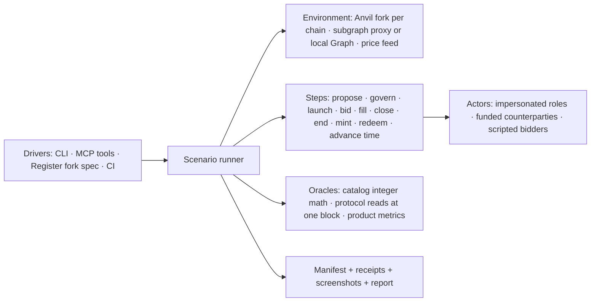

# Rebalance Lab — a standalone, agent-driven rebalance environment

**Status: specification, 2026-09-17. Nothing implemented under this plan yet.** Companion to the [v6 integration plan](index-dtf-v6-integration.md) (which owns the release-gate regression suite) and the [Register rebalance vertical](index-dtf-v6-register-rebalance.md) (which built the first fork lane).

## Goal

One environment, outside Register's test tree, where a person or an agent can take a real Index DTF at a pinned block, **propose a rebalance**, push it through governance, launch and fill auctions with scripted or live-priced counterparties, and read back what happened as protocol truth plus product metrics. The same environment is what Register, the SDK and the strategy bot test against, so "does this code change break rebalances" and "what would this rebalance proposal actually do" are the same run with different inputs.

Thesis in one line: a rebalance is a scenario, not a test; tests are scenarios with expectations attached.

## Current state

What exists today, and why none of it is the lab yet:

| Asset              | Where                                                                          | What it gives                                                                                                                                                                                         | What it lacks                                                                                                             |
| ------------------ | ------------------------------------------------------------------------------ | ----------------------------------------------------------------------------------------------------------------------------------------------------------------------------------------------------- | ------------------------------------------------------------------------------------------------------------------------- |
| Register fork lane | `register/e2e/fork/**`, `playwright.fork.config.ts`, `.claude/skills/fork-e2e` | Per-chain Anvil + Graph Node stack, impersonated launcher, production subgraph truncated at the fork block, one real UI launch verified with viem                                                     | Lives inside Register; scenario is a hand-written script; no proposal, no bids, no metrics; one DTF, one chain            |
| Protocol sandbox   | `index-protocol/script/sandbox/*` + codex skill `reserve-dtf-sandbox`          | Fresh v5/v6 fixtures on a mainnet fork, standard and optimistic governance lifecycles, upgrade spells, execution scenarios, a versioned fixture manifest with atomic writes and direct-RPC invariants | Mainnet only, fresh Folios only (no real source DTFs), Solidity-driven calldata (not the SDK's), no browser, no economics |
| SDK fork smoke     | `sdk/packages/sdk/src/index-dtf/fork-smoke*`                                   | Reads a fixture manifest and checks SDK encoding/reads against it                                                                                                                                     | Read-only consumer; cannot create state                                                                                   |
| Strategy bot       | `~/projects/dtf-strategy-bot`                                                  | A real autonomous proposer: weight changes through propose → vote → queue → execute → Dutch auctions, driven by a price signal                                                                        | Points at production; no sandbox to rehearse against; no way to compare strategies on the same state                      |
| Test catalog       | `index-dtf-v6-test-catalog.md`                                                 | 146 specified cases with independent oracles (integer bid math, price/target oracles, error maps)                                                                                                     | Specifications only; no runner                                                                                            |

The gap is a **scenario runner with actors, oracles and a proposal step**, packaged so that agents and CI call the same thing.

## Non-goals

- Replacing the offline Playwright suite: mocked, fast, deterministic UI coverage stays in Register.
- A price-prediction or strategy-optimization engine. The lab replays or scripts prices; strategies (the bot, an agent, a person) bring the intent.
- Mainnet execution of anything. The lab refuses non-loopback RPCs for writes, as the fork lane does today.
- Rebuilding the subgraph for every chain in phase 1. The truncating proxy is enough until indexed history itself is under test.

## Architecture



Layers, each its own module in one package (`packages/rebalance-lab`), no cross-feature imports:

1. **Environment** (`env/`). Owns the fork stack lifecycle per chain (the Compose files move here from `register/e2e/fork/docker`), the pinned block and hash, the subgraph strategy (proxy truncated at the fork block by default; local Graph Node profile when indexed history is the subject), and the price source (recorded API responses keyed by block, or a scripted vector). `doctor` refuses anything that is not loopback Anvil at the expected chain and hash.
2. **Scenario** (`scenario/`). A JSON document, schema-versioned like the sandbox manifest, describing source DTF, chain, fork block, actors, the proposal intent, the counterparty policy, time-advance rules and expectations. Scenarios are data; the runner is the only code that interprets them.
3. **Steps** (`steps/`). One function per protocol action, built on the SDK's public builders so the lab exercises the production calldata path: `buildIndexDtfBasketProposal` → `prepareIndexDtfSubmitProposal` / optimistic variant, vote/queue/execute through the real Governor and timelock (or the direct `REBALANCE_MANAGER` when the scenario declares `authority: direct` — labelled, never described as governance coverage), `prepareIndexDtfOpenAuction(Unrestricted)`, `getBidQuote` + `prepareIndexDtfBid`, trusted fills via the filler registry, close/end, mint/redeem, `evm_increaseTime`/`evm_mine`.
4. **Actors** (`actors/`). Impersonated role holders (funded with `anvil_setBalance`), counterparties funded by real token transfers from whales at the fork block (recorded in the manifest), and **bidders**: scripted policies that decide when and how much to bid from `getBid` quotes and a price vector (`fill-at-fair-value`, `fill-late`, `partial-then-walk`, `no-bidder`). Bidders are the part that turns "auction opened" into "rebalance happened".
5. **Oracles** (`oracles/`). Test-owned integer math from the catalog (§3.1 bid oracle, v4 vs v5/v6 branches; §3.2 price and target oracles), protocol reads pinned to one block, and product metrics: achieved basket vs target (per-asset error and dust), value traded, realized price vs start price, time to completion, rounds used, gas. Expected values never come from the SDK or the rebalance library.
6. **Report** (`report/`). Run manifest (schema v2 from the handoff §4.2: run identity, chain identity, candidate digests, fixtures, scenarios, operations, transitions, assertions, index proofs), receipts, optional screenshots, and one HTML report per run in the shape of the current evidence page.

Register keeps only a thin adapter: `playwright.fork.config.ts` and specs that point Register at a lab environment and drive the UI; the lab owns everything else. The strategy bot gets a `--lab <run>` mode that targets a lab environment instead of production.

## Scenario model

```jsonc
{
  "schemaVersion": 2,
  "name": "cmc20-nonce-12-what-if-tighter-caps",
  "source": {
    "chainId": 56,
    "address": "0x2f8A…6867",
    "forkBlock": 119967348,
    "forkBlockHash": "0x…",
  },
  "subgraph": { "mode": "proxy-truncated" },
  "prices": { "mode": "recorded", "at": "fork-block" },
  "actors": {
    "launcher": { "role": "AUCTION_LAUNCHER", "impersonate": true },
    "manager": { "role": "REBALANCE_MANAGER", "authority": "governance" },
    "bidders": [
      {
        "policy": "fill-at-fair-value",
        "fundFrom": "whale",
        "tokens": ["USDT", "BTCB"],
      },
    ],
  },
  "proposal": {
    "kind": "basket",
    "target": {
      "type": "shares",
      "tokens": [{ "address": "0x…", "share": 12.5 }, "…"],
    },
    "priceMode": "current",
    "windows": { "auctionLauncherWindow": 3600, "ttl": 86400 },
    "maxAuctionSizeUsd": 250000,
  },
  "plan": [
    { "step": "propose" },
    { "step": "govern", "through": "standard" },
    { "step": "launch", "by": "launcher", "percent": 98 },
    { "step": "bid", "policy": "fill-at-fair-value", "until": "auction-end" },
    { "step": "advance", "seconds": 1800 },
    { "step": "launch", "by": "launcher", "percent": 100 },
    { "step": "bid", "until": "auction-end" },
    { "step": "end" },
  ],
  "expect": {
    "finalBasketErrorBps": { "max": 25 },
    "dustPerAssetRaw": { "…": "…" },
    "catalogCases": ["RB-08.01", "RB-10.01", "RB-12.01"],
  },
}
```

The `proposal` block is what makes this more than a test harness: it is the same intent Register's propose-basket form or the strategy bot produces, and the lab turns it into calldata through the SDK, so a proposal can be rehearsed before it is ever submitted for real.

## Proposal simulation loop

1. Pin state: fork the source DTF at a block, record hash, versions, roles, basket, supply, fees, current rebalance and auction state (the S0 inventory record from the handoff §3.2).
2. Build the proposal with the SDK from the scenario intent; decode and diff it against the intent (token order, D18 shares, limits, windows, v6 nonce and deadline).
3. Execute governance: standard propose → vote (impersonated delegates at the snapshot) → queue → advance → execute, or the optimistic path where configured; or direct manager execution when the scenario says so.
4. Run the plan: launches (launcher or community), bidder policies filling from `getBid` quotes against the price vector, time advances, close/end.
5. Read outcomes at one block: final basket, per-asset error vs target, value traded, realized vs start prices, rounds, gas, plus the catalog invariants named in `expect`.
6. Write the manifest and report. A run is comparable to another run of the same scenario with a different `proposal` or `bidders`, which is how "what if we had tighter caps" or "what if nobody bids for an hour" get answered.

## Bid and case simulation

The runner above executes one plan against one price vector. The simulation layer runs many: it varies **when bids arrive**, **how prices move before and during the rebalance**, **what liquidity the swap really has**, and **what fails**, then reports the distribution of outcomes for a proposal. Every simulated run is still a real fork execution with real calldata; only the counterparties and the price inputs are modelled.

### Time model

The protocol prices a pair inside an auction by exponential decay from the start price (`sell.high / buy.low`) to the end price (`sell.low / buy.high`) over `[startTime, endTime]`, with `k = ln(P0 / Pt) / length` (`RebalancingLib.sol` `_price`, lines 446–495; atomic auctions use the start price). The lab implements the same curve in test-owned math so a bidder can compute, for its own fair value `F`, the earliest timestamp at which the auction price crosses `F`. Bid timing policies are expressed against that curve:

| Policy              | Bids when                                                                                                   | What it exercises                                                         |
| ------------------- | ----------------------------------------------------------------------------------------------------------- | ------------------------------------------------------------------------- |
| `at-fair-value`     | first timestamp where auction price ≤ bidder's fair value                                                   | the expected fill; baseline for price impact                              |
| `early-overpay`     | at `startTime + δ` regardless of fair value                                                                 | value captured by the DTF; `Folio__SlippageExceeded` if `maxBuy` is tight |
| `late`              | at `endTime − δ`                                                                                            | worst realized price for the DTF; end-inclusive bidding (`RB-07.09`)      |
| `staggered`         | several bidders with fair values spread ±x% around mark, each at its crossing                               | competition, partial fills, cap exhaustion (`RB-08.02`)                   |
| `partial-then-walk` | one partial fill, then nothing until the next round                                                         | multi-round behaviour, remaining caps, restart (`RB-08.08`, `RB-10.06`)   |
| `solver`            | when the auction price beats the bidder's own DEX execution on the fork by its margin (see liquidity model) | what a real solver would do with this asset's real depth                  |
| `no-bidder`         | never                                                                                                       | expiry, zero progress, end/close semantics (`RB-10.07`)                   |
| `replay`            | at the timestamps and sizes of the real bids indexed for that auction                                       | reproducing history on source DTFs                                        |

Timing is executed with `evm_setNextBlockTimestamp` before each bid so the fork's clock, not the wall clock, decides the price; the report records the requested and the mined timestamp for every bid.

### Price model

Prices enter in two places, and the simulation controls both:

- **Before the rebalance**: the snapshot prices the proposal was built with versus the prices at launch. Scenarios declare a drift between proposal and launch (`priceDrift: { token, pct }` or a recorded series between two blocks) so the target-basket mode (snapshot versus current) and `priceError` bands are exercised as the protocol will see them (`RB-02.01`, `RB-04.03`).
- **During auctions**: a path per token, sampled per bid decision. Modes: `recorded` (API series keyed by block, the honest default for source DTFs), `scripted` (explicit steps: `+3% at t+600`, `−15% at t+900`), and `random-walk` (seeded, per-token volatility, optional correlation). Bidders' fair values follow the path; the DTF's on-chain price ranges do not, which is exactly the exposure being measured.

Seeds are pinned in the scenario; a seed that produced a failure becomes a named regression case, as the catalog requires.

### Liquidity and expected price impact

A bidder that fills a Folio auction sources the buy token somewhere and disposes of the sell token somewhere; on a fork that "somewhere" is real. The lab therefore predicts price impact from **on-chain funds for the specific asset and the intended swap**, and then measures it:

1. **Liquidity inventory** at the fork block, per asset in the rebalance: the venues that hold it on that chain (Uniswap v2/v3/v4 and PancakeSwap pools, Curve pools, 1inch/CoW routes when quotable on-chain), their reserves or in-range liquidity, and the reference token on each route. Recorded in the manifest as the asset's depth at that block; Register's existing `/rebalance/liquidity` response is captured alongside for comparison but is not the source of truth.
2. **Pre-trade impact curve**: for each leg of the intended swap (sell token → buy token, sized from the proposal's target deltas and per-token caps), the execution price as a function of size, obtained by quoting the routes on the fork (`eth_call` against the real quoter or pool contracts at the pinned block) rather than by re-implementing AMM math; constant-product and concentrated-liquidity formulas are used only as an independent cross-check for the simple pools. The curve gives the expected impact in basis points for the lot the auction will offer, the size at which impact exceeds the proposal's `priceError` band, and therefore the largest lot a rational solver will take per round.
3. **Expected outcome before running**: from the curve and the auction's price band the lab predicts, per round, the crossing time for a solver with a given margin, the expected fill size, the expected realized price, and whether the round can complete at all; across rounds it predicts rounds-to-completion and the total impact cost. This is the number a proposer wants before submitting, and it is produced without executing anything.
4. **Measured outcome**: the `solver` bidder policy executes the real swap on the fork (route the sell token into the buy token on the recorded venues, then bid) so the realized impact includes the DEX legs; the report shows predicted versus realized impact per fill and flags legs where the fork's liquidity diverged from the recorded inventory.
5. **Sizing feedback**: the comparison report recommends `maxAuctionSizeUsd` and round counts that keep expected impact inside the band, as candidates for the proposal, never as an automatic change.

Assets whose depth is not on-chain (tokenized equities, restricted assets) are inventoried as such; their bidders can only be `replay` or scripted, and the report says so instead of inventing a curve.

### Case library

Each case is a scenario template with actors, price model, bid policy and expectations. Cases map to catalog IDs so the release gate and the simulation share vocabulary.

| Case                           | Setup                                                                                                         | Expected outcome                                                                                                                | Catalog                      |
| ------------------------------ | ------------------------------------------------------------------------------------------------------------- | ------------------------------------------------------------------------------------------------------------------------------- | ---------------------------- |
| **Happy path**                 | recorded prices, no drift, `at-fair-value` bidders funded for the full lot, launcher opens each round on time | target reached within tolerance in the planned rounds; realized price within the auction band; no dust above declared allowance | RB-01.01, RB-10.01           |
| **Decent**                     | 2% drift before launch, `staggered` bidders at ±1.5%, one round late by 10 minutes                            | target reached with residual under 50 bps; slippage cost reported; one extra round                                              | RB-02.01, RB-08.01, RB-12.01 |
| **Real depth**                 | `solver` bidders with a 30 bps margin over their fork DEX execution                                           | predicted impact matches realized within the declared tolerance; rounds and lots as predicted                                   | RB-08.01, RB-12.01           |
| **Thin market**                | `partial-then-walk` with 40% of lot size, `late` for the rest                                                 | partial completion per round, caps and remaining capacity asserted, extra rounds until TTL                                      | RB-08.02, RB-08.08           |
| **Price shock during auction** | `random-walk` with a −15% step on the largest sell token at `t+900`                                           | bidders stop crossing; round expires; next round re-prices from current; DTF value leakage bounded by the price band            | RB-04.01, RB-07.04, RB-10.07 |
| **Stale snapshot**             | snapshot prices 10% off launch prices, native price mode                                                      | launch blocked by Register's price pre-check or the lib's bounds; nothing sent                                                  | RB-04.03, RB-04.01           |
| **No bidders**                 | `no-bidder`                                                                                                   | auction expires, `endRebalance` behaviour, restart with a new nonce invalidates old bids                                        | RB-10.02, RB-10.06           |
| **Launcher misses the window** | no launch until `restrictedUntil`, then community launch                                                      | permissionless open with spot values; restricted-window errors before it                                                        | RB-06.04, RB-06.05           |
| **Stale nonce and collisions** | new rebalance started while an auction is time-valid; community launch inside the buffer                      | `Folio__AuctionNotOngoing`, `Folio__NotRebalancing`; RPC-first gate in Register reflects it                                     | RB-06.06, RB-07.10           |
| **Overbid and cap exhaustion** | `early-overpay` with `maxBuy` below the ceil payment; bids past the per-token cap                             | `Folio__SlippageExceeded`, `Folio__InsufficientSellAvailable`; unchanged state after each revert                                | RB-08.02, RB-08.03           |
| **Infrastructure**             | archive endpoint failure mid-run, indexer lag beyond the receipt                                              | run marked blocked, not passed; UI gate stays on RPC                                                                            | INF-02, RB-13.06             |

Failure cases assert the exact custom error and the absence of state change, never "any revert"; positive cases assert nonzero execution and the final state, never "auction opened".

### Outcome metrics and distributions

For every run the report computes, from protocol reads at one block and the test-owned math:

- **Price impact**: predicted (from the liquidity curve) and realized (per fill versus the mark price at the same timestamp), per token and for the whole rebalance, in basis points and USD.
- **Basket error**: per-asset distance from the target in share and units; dust versus the declared allowance.
- **Value traded, value leaked**: gross traded USD; the difference between what the DTF received and what it would have received at mark.
- **Completion**: rounds used, time from start to the last fill, whether TTL expired, remaining caps.
- **Gas** per actor.

A **distribution run** repeats a scenario over `N` seeds (price paths and bid timings), executing each on a fresh snapshot of the same fork state (`evm_snapshot` / `evm_revert`, isolated lane: no indexer attached). The report presents worst, median and best runs by the scenario's primary metric (default: basket error, then price impact), with the full per-seed table and the seeds that produced the extremes, so the worst case can be replayed as a named scenario.

### Reports

Every run writes `manifest.json` (schema v2), `receipts/`, optional screenshots, and a report the agent builds from that data:

- **Single run**: the evidence-page shape already in use, with sections per step (proposal decode, governance lifecycle, each auction round with its bids on the price curve, final state), the metrics above, predicted versus realized impact, the catalog cases exercised and their verdicts, and the labelled impersonations.
- **Case report**: one page per case template, aggregating its runs across seeds: distribution table, worst/median/best with links to the single-run pages, price-path and fill charts drawn from the run data.
- **Comparison**: two or more runs of the same scenario with different proposals or bidder policies side by side (the "what if" answer), including the sizing candidates from the liquidity model.

The generator is one script (`lab report <run|case|compare>`) that reads only manifests; the agent calls it and may add a short narrative on top, but every number on the page traces to a manifest field. Reports live in the run directory, never the repo.

## Agent interface

Agents (Claude Code, codex, the strategy bot) drive the lab through the same runner people use:

- **CLI**: `lab up <chain>`, `lab inventory <dtf>`, `lab run <scenario.json>`, `lab step <run> <step>`, `lab state <run>`, `lab report <run>`, `lab reset <chain>`.
- **MCP server** exposing those verbs as tools with JSON schemas, plus `lab.compare <runA> <runB>`; loopback-only, impersonation always labelled in results, no write verb can target a non-Anvil endpoint.
- **Skill** (`skills/rebalance-lab.md`, replacing `.claude/skills/fork-e2e`): when to reach for the lab, how to write a scenario, how to read a report, the pinning rules (inside a real launcher window and before that nonce's real auctions when the proxy is in use).

Guardrails for agent runs: every write requires an `Actor` from the scenario; the runner records who signed what; a run cannot advance time past the fork block's window without declaring it; results are data, never instructions.

## Acceptance evidence

| Criterion            | Evidence                                                                                                                                                                                                                                                                                                              |
| -------------------- | --------------------------------------------------------------------------------------------------------------------------------------------------------------------------------------------------------------------------------------------------------------------------------------------------------------------- |
| Standalone           | `packages/rebalance-lab` builds and runs `lab run` with no import from Register; Register's fork spec imports the lab's client and passes unchanged.                                                                                                                                                                  |
| Proposal simulation  | A scenario on CMC20 (v5) proposes a basket change, executes it through the real Governor on the fork, launches, fills with a scripted bidder, ends, and the report shows final basket error within the declared tolerance; a second run with a different `maxAuctionSizeUsd` produces a different, explained outcome. |
| Independent oracles  | Bid amounts and targets asserted with the catalog's integer math; a mutation that flips ceil→floor in the SDK fails the run.                                                                                                                                                                                          |
| Agent-driven         | An agent session creates a scenario from a natural-language intent, runs it through MCP, and reports the metrics; the transcript shows only lab tools, no raw RPC.                                                                                                                                                    |
| Governance realism   | Standard and optimistic lifecycles on real source DTFs with real delegates impersonated at the snapshot; direct-manager runs labelled as such.                                                                                                                                                                        |
| Bid timing           | On one auction, `at-fair-value`, `early-overpay` and `late` bidders fill at timestamps the lab predicted from its own price curve within one block; the realized prices match the test-owned decay math, not the SDK.                                                                                                 |
| Price paths          | A −15% scripted shock during an auction stops fills and the next round re-prices; a 10% stale-snapshot drift blocks the launch before any send.                                                                                                                                                                       |
| Liquidity and impact | For a CMC20 leg, the fork-quoted impact curve predicts the solver bidder's fill size, crossing time and realized price within the declared tolerance; a leg whose depth is off-chain is reported as such, not curved.                                                                                                 |
| Case library         | Happy, decent, real-depth, thin-market, no-bidder, stale-nonce and overbid cases run on CMC20 with the expected outcomes and exact custom errors; each names its catalog cases.                                                                                                                                       |
| Distributions        | A 25-seed run of the decent case reports worst/median/best basket error and price impact; the worst seed replays as a named scenario with the same result.                                                                                                                                                            |
| Reports              | `lab report` builds single-run, case and comparison HTML from manifests only; the agent's narrative adds no number that is not in a manifest.                                                                                                                                                                         |
| Reuse                | The strategy bot rehearses one CCA transition against a lab run before the real proposal.                                                                                                                                                                                                                             |
| Safety               | Non-loopback write attempt refused with evidence; archive key never appears in a report.                                                                                                                                                                                                                              |

## Test seams

- Runner and steps: vitest against a fork (same env gating as the SDK fork smoke: `RUN_REBALANCE_LAB=1`).
- Oracles: pure vitest with the catalog vectors (§3.1 hand-calculated v4 and v5/v6 results).
- Simulation: seeded runs on the isolated lane (`evm_snapshot`/`evm_revert`, no indexer); a named seed reproduces its extreme. Liquidity curves are checked against a direct fork quote at three sizes per leg.
- Scenario schema: zod, rejects unknown versions.
- Register UI: existing fork spec through the lab client.
- MCP: a tool-level test that runs a minimal scenario end to end.

## Slices

- Slice 1 — Extract: create `packages/rebalance-lab` in the interface hub (or its own repo, see decisions), move `e2e/fork/docker`, the wallet, proxy and prepare script into `env/`; Register's spec consumes the lab client; scenario schema v2 and manifest writer; `lab up/doctor/inventory/reset`. Blocked by: none.
- Slice 2 — Launch and bid on a real source DTF: steps for launch (launcher and community), `bid` with the `fill-at-fair-value` policy funded from a recorded whale, close/end; catalog bid oracle; report with metrics. Scenario: CMC20 nonce 12 window. Blocked by: 1.
- Slice 3 — Proposal simulation on v5: `propose` step through the SDK builder, standard governance lifecycle with impersonated delegates, `lab compare`. Scenario: a CMC20 what-if with two cap settings. Blocked by: 2.
- Slice 4 — Bid and price simulation: the auction price curve in test-owned math, bid timing policies, price models (recorded, scripted, seeded random walk), pre-launch drift, single-run metrics and the single-run report. Scenario: the happy and decent cases on CMC20. Blocked by: 2.
- Slice 5 — Liquidity and impact: per-asset on-chain depth inventory at the fork block, fork-quoted impact curves for the intended swap, predicted rounds and sizing, the `solver` bidder executing real DEX legs on the fork, predicted-versus-realized in the report. Blocked by: 4.
- Slice 6 — Case library and distributions: the case templates with catalog mappings, snapshot/revert distribution runs over seeds, worst/median/best selection, case and comparison reports. Blocked by: 3, 5.
- Slice 7 — Agent surface: CLI polish, MCP server (including `lab simulate`, `lab impact` and `lab report`), skill; the strategy bot's `--lab` mode. Blocked by: 6.
- Slice 8 — Three chains and cohort: chain profiles for 1 and 8453, the twelve cohort DTFs as source scenarios, CI lanes (this is where the release-gate suite from the integration plan starts running for real). Blocked by: 2.
- Slice 9 — v6 and upgrades: native v6 controls from the protocol sandbox bootstrap, upgrade scenarios, v6-only cases from the catalog. Blocked by: 3, 8.

## Decisions for Luis

| Decision                         | Options                                                                                                                                                                                                      | Recommendation                                                                                                                                                                                                |
| -------------------------------- | ------------------------------------------------------------------------------------------------------------------------------------------------------------------------------------------------------------ | ------------------------------------------------------------------------------------------------------------------------------------------------------------------------------------------------------------- |
| Where it lives                   | (a) `interface/packages/rebalance-lab` in the hub, consumed by Register via `link:` during dev; (b) new repo `reserve-protocol/dtf-rebalance-lab` published on npm; (c) inside the SDK monorepo as a package | (b). It depends on the SDK as a consumer, is used by Register, the bot and agents alike, and must never be part of Register's build. Start as (a) for one slice if publishing friction blocks slice 1.        |
| Subgraph on the fork             | (a) truncating proxy of production; (b) local Graph Node with a per-chain profile; (c) both, scenario-selected                                                                                               | (c), proxy default. Local Graph is needed only when indexed history is the subject (catalog RB-13) and is the expensive part; the proxy is honest for everything else, provided the pinning rule is followed. |
| Bidder realism                   | (a) scripted policies on `getBid` quotes; (b) replay real bids from the subgraph; (c) CoW-style solver simulation                                                                                            | (a) first, (b) as a policy in slice 2 for source DTFs that had real fills; (c) never inside the lab (external solver behaviour is an observational lane).                                                     |
| Where proposal intents come from | (a) scenario JSON; (b) Register's propose-basket form exported as intent; (c) the strategy bot; (d) an agent from a prompt                                                                                   | All four converge on the same intent shape; ship (a) and (d) first, (c) in slice 4, (b) is a small Register export later.                                                                                     |
| Governance actors                | (a) impersonate real delegates at the snapshot; (b) impersonate the timelock and execute directly; (c) both, labelled                                                                                        | (c). Real delegates prove the lifecycle; direct execution is the fast path for what-if runs and must be labelled `authority: direct`.                                                                         |
| CI                               | (a) nightly full scenarios; (b) PR-scoped single scenario; (c) both                                                                                                                                          | (c) once slice 5 lands; until then local and agent runs only.                                                                                                                                                 |

## Risks

- Cold fork reads on public archive endpoints are slow; the lab warms the source DTF's reads and records durations so slow runs are visible, not mysterious.
- Real delegate impersonation depends on vote-lock snapshots existing at the fork block; scenarios must inventory delegates before promising a standard lifecycle.
- Reserve API dependency: the auction analytics and rebalance history Register renders come from the API's own RPC/event decoding, which today routes anything not `5.x` through the v4 layout and omits `auctionLength`, so it cannot describe a v6 rebalance ([API addendum](index-dtf-v6-api.md)). The lab reads price series from the API but computes every auction metric itself from protocol reads; until the API supports v6, its analytics for a lab run are compared, never trusted, and the report flags the mismatch.
- Price realism: recorded API prices at the fork block are the honest default; anything scripted is a declared assumption in the report.
- Scope creep into a backtester: the lab answers "what does this proposal do on this state", not "which strategy is best over a year". The bot and any backtester sit on top.
