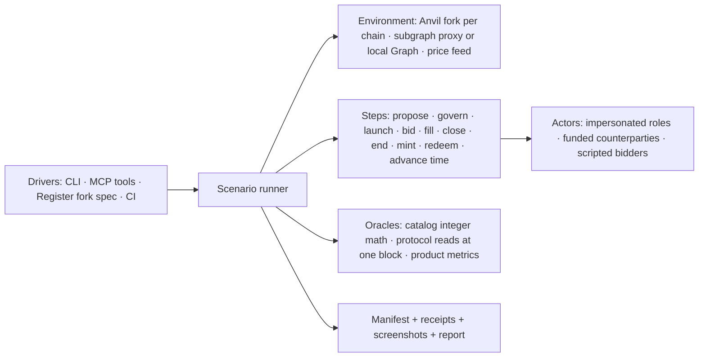

# Rebalance Lab — a standalone, agent-driven rebalance environment

**Status: specification, 2026-09-17. Nothing implemented under this plan yet.** Companion to the [v6 integration plan](index-dtf-v6-integration.md) (which owns the release-gate regression suite) and the [Register rebalance vertical](index-dtf-v6-register-rebalance.md) (which built the first fork lane).

## Goal

One environment, outside Register's test tree, where a person or an agent can take a real Index DTF at a pinned block, **propose a rebalance**, push it through governance, launch and fill auctions with scripted or live-priced counterparties, and read back what happened as protocol truth plus product metrics. The same environment is what Register, the SDK and the strategy bot test against, so "does this code change break rebalances" and "what would this rebalance proposal actually do" are the same run with different inputs.

Thesis in one line: a rebalance is a scenario, not a test; tests are scenarios with expectations attached.

## Current state

What exists today, and why none of it is the lab yet:

| Asset              | Where                                                                          | What it gives                                                                                                                                                                                         | What it lacks                                                                                                             |
| ------------------ | ------------------------------------------------------------------------------ | ----------------------------------------------------------------------------------------------------------------------------------------------------------------------------------------------------- | ------------------------------------------------------------------------------------------------------------------------- |
| Register fork lane | `register/e2e/fork/**`, `playwright.fork.config.ts`, `.claude/skills/fork-e2e` | Per-chain Anvil + Graph Node stack, impersonated launcher, production subgraph truncated at the fork block, one real UI launch verified with viem                                                     | Lives inside Register; scenario is a hand-written script; no proposal, no bids, no metrics; one DTF, one chain            |
| Protocol sandbox   | `index-protocol/script/sandbox/*` + codex skill `reserve-dtf-sandbox`          | Fresh v5/v6 fixtures on a mainnet fork, standard and optimistic governance lifecycles, upgrade spells, execution scenarios, a versioned fixture manifest with atomic writes and direct-RPC invariants | Mainnet only, fresh Folios only (no real source DTFs), Solidity-driven calldata (not the SDK's), no browser, no economics |
| SDK fork smoke     | `sdk/packages/sdk/src/index-dtf/fork-smoke*`                                   | Reads a fixture manifest and checks SDK encoding/reads against it                                                                                                                                     | Read-only consumer; cannot create state                                                                                   |
| Strategy bot       | `~/projects/dtf-strategy-bot`                                                  | A real autonomous proposer: weight changes through propose → vote → queue → execute → Dutch auctions, driven by a price signal                                                                        | Points at production; no sandbox to rehearse against; no way to compare strategies on the same state                      |
| Test catalog       | `index-dtf-v6-test-catalog.md`                                                 | 146 specified cases with independent oracles (integer bid math, price/target oracles, error maps)                                                                                                     | Specifications only; no runner                                                                                            |

The gap is a **scenario runner with actors, oracles and a proposal step**, packaged so that agents and CI call the same thing.

## Non-goals

- Replacing the offline Playwright suite: mocked, fast, deterministic UI coverage stays in Register.
- A price-prediction or strategy-optimization engine. The lab replays or scripts prices; strategies (the bot, an agent, a person) bring the intent.
- Mainnet execution of anything. The lab refuses non-loopback RPCs for writes, as the fork lane does today.
- Rebuilding the subgraph for every chain in phase 1. The truncating proxy is enough until indexed history itself is under test.

## Architecture



Layers, each its own module in one package (`packages/rebalance-lab`), no cross-feature imports:

1. **Environment** (`env/`). Owns the fork stack lifecycle per chain (the Compose files move here from `register/e2e/fork/docker`), the pinned block and hash, the subgraph strategy (proxy truncated at the fork block by default; local Graph Node profile when indexed history is the subject), and the price source (recorded API responses keyed by block, or a scripted vector). `doctor` refuses anything that is not loopback Anvil at the expected chain and hash.
2. **Scenario** (`scenario/`). A JSON document, schema-versioned like the sandbox manifest, describing source DTF, chain, fork block, actors, the proposal intent, the counterparty policy, time-advance rules and expectations. Scenarios are data; the runner is the only code that interprets them.
3. **Steps** (`steps/`). One function per protocol action, built on the SDK's public builders so the lab exercises the production calldata path: `buildIndexDtfBasketProposal` → `prepareIndexDtfSubmitProposal` / optimistic variant, vote/queue/execute through the real Governor and timelock (or the direct `REBALANCE_MANAGER` when the scenario declares `authority: direct` — labelled, never described as governance coverage), `prepareIndexDtfOpenAuction(Unrestricted)`, `getBidQuote` + `prepareIndexDtfBid`, trusted fills via the filler registry, close/end, mint/redeem, `evm_increaseTime`/`evm_mine`.
4. **Actors** (`actors/`). Impersonated role holders (funded with `anvil_setBalance`), counterparties funded by real token transfers from whales at the fork block (recorded in the manifest), and **bidders**: scripted policies that decide when and how much to bid from `getBid` quotes and a price vector (`fill-at-fair-value`, `fill-late`, `partial-then-walk`, `no-bidder`). Bidders are the part that turns "auction opened" into "rebalance happened".
5. **Oracles** (`oracles/`). Test-owned integer math from the catalog (§3.1 bid oracle, v4 vs v5/v6 branches; §3.2 price and target oracles), protocol reads pinned to one block, and product metrics: achieved basket vs target (per-asset error and dust), value traded, realized price vs start price, time to completion, rounds used, gas. Expected values never come from the SDK or the rebalance library.
6. **Report** (`report/`). Run manifest (schema v2 from the handoff §4.2: run identity, chain identity, candidate digests, fixtures, scenarios, operations, transitions, assertions, index proofs), receipts, optional screenshots, and one HTML report per run in the shape of the current evidence page.

Register keeps only a thin adapter: `playwright.fork.config.ts` and specs that point Register at a lab environment and drive the UI; the lab owns everything else. The strategy bot gets a `--lab <run>` mode that targets a lab environment instead of production.

## Scenario model

```jsonc
{
  "schemaVersion": 2,
  "name": "cmc20-nonce-12-what-if-tighter-caps",
  "source": {
    "chainId": 56,
    "address": "0x2f8A…6867",
    "forkBlock": 119967348,
    "forkBlockHash": "0x…",
  },
  "subgraph": { "mode": "proxy-truncated" },
  "prices": { "mode": "recorded", "at": "fork-block" },
  "actors": {
    "launcher": { "role": "AUCTION_LAUNCHER", "impersonate": true },
    "manager": { "role": "REBALANCE_MANAGER", "authority": "governance" },
    "bidders": [
      {
        "policy": "fill-at-fair-value",
        "fundFrom": "whale",
        "tokens": ["USDT", "BTCB"],
      },
    ],
  },
  "proposal": {
    "kind": "basket",
    "target": {
      "type": "shares",
      "tokens": [{ "address": "0x…", "share": 12.5 }, "…"],
    },
    "priceMode": "current",
    "windows": { "auctionLauncherWindow": 3600, "ttl": 86400 },
    "maxAuctionSizeUsd": 250000,
  },
  "plan": [
    { "step": "propose" },
    { "step": "govern", "through": "standard" },
    { "step": "launch", "by": "launcher", "percent": 98 },
    { "step": "bid", "policy": "fill-at-fair-value", "until": "auction-end" },
    { "step": "advance", "seconds": 1800 },
    { "step": "launch", "by": "launcher", "percent": 100 },
    { "step": "bid", "until": "auction-end" },
    { "step": "end" },
  ],
  "expect": {
    "finalBasketErrorBps": { "max": 25 },
    "dustPerAssetRaw": { "…": "…" },
    "catalogCases": ["RB-08.01", "RB-10.01", "RB-12.01"],
  },
}
```

The `proposal` block is what makes this more than a test harness: it is the same intent Register's propose-basket form or the strategy bot produces, and the lab turns it into calldata through the SDK, so a proposal can be rehearsed before it is ever submitted for real.

## Proposal simulation loop

1. Pin state: fork the source DTF at a block, record hash, versions, roles, basket, supply, fees, current rebalance and auction state (the S0 inventory record from the handoff §3.2).
2. Build the proposal with the SDK from the scenario intent; decode and diff it against the intent (token order, D18 shares, limits, windows, v6 nonce and deadline).
3. Execute governance: standard propose → vote (impersonated delegates at the snapshot) → queue → advance → execute, or the optimistic path where configured; or direct manager execution when the scenario says so.
4. Run the plan: launches (launcher or community), bidder policies filling from `getBid` quotes against the price vector, time advances, close/end.
5. Read outcomes at one block: final basket, per-asset error vs target, value traded, realized vs start prices, rounds, gas, plus the catalog invariants named in `expect`.
6. Write the manifest and report. A run is comparable to another run of the same scenario with a different `proposal` or `bidders`, which is how "what if we had tighter caps" or "what if nobody bids for an hour" get answered.

## Agent interface

Agents (Claude Code, codex, the strategy bot) drive the lab through the same runner people use:

- **CLI**: `lab up <chain>`, `lab inventory <dtf>`, `lab run <scenario.json>`, `lab step <run> <step>`, `lab state <run>`, `lab report <run>`, `lab reset <chain>`.
- **MCP server** exposing those verbs as tools with JSON schemas, plus `lab.compare <runA> <runB>`; loopback-only, impersonation always labelled in results, no write verb can target a non-Anvil endpoint.
- **Skill** (`skills/rebalance-lab.md`, replacing `.claude/skills/fork-e2e`): when to reach for the lab, how to write a scenario, how to read a report, the pinning rules (inside a real launcher window and before that nonce's real auctions when the proxy is in use).

Guardrails for agent runs: every write requires an `Actor` from the scenario; the runner records who signed what; a run cannot advance time past the fork block's window without declaring it; results are data, never instructions.

## Acceptance evidence

| Criterion           | Evidence                                                                                                                                                                                                                                                                                                              |
| ------------------- | --------------------------------------------------------------------------------------------------------------------------------------------------------------------------------------------------------------------------------------------------------------------------------------------------------------------- |
| Standalone          | `packages/rebalance-lab` builds and runs `lab run` with no import from Register; Register's fork spec imports the lab's client and passes unchanged.                                                                                                                                                                  |
| Proposal simulation | A scenario on CMC20 (v5) proposes a basket change, executes it through the real Governor on the fork, launches, fills with a scripted bidder, ends, and the report shows final basket error within the declared tolerance; a second run with a different `maxAuctionSizeUsd` produces a different, explained outcome. |
| Independent oracles | Bid amounts and targets asserted with the catalog's integer math; a mutation that flips ceil→floor in the SDK fails the run.                                                                                                                                                                                          |
| Agent-driven        | An agent session creates a scenario from a natural-language intent, runs it through MCP, and reports the metrics; the transcript shows only lab tools, no raw RPC.                                                                                                                                                    |
| Governance realism  | Standard and optimistic lifecycles on real source DTFs with real delegates impersonated at the snapshot; direct-manager runs labelled as such.                                                                                                                                                                        |
| Reuse               | The strategy bot rehearses one CCA transition against a lab run before the real proposal.                                                                                                                                                                                                                             |
| Safety              | Non-loopback write attempt refused with evidence; archive key never appears in a report.                                                                                                                                                                                                                              |

## Test seams

- Runner and steps: vitest against a fork (same env gating as the SDK fork smoke: `RUN_REBALANCE_LAB=1`).
- Oracles: pure vitest with the catalog vectors (§3.1 hand-calculated v4 and v5/v6 results).
- Scenario schema: zod, rejects unknown versions.
- Register UI: existing fork spec through the lab client.
- MCP: a tool-level test that runs a minimal scenario end to end.

## Slices

- Slice 1 — Extract: create `packages/rebalance-lab` in the interface hub (or its own repo, see decisions), move `e2e/fork/docker`, the wallet, proxy and prepare script into `env/`; Register's spec consumes the lab client; scenario schema v2 and manifest writer; `lab up/doctor/inventory/reset`. Blocked by: none.
- Slice 2 — Launch and bid on a real source DTF: steps for launch (launcher and community), `bid` with the `fill-at-fair-value` policy funded from a recorded whale, close/end; catalog bid oracle; report with metrics. Scenario: CMC20 nonce 12 window. Blocked by: 1.
- Slice 3 — Proposal simulation on v5: `propose` step through the SDK builder, standard governance lifecycle with impersonated delegates, `lab compare`. Scenario: a CMC20 what-if with two cap settings. Blocked by: 2.
- Slice 4 — Agent surface: CLI polish, MCP server, skill; the strategy bot's `--lab` mode. Blocked by: 3.
- Slice 5 — Three chains and cohort: chain profiles for 1 and 8453, the twelve cohort DTFs as source scenarios, CI lanes (this is where the release-gate suite from the integration plan starts running for real). Blocked by: 2.
- Slice 6 — v6 and upgrades: native v6 controls from the protocol sandbox bootstrap, upgrade scenarios, v6-only cases from the catalog. Blocked by: 3, 5.

## Decisions for Luis

| Decision                         | Options                                                                                                                                                                                                      | Recommendation                                                                                                                                                                                                |
| -------------------------------- | ------------------------------------------------------------------------------------------------------------------------------------------------------------------------------------------------------------ | ------------------------------------------------------------------------------------------------------------------------------------------------------------------------------------------------------------- |
| Where it lives                   | (a) `interface/packages/rebalance-lab` in the hub, consumed by Register via `link:` during dev; (b) new repo `reserve-protocol/dtf-rebalance-lab` published on npm; (c) inside the SDK monorepo as a package | (b). It depends on the SDK as a consumer, is used by Register, the bot and agents alike, and must never be part of Register's build. Start as (a) for one slice if publishing friction blocks slice 1.        |
| Subgraph on the fork             | (a) truncating proxy of production; (b) local Graph Node with a per-chain profile; (c) both, scenario-selected                                                                                               | (c), proxy default. Local Graph is needed only when indexed history is the subject (catalog RB-13) and is the expensive part; the proxy is honest for everything else, provided the pinning rule is followed. |
| Bidder realism                   | (a) scripted policies on `getBid` quotes; (b) replay real bids from the subgraph; (c) CoW-style solver simulation                                                                                            | (a) first, (b) as a policy in slice 2 for source DTFs that had real fills; (c) never inside the lab (external solver behaviour is an observational lane).                                                     |
| Where proposal intents come from | (a) scenario JSON; (b) Register's propose-basket form exported as intent; (c) the strategy bot; (d) an agent from a prompt                                                                                   | All four converge on the same intent shape; ship (a) and (d) first, (c) in slice 4, (b) is a small Register export later.                                                                                     |
| Governance actors                | (a) impersonate real delegates at the snapshot; (b) impersonate the timelock and execute directly; (c) both, labelled                                                                                        | (c). Real delegates prove the lifecycle; direct execution is the fast path for what-if runs and must be labelled `authority: direct`.                                                                         |
| CI                               | (a) nightly full scenarios; (b) PR-scoped single scenario; (c) both                                                                                                                                          | (c) once slice 5 lands; until then local and agent runs only.                                                                                                                                                 |

## Risks

- Cold fork reads on public archive endpoints are slow; the lab warms the source DTF's reads and records durations so slow runs are visible, not mysterious.
- Real delegate impersonation depends on vote-lock snapshots existing at the fork block; scenarios must inventory delegates before promising a standard lifecycle.
- Price realism: recorded API prices at the fork block are the honest default; anything scripted is a declared assumption in the report.
- Scope creep into a backtester: the lab answers "what does this proposal do on this state", not "which strategy is best over a year". The bot and any backtester sit on top.
