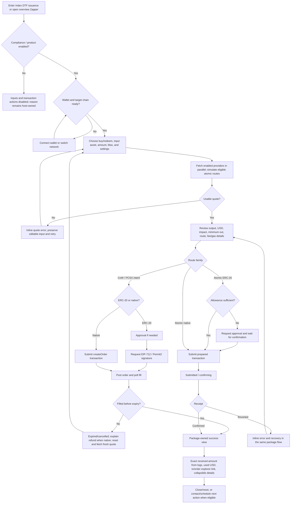
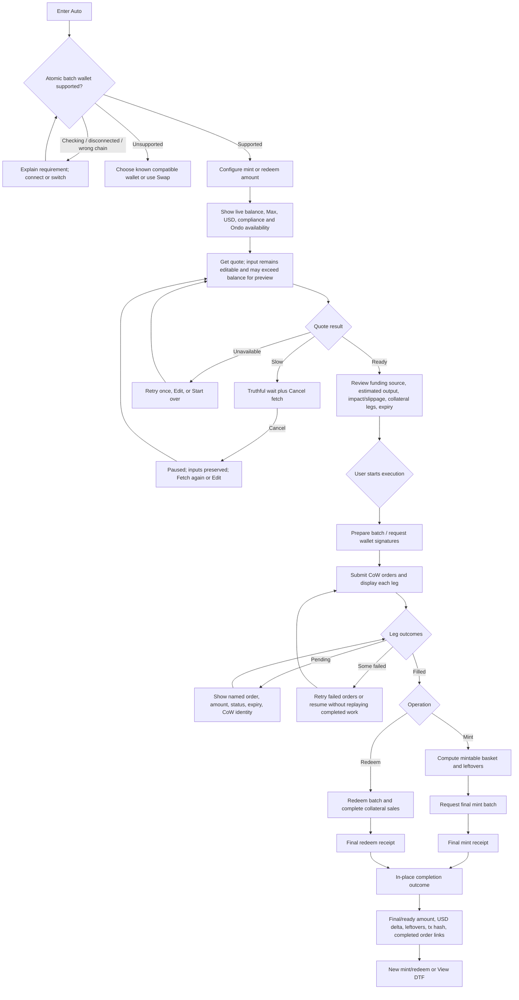
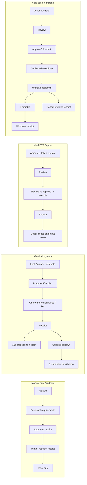
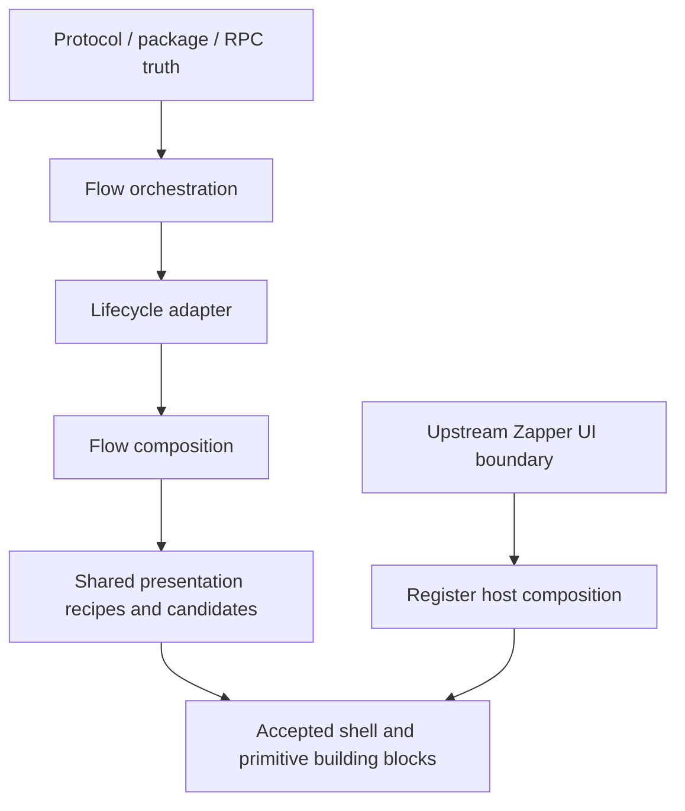

# Transaction system audit

**Status:** source-grounded audit; no implementation or migration authorized

**Date:** 2026-08-25

**Primary anchors:** Index DTF Zapper and automated mint/redeem

**Supporting coverage:** manual mint/redeem, vote lock/unlock/delegation, Yield DTF Zapper, and Yield DTF stake/unstake/withdraw

**Supplemental evidence:** Confirm Deploy, asset selection, and older direct Index DTF mint/redeem patterns

This document completes the transaction-system mapping requested by the Design
System V1 plan. It is a synthesis of current source, the installed Zapper
package contract, and accepted/provisional design-system authority. It does not
make any component canonical, authorize production migration, modify shared
defaults, or propose a universal transaction controller.

## 1. Executive summary

Register already has a recognizable transaction grammar, but it is distributed
across package-owned UI, shared legacy primitives, flow-local orchestration, and
several mutually inconsistent result treatments. The correct unification seam
is presentation grammar and state vocabulary—not one `TransactionFlow`
component and not one fixed amount of progress detail.

Five conclusions govern the next work:

1. **The two primary anchors prove different but compatible lifecycle needs.**
   The installed Index DTF Zapper owns a compact, mostly opaque flow that may be
   atomic or RFQ-based. Automated mint owns a transparent, resumable sequence of
   quote legs, order fills, and a final protocol transaction. They should share
   state words, action hierarchy, shell rules, transaction identity, recovery
   hierarchy, and outcome anatomy; they should not share orchestration or the
   same progress visualization.
2. **Outcome quality is the largest cross-flow design gap.** Index Zapper and
   automated mint retain consequential results in context. Manual issuance and
   vote-lock actions collapse results into toasts; Yield Zapper usually closes
   its review modal after a receipt; later withdraw/cancel actions provide only
   button-level processing. The absence of result detail in these flows is not
   evidence that the detail is unnecessary.
3. **“Success” currently means four different things.** It can mean an exact
   asset transfer, a confirmed protocol transaction, an intent/order fill, or
   only the start of a cooldown whose final withdrawal is still outstanding.
   The canonical vocabulary must keep `signed`, `submitted`, `confirmed`,
   `filled`, `cooldown started`, `claimable`, and `complete` distinct.
4. **Amount and asset-selection seams have multi-flow evidence, but are not yet
   canonical components.** The repeated anatomy is strong enough to create
   review candidates. The package Zapper remains an upstream boundary, and
   automated order legs, deploy basket editing, and delayed-settlement logic
   remain flow-owned.
5. **Two supplemental deploy findings are product-correctness risks, not visual
   refinements.** Simple deploy's outcome reads the manual `initialTokensAtom`
   rather than the simple quote/result amount, and manual deploy's one
   `hasBalanceAtom` is overwritten independently by every asset row. Both need
   engineer review before Confirm Deploy is used as an outcome or readiness
   reference.

The first visual review should therefore work backward from reliable outcomes
and truthful lifecycle labels, then pressure-test responsive shells. It should
not start by styling the current `TransactionButton`, copying the most detailed
automated-mint screen, or recreating package internals.

## 2. Coverage and confidence

### Audit boundary

| Flow                             | Role in audit | Source coverage                                                                                               | Confidence                                                | Important limitation                                                                              |
| -------------------------------- | ------------- | ------------------------------------------------------------------------------------------------------------- | --------------------------------------------------------- | ------------------------------------------------------------------------------------------------- |
| Index DTF Zapper                 | Primary       | Host integration, installed package `2.8.0` README/types, project Zapper wiki                                 | High for public behavior; medium for internal transitions | No live wallet/provider exercise; upstream internals are not a Register styling surface           |
| Automated mint/redeem            | Primary       | Provider/context, atoms, wallet gate, configure, quote/execution, order rows, result states, local area guide | High                                                      | Static trace only; no live CoW fill, expiry, RPC failure, or wallet rejection run                 |
| Manual mint/redeem               | Supporting    | Amount validation, basket requirements, approvals, execution, receipt watcher, result toast                   | High                                                      | No live multi-approval session                                                                    |
| Vote lock/unlock/delegate        | Supporting    | Drawer shell, quote views, warnings, SDK plan preparation, sequential calls, receipts, reset/close            | High                                                      | Protocol reason for the post-receipt ten-second delay is not documented in the UI source          |
| Yield DTF Zapper                 | Supporting    | Quote context, token selector, review modal, revoke/approve/execute sequence, receipt handling                | High                                                      | Legacy surface; outcome amounts were not verified from receipt logs                               |
| Yield DTF stake/unstake/withdraw | Supporting    | Page inputs, review modals, approve/execute, cooldown, claimable and cancel/withdraw surfaces                 | High for UI; medium for queue-index semantics             | No live multi-entry unstake queue or era transition                                               |
| Confirm Deploy                   | Supplemental  | Simple/manual modes, quote/approval/deploy, event parsing, success view                                       | High for traced code                                      | It is not promoted as visual authority; two correctness findings require engineering review       |
| Token/asset selection            | Supplemental  | Index deploy selector, Yield Zapper selector, package selector behavior                                       | High                                                      | Package rows are documented, not locally inspectable presentation contracts                       |
| Older direct Index mint/redeem   | Supplemental  | Source trace and import reachability search                                                                   | High that the inspected pattern is orphaned/legacy        | Absence of imports is static evidence, not a guarantee that no external build entry references it |

### Evidence register

The following references are the basis for claims in this report. Line numbers
refer to the audited working tree on the date above.

| ID  | Evidence                                                                                                                                                                  |
| --- | ------------------------------------------------------------------------------------------------------------------------------------------------------------------------- |
| A1  | `docs/plans/design-system-v1-history.md` — historical transaction-system frontier, non-goals, outcome requirements, and family resemblance                                |
| A2  | `docs/wiki/domains/design-system-reference.md` — detailed accepted Dialog direction, V1 components, and package-style containment                                         |
| A3  | `src/views/internal/design-system/modal-family-audit.ts:1-71` — modal jobs and outcome status                                                                             |
| A4  | `src/views/internal/design-system/component-catalog-primary.ts:200-240,538-599` — Transaction Action, Amount Field, and Asset Picker are mapped/open                      |
| A5  | `src/views/internal/design-system/component-catalog-support.ts:299-400` — Inline Message is provisional; Toast and Progress remain mapped/open                            |
| A6  | `src/views/internal/design-system/current-review.ts:1-34` — Current Review is empty                                                                                       |
| A7  | `src/views/internal/design-system/component-catalog-support.ts:538-573` — compact Lifecycle Status is an accepted, unadopted V1 candidate                                 |
| Z1  | `src/views/index-dtf/components/zapper/zapper-wrapper.tsx:16-80` — host-owned connection, locale, locked settings, schedule-call integration                              |
| Z2  | `src/views/index-dtf/issuance/index.tsx:22-69` — inline 420px issuance host, compliance disablement, and mode-switch lifecycle                                            |
| Z3  | `node_modules/@reserve-protocol/react-zapper/package.json` — installed version `2.8.0`                                                                                    |
| Z4  | `node_modules/@reserve-protocol/react-zapper/README.md:200-221` — provider selection, RFQ signatures, fill/expiry, and native-input refund behavior                       |
| Z5  | `node_modules/@reserve-protocol/react-zapper/README.md:312-326` — inline errors and exact receipt-log success result                                                      |
| Z6  | `node_modules/@reserve-protocol/react-zapper/README.md:417-432` — selector ordering and default selection                                                                 |
| M1  | `src/views/index-dtf/issuance/async-mint/index.tsx:14-76` — wizard routing and 476px-to-1200px responsive workspace                                                       |
| M2  | `src/views/index-dtf/issuance/async-mint/atoms.ts:30-82` — wizard state, quote cancel/halt, inputs, dust snapshot, reset                                                  |
| M3  | `src/views/index-dtf/issuance/async-mint/steps/configure-mint.tsx:44-127,140-271` — operation, compliance, balances, amount, Max, and advertised stages                   |
| M4  | `src/views/index-dtf/issuance/async-mint/steps/quote-summary.tsx:87-1248` — execution labels, quote states, retry/resume, errors, and actions                             |
| M5  | `src/views/index-dtf/issuance/async-mint/steps/quote-summary.tsx:1316-1595` — in-place completion, transaction identity, final/estimated amounts, leftovers, next actions |
| M6  | `src/views/index-dtf/issuance/async-mint/steps/quote-summary.tsx:1598-1736` — live/completed order panel and quote-empty/error states                                     |
| M7  | `src/views/index-dtf/issuance/async-mint/components/leg-row.tsx:56-280` — leg lifecycle, amounts, impact, and CoW identity                                                |
| M8  | `src/views/index-dtf/issuance/async-mint/steps/success.tsx:49-332` — duplicate result composition                                                                         |
| M9  | `src/views/index-dtf/issuance/async-mint/CLAUDE.md` — SDK ownership and test/state map                                                                                    |
| I1  | `src/views/index-dtf/issuance/manual/components/index-manual-issuance.tsx:44-269` — manual validation, execution, toast, errors, and shell                                |
| I2  | `src/views/index-dtf/issuance/manual/components/asset-list.tsx:37-338` — required/received assets, balances, approval and revoke rows                                     |
| I3  | `src/views/index-dtf/issuance/manual/components/approve-all-button.tsx:20-113` — batch approval progress and failed-item retry                                            |
| V1  | `src/components/vote-lock/drawer.tsx:32-99` and `src/components/vote-lock/components/drawer-footer.tsx:16-115` — three-mode drawer and delayed-unlock explanation         |
| V2  | `src/components/vote-lock/components/submit-lock-button.tsx:55-227` — SDK deposit plan, approval, receipt, ten-second processing, toast                                   |
| V3  | `src/components/vote-lock/components/submit-unlock-button.tsx:46-138` — redeem plan, cooldown start, processing delay, toast                                              |
| V4  | `src/components/vote-lock/components/submit-delegate-button.tsx:35-185` — validation, one/two sequential calls, receipt handling, toast                                   |
| Y1  | `src/views/yield-dtf/issuance/components/zapV2/context/ZapTxContext.tsx:84-400` — revoke/approval/execute state and receipt-close behavior                                |
| Y2  | `src/views/yield-dtf/issuance/components/zapV2/submit/ZapSubmitModal.tsx:18-105` and `ZapConfirm.tsx:9-31` — review composition and action sequence                       |
| Y3  | `src/views/yield-dtf/issuance/components/zapV2/submit/ZapConfirmButton.tsx:9-79` — submitted/failed labels and confirmation state                                         |
| S1  | `src/views/yield-dtf/staking/components/stake/confirm-stake-button.tsx:17-136` — approval, submission, explorer link, confirmation                                        |
| S2  | `src/views/yield-dtf/staking/components/unstake/confirm-unstake-button.tsx:17-105` — cooldown-start outcome and explorer link                                             |
| S3  | `src/views/yield-dtf/staking/components/unstake-delay.tsx:8-69` — initiate/wait/withdraw model                                                                            |
| S4  | `src/views/yield-dtf/staking/components/withdraw/available-unstake.tsx:46-82` and `cooldown-unstake.tsx:48-75` — withdraw/cancel actions                                  |
| S5  | `src/views/yield-dtf/staking/components/withdraw/updater.tsx:20-84` and `src/views/yield-dtf/staking/atoms.ts:20-56` — live pending queue and summary                     |
| D1  | `src/views/index-dtf/deploy/steps/confirm-deploy/index.tsx:49-168` — simple/manual Drawer and success replacement                                                         |
| D2  | `src/views/index-dtf/deploy/steps/confirm-deploy/simple/simple-deploy-button.tsx:17-156` — approval, deployment receipt, event extraction                                 |
| D3  | `src/views/index-dtf/deploy/steps/confirm-deploy/manual/components/deploy-assets-approvals.tsx:28-270` — per-asset balance/approval state                                 |
| D4  | `src/views/index-dtf/deploy/steps/confirm-deploy/success/index.tsx:35-109` — address and genesis-mint outcome                                                             |
| L1  | `src/views/index-dtf/overview/components/zap-mint/submit-zap.tsx:56-243` — older direct approval/transaction/toast pattern                                                |

### What was not done

- No browser, wallet, RPC, API, CoW order, or transaction was executed.
- No package source or local component was restyled.
- No authority document, Current Review entry, test, fixture, or production file
  was changed.
- The source plan's “transaction-system map, not started” progress label is now
  stale by completion of this audit, but remains intentionally unchanged under
  the single-file write boundary. Reconcile it only in a separately authorized
  authority/docs housekeeping pass.
- Dynamic focus, dismissal, screen-reader announcements, viewport behavior, and
  wallet-specific rejection copy remain to be pressure-tested visually and
  interactively.

## 3. Journey maps

### Primary: Index DTF Zapper

The package truthfully diverges after quote selection. An atomic quote has a
transaction receipt; an RFQ quote has a signed intent, an open-order wait, and
possibly an expiry/refund period. A single generic `pending` state would erase
material user risk. Register should consume the package as-is and align the host
shell/context around it, not duplicate these states locally. [Z1–Z6]

### Primary: automated mint/redeem

The visible system is transparent only where the SDK exposes real stages and
leg states. It does not need a fabricated percentage. Quote cancellation is an
escape from fetching, not cancellation of already posted orders. [M1–M7]

### Supporting flows: compact comparison

## 4. Flow-stage matrix

### Primary anchors

| Flow / stage                        | System state available                                                                   | Current UI                                                                                         | User need                                                                          | Gap or unnecessary exposure                                                                      | Correct owner                                              |
| ----------------------------------- | ---------------------------------------------------------------------------------------- | -------------------------------------------------------------------------------------------------- | ---------------------------------------------------------------------------------- | ------------------------------------------------------------------------------------------------ | ---------------------------------------------------------- |
| Index Zapper / entry                | DTF, chain, compliance, deprecation, wallet                                              | Inline package in a 420px host; host disables restricted actions and sell-only deprecated DTFs     | Know whether the task is available and why                                         | Host reason and package disabled state can feel like separate systems; preserve package API      | Host composition + package boundary                        |
| Index Zapper / prerequisites        | Wallet connection and active chain                                                       | Package action with host-provided connect callback                                                 | One direct instruction at a time                                                   | Align vocabulary with local flows; do not wrap with a second transaction action                  | Package-owned lifecycle; host supplies gateway             |
| Index Zapper / input                | Operation, token list, balances/prices, amount, Max, settings                            | Package amount/input-output composition; selector defaults to highest wallet USD holding           | Recognize asset/chain, enter precise amount, understand balance and controls       | No Register-side anatomy changes; use as evidence for shared local candidates                    | Package-owned                                              |
| Index Zapper / quote                | Parallel providers, simulation eligibility, min out, impact, gas, validity               | Winning route, output and details                                                                  | Know what is estimated, how long it is valid, and why this route won               | Route comparison can remain collapsed; validity/staleness language should align with other flows | Package-owned quote; shared vocabulary only                |
| Index Zapper / approval             | Spender and required allowance                                                           | Inline approval request and confirmation                                                           | Distinguish permission from purchase; know token and spender when detail is useful | Shared local flows need the same state words, not the same package component                     | Package orchestration; transaction-state grammar shared    |
| Index Zapper / atomic submit        | Prepared tx, wallet request, hash, receipt                                               | Inline wallet/submission/confirmation feedback                                                     | Know whether action is still required in wallet or already on-chain                | Avoid calling a confirmed receipt merely “submitted” in peer flows                               | Package orchestration; shared status vocabulary            |
| Index Zapper / RFQ intent           | Typed signature, order ID, validity, fill status; native refund path                     | Waiting-for-fill, order link, expiry/cancel reset, refund explanation                              | Understand that a signature is not a mined transaction and funds may settle later  | Generic spinner/action cannot represent this safely                                              | Package-owned RFQ presenter                                |
| Index Zapper / failure              | Quote/provider failure, rejection, revert, expiry/cancel                                 | Inline errors; fresh quote on expired/cancelled intent                                             | Preserve amount when safe; expose retry/edit and consequences                      | Host must not add a second toast that competes with package feedback                             | Package-owned; host observes only where public API permits |
| Index Zapper / outcome              | Exact output from logs, used USD, tx or order identity, details                          | Consequential success stays in package modal; optional contact/schedule                            | Verify what changed and leave with a useful next step                              | Strongest current outcome reference, but still upstream visual authority                         | Package-owned outcome; host-owned optional next action     |
| Automated / wallet gate             | Atomic batching support, connection, chain, compatible wallets                           | Dedicated gate with supported-wallet guidance and Swap escape                                      | Understand why Auto requires a specific wallet capability                          | Capability gate is flow-specific and should not become generic transaction chrome                | Flow-owned gate                                            |
| Automated / configure               | Live input/share balances, prices, compliance, Ondo pause                                | Mint/redeem tabs, amount, USD, balance/Max, two conceptual stages                                  | Enter amount and anticipate work                                                   | “Automatically acquire assets” is valid orientation; do not imply fixed duration                 | Flow composition using candidate amount anatomy            |
| Automated / quote loading           | Multiple leg queries and aggregate quote                                                 | Skeletons and named wait; after 20s offers Cancel                                                  | Know the app is working and retain an exit                                         | No elapsed/estimated time; truthful indeterminate wait is acceptable until data exists           | SDK/query + flow presenter                                 |
| Automated / quote cancelled         | Query polling halted; input atoms preserved                                              | Fetching paused with Fetch again/Edit                                                              | Know nothing was submitted and resume without re-entry                             | Correct recovery reference                                                                       | Flow-owned recovery recipe                                 |
| Automated / quote ready             | Legs, direct collateral, expected shares/output, price impact, expiry, existing balances | Review card plus optional orders panel                                                             | Compare funding, estimated result, risk, and expiry                                | Dense but justified; visual hierarchy should be reviewed, not reduced blindly                    | Flow composition                                           |
| Automated / execution start         | SDK preparation and wallet steps                                                         | Action label maps preparing, signing, confirming, filling, final signing, completion               | Know whether to act in wallet or wait                                              | One action can carry truthful named state because SDK exposes it                                 | SDK adapter + lifecycle presenter                          |
| Automated / order legs              | Per-leg quote/order state, order ID, actual/quoted amounts, impact, expiry               | Row per collateral swap; CoW links; pending/fulfilled/failed/expired/cancelled                     | Inspect and trust a long-running multi-order operation                             | Do not promote `LegRow`; it is specifically a CoW collateral-order record                        | Flow-owned                                                 |
| Automated / partial failure         | Completed and failed legs remain in SDK state                                            | Retry failed orders, Try again, resume without replaying completed work                            | Recover without losing successful work                                             | Strong reference for resumable failure; Start over consequence should remain explicit            | SDK orchestration + flow recovery                          |
| Automated / final mint/redeem       | Collateral readiness, final batch/hash/receipt                                           | Separate final action where required                                                               | Understand swaps alone are not the protocol result                                 | Stage names must say “ready to mint” versus “minted”                                             | Flow presenter                                             |
| Automated / outcome                 | Final batch hash, calculated output, order states, input delta, leftover collateral      | In-place completed state, explorer/copy, completed orders, New/View actions                        | Reconcile quote to result and account for leftovers                                | Completion identity is split across final tx and order links; needs one coherent outcome record  | Flow-owned outcome composition using shared result grammar |
| Automated / duplicate success route | `wizardStepAtom` admits `success`                                                        | Router renders a separate `Success`, but no audited source sets that step; actual result is inline | One trustworthy completion surface                                                 | Unreachable duplicate risks divergence and conflicting result fields                             | Keep current until engineering confirms, then remove/merge |

### Supporting and supplemental flows

| Flow / stage                          | System state available                                                      | Current UI                                                                            | User need                                                           | Gap or unnecessary exposure                                                                                     | Correct owner                                                 |
| ------------------------------------- | --------------------------------------------------------------------------- | ------------------------------------------------------------------------------------- | ------------------------------------------------------------------- | --------------------------------------------------------------------------------------------------------------- | ------------------------------------------------------------- |
| Manual issuance / configure           | Share amount, live wallet balances, required basket amounts, min outputs    | Amount card and full asset list                                                       | Know total goal and every asset obligation                          | Strong repeated requirement-row evidence; visual density is flow-specific                                       | Flow composition + candidate requirement row                  |
| Manual issuance / approvals           | Allowance per asset, USDT revoke need, batch progress/failures              | Per-token approve/revoke plus Approve All count and retry                             | Distinguish which permission failed and continue                    | Individual wagmi `isSuccess` can precede refreshed allowance; receipt semantics need engineer confirmation      | Approval orchestration remains current                        |
| Manual issuance / execute             | Prepared mint/redeem call, hash, receipt/error                              | Stable TransactionButton labels and inline error                                      | Know wallet-required versus confirming state                        | No persistent transaction identity                                                                              | Existing shared primitive during migration                    |
| Manual issuance / outcome             | Receipt plus precomputed asset requirements/minimums                        | Success toast with entered share amount; form resets                                  | Verify final shares/assets and tx                                   | Consequential result is reduced to transient copy; redeem outputs and hash disappear                            | New outcome composition candidate                             |
| Vote lock / configure                 | Lock/unlock quote, balance, rate, delay; delegate addresses                 | Drawer tabs, input/output, warnings, delegate fields                                  | Understand governance effect and withdrawal consequence             | Drawer geometry is legacy; content jobs are valid                                                               | Flow composition in responsive Dialog pressure test           |
| Vote lock / execute                   | SDK-prepared plan, optional approval/delegate, one/two calls, receipts      | TransactionButton labels current call; inline error                                   | Know each required signature/tx and which completed                 | Delegation can require two sequential calls but has no durable step record or partial-success result            | Flow-owned orchestration + shared status rows                 |
| Vote lock / post-receipt              | Successful receipt plus local optimistic state                              | Ten-second `Processing...`, then close and toast                                      | Know what the app is waiting for                                    | Opaque fixed delay after confirmation is unexplained and may misstate chain truth                               | Engineer-owned synchronization; presenter must be truthful    |
| Vote unlock / delayed follow-up       | Unlock initiated; N-day delay; later withdraw required                      | Preflight three-step explanation, then toast                                          | Retain amount, unlock time, claimable date, and return path         | Follow-up disappears after close; toast is not a durable delayed-state outcome                                  | Flow outcome + account position surface                       |
| Yield Zapper / configure and quote    | Input token/balance, amount, quote, impact, gas, dust, slippage, provider   | Legacy card, selector modal, refresh/settings                                         | Decide asset and route                                              | Useful coverage, not visual authority; local modal may stack with elite/contact modal state                     | Flow remains current pending replacement/deprecation decision |
| Yield Zapper / revoke/approve/execute | Revoke need, allowance, prepared tx, receipt                                | Review modal sequences buttons/status rows                                            | Know which permission/action is next                                | `Transaction Submitted` is displayed after a receipt exists; label conflates confirmation and submission        | Flow presenter                                                |
| Yield Zapper / outcome                | Receipt/status and quote result                                             | Usually closes review and resets immediately; expensive mint diverts to minter prompt | Verify actual received amount and transaction                       | No durable success result; quoted amount may be mistaken for actual                                             | Outcome candidate; receipt decoding requires engineering      |
| Yield stake / stake                   | Amount/rate, delegate, allowance, approval/execute hashes, receipt          | Review modal; approval row; explorer link; confirmed icon                             | Verify stake and resulting stRSR/delegate                           | Result retains quoted amounts but does not explicitly distinguish quoted versus receipt-derived                 | Flow outcome using shared transaction identity                |
| Yield stake / unstake initiate        | Amount/rate, delay, hash, receipt                                           | Review modal says cooldown started and links explorer                                 | Understand this is initiation, not withdrawal                       | Good state label; needs durable return/claimable context after modal closes                                     | Delayed outcome recipe                                        |
| Yield stake / cooldown                | RPC-read pending entries, amount, availability timestamp                    | Account page summarizes cooldown and offers Cancel                                    | Know amount and when it becomes claimable                           | Summary does not visibly show the actual timestamp/countdown in the compact card                                | Flow-owned queue view                                         |
| Yield stake / withdraw/cancel         | Queue boundary/index, tx hash/receipt                                       | Small action shows `Processing...`; receipt feedback delegated to watcher             | Confirm which entries changed and whether funds arrived/restaked    | No inline identity/result; index aggregation correctness needs engineering review                               | Flow-owned queue orchestration + shared action/result grammar |
| Confirm Deploy / shell and modes      | Validated form, chain, simple quote or manual basket                        | Right Drawer with simple/manual tabs; entire body replaced by success                 | Finish a long, consequential task without losing context            | Accepted V1 direction is wider centered Dialog on desktop and bottom sheet on phone; no Drawer exception proven | Flow composition + Dialog shell                               |
| Confirm Deploy / simple               | Quote, one input token, approval, deployment receipt, deploy event          | Swap-style input, approval/deploy TransactionButton                                   | Know route, genesis amount, deployment state                        | Success reads a different amount atom; event-not-found has no recovery                                          | Engineer-owned correctness before visual review               |
| Confirm Deploy / manual               | Required assets, each balance/allowance, approvals, deploy call             | Scrollable requirement list, batch approval, deploy footer                            | Know every blocking asset and permission                            | Shared `hasBalanceAtom` is overwritten by individual rows; may represent only the last update                   | Engineer-owned correctness before visual review               |
| Confirm Deploy / outcome              | Deployed DTF/DAO addresses, receipt logs, wallet asset action               | Congratulatory state with addresses, claimed genesis amount, next action              | Verify exact created entities, minted amount, tx, and configuration | Missing tx identity; simple amount claim can be wrong                                                           | Flow-owned outcome using candidate result anatomy             |
| Token selection                       | Search, token identity/address/chain, price support, selected set, balances | Yield modal and deploy Drawer use different rows/shells; package has its own selector | Safely distinguish assets, search by address, keep selected draft   | Shared local row/selection recipe is justified; package selector stays upstream                                 | Local candidate + package boundary                            |
| Older direct Index zap                | Prepared legacy ZapResult, approval, tx receipt, quoted output              | Source would toast “Swapped” then close/reset                                         | None if unreachable                                                 | No audited imports; duplicate legacy behavior should not influence V1                                           | Legacy current code; remove only in separate verified cleanup |

## 5. Lifecycle taxonomy

Duration and execution visibility are independent. A long operation is not
automatically transparent, and a transparent operation does not need a numeric
percentage.

| Class                     | Truth available                                                     | Examples                                             | Presentation rule                                                                                           | Never imply                                           |
| ------------------------- | ------------------------------------------------------------------- | ---------------------------------------------------- | ----------------------------------------------------------------------------------------------------------- | ----------------------------------------------------- |
| Near-instant atomic       | Wallet request, tx hash, receipt                                    | Manual mint/redeem, lock, delegate, stake, deploy    | Stable action; distinguish wallet request, submitted, confirming, confirmed; show inline recovery           | That wallet signature equals confirmation             |
| Opaque asynchronous       | Only request/fill status and perhaps expiry                         | Package RFQ fill; post-receipt synchronization delay | Name the real wait and expiry/refund consequence; use indeterminate motion only                             | Invented internal stages or percentage                |
| Transparent staged        | Named SDK steps and individual leg/order states                     | Automated mint/redeem                                | Show actual stage and per-leg state; preserve completed work; allow contextual retry/resume                 | Uniform duration per step or replay of completed work |
| Delayed / later claimable | Initiation receipt, unlock time, claimable state, final withdraw tx | Vote unlock; Yield unstake                           | Outcome says “started”; persist amount/date/status outside the modal; later action becomes “claim/withdraw” | That initiation is complete settlement                |

### Canonical state vocabulary candidate

These are semantic states, not a proposed enum or universal API.

| State                           | Meaning                                                                  | Preferred user language                                            | Recovery / next action                                       |
| ------------------------------- | ------------------------------------------------------------------------ | ------------------------------------------------------------------ | ------------------------------------------------------------ |
| Prerequisite blocked            | Wallet, chain, compliance, capability, or availability prevents progress | `Connect wallet`, `Switch to Base`, or consequence-specific reason | Satisfy prerequisite or use an explicit alternate flow       |
| Input ready                     | Valid amount and asset context are available                             | Consequence-specific action, such as `Get quote`                   | Edit amount/asset                                            |
| Quoting                         | No user wallet action is required; route/leg data is loading             | `Finding route…` / `Fetching collateral quotes…`                   | Wait; cancel only if cancellation is real                    |
| Quote ready                     | Estimate is actionable within its validity window                        | `Review mint` / `Start collateral trades`                          | Submit, refresh, or edit                                     |
| Quote stale/expired             | Estimate is no longer actionable                                         | `Quote expired`                                                    | Refresh while preserving safe input                          |
| Approval required               | Token permission is insufficient                                         | `Approve use of USDC`                                              | Submit permission transaction                                |
| Approval requested              | Wallet must still act                                                    | `Approve in wallet`                                                | Reject/cancel leaves user in review                          |
| Approval confirming             | Permission tx is submitted                                               | `Confirming approval`                                              | Wait or open explorer                                        |
| Signature requested             | Typed message or transaction awaits wallet signature                     | `Sign order in wallet` / `Confirm mint in wallet`                  | Reject returns to actionable review                          |
| Submitted                       | Hash/order exists; final result is unknown                               | `Transaction submitted` / `Order submitted`                        | Wait; expose identity when useful                            |
| Confirming                      | Chain receipt is pending                                                 | `Confirming transaction`                                           | Wait; explorer link                                          |
| Open intent                     | Off-chain order waits for fill                                           | `Waiting for order to fill`                                        | Show expiry and cancellation/refund semantics                |
| Partially fulfilled             | Some independent legs succeeded                                          | `3 of 5 orders filled`                                             | Retry only failed/resumable work                             |
| Confirmed                       | Receipt succeeded, but downstream follow-up may remain                   | `Mint transaction confirmed`                                       | Derive result; do not yet say complete if later work remains |
| Cooldown started                | Initiation confirmed and a time gate is active                           | `Unstaking started`                                                | Show claimable time, amount, and where to return             |
| Claimable                       | Time gate passed and final user action is available                      | `RSR ready to withdraw`                                            | Withdraw/claim                                               |
| Complete                        | All in-scope asset/permission/position changes are final                 | `Mint complete` / `Delegation updated`                             | Show result and useful next action                           |
| Recoverable failure             | Inputs and completed work remain valid                                   | Specific failure plus `Retry`, `Edit`, or `Resume`                 | Preserve safe state and explain retry scope                  |
| Terminal/reset-required failure | Continuing the current attempt is unsafe or impossible                   | Consequence-specific explanation                                   | Start over with explicit loss/reset scope                    |

“Success,” “done,” and a check icon are insufficient by themselves. Every flow
must choose the narrowest truthful terminal label.

## 6. Outcome matrix

| Flow / terminal state   | What actually changed                                                      | Reliable amount/result source                                       | Chain / transaction identity                  | Remaining work                                            | Current treatment                           | Required outcome direction                                                                             |
| ----------------------- | -------------------------------------------------------------------------- | ------------------------------------------------------------------- | --------------------------------------------- | --------------------------------------------------------- | ------------------------------------------- | ------------------------------------------------------------------------------------------------------ |
| Index Zapper atomic     | Input spent; output credited                                               | Exact output decoded from receipt logs; used USD                    | Explorer transaction link                     | None, unless optional contact/schedule                    | Package success view                        | Retain package behavior; align surrounding host only                                                   |
| Index Zapper RFQ        | Signed order filled; output credited                                       | Filled-order result                                                 | CoW/order explorer identity                   | None when filled; refund wait if native order expires     | Package success or expiry/reset explanation | Retain package distinction between fill and refund path                                                |
| Automated mint          | Orders acquired basket; final DTF mint confirmed; leftovers may remain     | SDK orders, balance snapshot/delta, final mint readiness/receipt    | Final mint tx plus individual CoW order links | None after final mint; leftovers remain wallet assets     | Strong in-place outcome                     | Reconcile final tx and order identities in one result hierarchy; label derived vs receipt-exact values |
| Automated redeem        | DTF redeemed; collateral sale orders settle to input token                 | SDK execution/order state and redeem batch receipt                  | Redeem tx plus CoW links                      | None only after all required sale legs                    | In-place outcome                            | State clearly whether receive amount is exact, derived, or still settling                              |
| Manual mint             | Basket assets spent; shares minted                                         | Receipt exists; UI currently repeats entered share amount           | Not shown in outcome                          | None                                                      | Toast then reset                            | Persistent/in-context result with minted shares, tx, and any permission residue                        |
| Manual redeem           | Shares burned; basket assets returned                                      | Precomputed minimums and receipt; actual transfers not surfaced     | Not shown                                     | None                                                      | Toast then reset                            | Show received assets when reliably decodable, share amount, tx, and any partial/edge state             |
| Vote lock               | Underlying deposited; vote-lock shares/power and possibly delegate changed | Receipt(s) and refreshed SDK state                                  | Not shown after close                         | None after synchronization                                | Ten-second wait then toast                  | Show amount, resulting voting position/delegate, tx(s), and truthful synchronization state             |
| Vote unlock initiated   | Vote-lock shares enter unlock process; rewards stop                        | Receipt plus unstaking delay                                        | Not shown after close                         | Return after N days and withdraw                          | Toast                                       | Durable delayed outcome with amount, claimable date, destination, and tx                               |
| Delegation updated      | Normal and/or fast delegate changed                                        | One or two receipts plus refreshed delegate state                   | Not shown                                     | None; partial success possible if only one call completed | Toast                                       | Show each changed delegate and tx; handle partial multi-call result explicitly                         |
| Yield Zapper            | Zap transaction confirmed                                                  | Quote plus receipt; exact transfer result not decoded in audited UI | Receipt exists but modal closes               | None for atomic route                                     | Close/reset, or expensive-mint prompt       | In-context result only after engineer defines reliable actual amounts                                  |
| Yield stake             | RSR deposited; stRSR and possibly delegate changed                         | Quote/rate plus execute receipt                                     | Explorer link shown                           | None                                                      | Confirmation remains in modal               | Keep in-context; identify quoted versus confirmed result and changed delegate                          |
| Yield unstake initiated | stRSR burned/queued; yield stops; cooldown active                          | Receipt plus RPC pending queue                                      | Explorer link shown                           | Wait, then withdraw; cancel may be possible               | `cooldown started` in modal                 | Persist queue amount and claimable time on account surface                                             |
| Yield withdraw          | Mature queue entries paid out                                              | Receipt plus refreshed RSR balance/queue                            | Not shown inline                              | None for withdrawn range                                  | Processing button / watcher feedback        | Show withdrawn amount/range, tx, remaining queue                                                       |
| Yield cancel unstake    | Pending queue entries restaked/cancelled                                   | Receipt plus refreshed queue/stake balance                          | Not shown inline                              | None for cancelled range                                  | Processing button / watcher feedback        | Show returned stake amount, tx, remaining queue                                                        |
| Confirm Deploy          | DTF and optionally DAO created; genesis shares minted                      | Deploy event(s), receipt logs, quote/manual input                   | DTF/DAO address links; no deployment tx link  | Add token or visit overview                               | Rich success view                           | Correct source-of-truth amount first; add tx identity and preserve created-entity summary              |

An outcome should include only reliable information, but reliability must be
actively established. If exact output is not derivable, label a value as
`Quoted`, `Minimum`, or `Estimated`; do not silently promote it to `Received`.

## 7. Component and recipe registry

Every entry below has exactly one classification. “Candidate” means evidenced
enough for a realistic visual/contract review, not accepted or authorized for
production.

| Registry item                                                                                                  | Exact classification                                                  | Evidence and disposition                                                                                                                                                                                                          |
| -------------------------------------------------------------------------------------------------------------- | --------------------------------------------------------------------- | --------------------------------------------------------------------------------------------------------------------------------------------------------------------------------------------------------------------------------- |
| V1 `Button`, `IconButton`, and `ActionGroup`                                                                   | **1 — existing V1 building block**                                    | Accepted action hierarchy/geometry can present actions; it must not own wallet or chain behavior                                                                                                                                  |
| V1 `Dialog` shell and anchored regions                                                                         | **1 — existing V1 building block**                                    | Accepted centered desktop and bottom-attached phone direction; outcome composition remains open                                                                                                                                   |
| V1 Field/TextInput, Tabs/Segmented Control, Link, Copyable Value, Skeleton, Spinner, and `LifecycleStatusPill` | **1 — existing V1 building block**                                    | Reuse their accepted contracts without widening them into transaction-specific APIs; the pill provides compact lifecycle meaning, not transaction orchestration                                                                   |
| Semantic text/surface/feedback recipes                                                                         | **1 — existing V1 building block**                                    | Use tokens/roles; feedback colors that remain provisional must stay declared provisional                                                                                                                                          |
| `TransactionButton` and `TransactionButtonContainer`                                                           | **2 — existing shared primitive**                                     | Existing wallet/network/action seam with broad use; preserve defaults and behavior until lifecycle mapping is implemented                                                                                                         |
| `SeamlessTransactionContainer`                                                                                 | **2 — existing shared primitive**                                     | Existing prerequisite interception and auto-retrigger behavior; do not merge casually with TransactionButton                                                                                                                      |
| Shared `Swap`, `TransactionInput`, legacy `Modal`, and shared Drawer                                           | **2 — existing shared primitive**                                     | Current reusable surfaces supply migration evidence; their current defaults are not V1 authority                                                                                                                                  |
| `useBatchApproval` and `useApproveAndExecute` behavior seams                                                   | **2 — existing shared primitive**                                     | Shared orchestration utilities; presentation changes must not rewrite permission or receipt behavior                                                                                                                              |
| Automated `QuoteSummary` and its in-place completion                                                           | **3 — current component that should remain current during migration** | Highest-fidelity local lifecycle; migrate around verified state seams before decomposition                                                                                                                                        |
| Manual issuance `AssetList` / `ApproveAllButton`                                                               | **3 — current component that should remain current during migration** | Preserves per-asset approval/revoke and retry behavior while candidates are reviewed                                                                                                                                              |
| Vote-lock submit components                                                                                    | **3 — current component that should remain current during migration** | SDK plans, sequential calls, optimistic update, and delay semantics are high-risk to restyle indirectly                                                                                                                           |
| Yield stake/unstake confirm components                                                                         | **3 — current component that should remain current during migration** | Approval/hash/receipt and delayed-start behavior must survive shell migration unchanged                                                                                                                                           |
| Transaction-action lifecycle presenter                                                                         | **4 — new shared candidate evidenced across multiple flows**          | Approval, wallet request, submitted, confirming, confirmed, failure, and explorer identity repeat across every local flow; it may compose the existing `LifecycleStatusPill`, but remains a presenter rather than an orchestrator |
| Local Amount object                                                                                            | **4 — new shared candidate evidenced across multiple flows**          | Input/output role, amount, asset identity, fiat equivalent, balance/Max, validation, precision, and quote loading recur in automated, manual, Yield Zap, stake, and deploy                                                        |
| Local Asset Picker trigger + searchable selection composition                                                  | **4 — new shared candidate evidenced across multiple flows**          | Yield Zap and deploy prove trigger/search/identity/address/balance/selection states; package selector is excluded from implementation authority                                                                                   |
| Approval/requirement row                                                                                       | **4 — new shared candidate evidenced across multiple flows**          | Manual issuance and manual deploy both need asset identity, required/balance, permission state, progress, and retry                                                                                                               |
| Transaction identity block                                                                                     | **4 — new shared candidate evidenced across multiple flows**          | Hash/order/address, chain, explorer, and copy repeat across automated, staking, deploy, and package outcomes                                                                                                                      |
| Consequential outcome summary                                                                                  | **4 — new shared candidate evidenced across multiple flows**          | Exact/estimated result, changed assets/position/permissions, identity, remaining work, and next action recur, with flow-owned content slots                                                                                       |
| Input → output stack                                                                                           | **5 — composition recipe only**                                       | Shared hierarchy and 8px composite rhythm; no universal props matrix or forced use for delegate/deploy-only flows                                                                                                                 |
| Review-and-commit dialog with stable footer                                                                    | **5 — composition recipe only**                                       | Summary/body/detail/error regions may change while the primary action remains anchored and stable                                                                                                                                 |
| Transparent stage list                                                                                         | **5 — composition recipe only**                                       | Used only when real steps exist; it can compose lifecycle rows but is not a generic Progress component                                                                                                                            |
| Delayed-settlement outcome                                                                                     | **5 — composition recipe only**                                       | Initiated amount, cooldown/claimable date, destination, and later action; shared recipe, flow-specific queue logic                                                                                                                |
| Selector Dialog with bounded list                                                                              | **5 — composition recipe only**                                       | Search/header, scroll ownership, selected draft, empty/loading states, and footer; shell adapts to phone                                                                                                                          |
| Automated Gnosis/batch-capability gate                                                                         | **6 — flow-owned**                                                    | Specific prerequisite and compatible-wallet guidance                                                                                                                                                                              |
| Automated CoW leg/order row and retry/resume policy                                                            | **6 — flow-owned**                                                    | Represents SDK-specific execution, order identity, and partial completion                                                                                                                                                         |
| Automated existing-collateral and dust accounting                                                              | **6 — flow-owned**                                                    | Depends on basket balances, fixed ratios, snapshots, and SDK semantics                                                                                                                                                            |
| Vote-lock normal/fast delegation editor and sequential plan                                                    | **6 — flow-owned**                                                    | Governance-specific addresses and plan semantics                                                                                                                                                                                  |
| Stake queue index, cancel, claimable, and withdraw orchestration                                               | **6 — flow-owned**                                                    | Contract queue/era semantics must not enter a generic lifecycle component                                                                                                                                                         |
| Confirm Deploy simple/manual mode logic, basket requirements, and event parsing                                | **6 — flow-owned**                                                    | Creation/configuration semantics and event truth are deploy-specific                                                                                                                                                              |
| `@reserve-protocol/react-zapper` amount, selector, quote, transaction, RFQ, error, and success UI              | **7 — upstream/package-owned**                                        | Register may configure public props and host context only; no local internal restyling or reimplementation                                                                                                                        |

The existing V1 catalog entries for Transaction Action, Amount Field, Asset
Picker, Inline Message, Progress, and outcome composition remain open after
this audit. This report adds source-grounded seams; it does not promote them.

## 8. Ownership and layering

| Layer                      | Owns                                                                                                                    | Must not own                                                               |
| -------------------------- | ----------------------------------------------------------------------------------------------------------------------- | -------------------------------------------------------------------------- |
| Protocol/package/RPC truth | Balances, allowances, simulation, transaction receipts, logs, order status, queue availability, SDK plans               | Copy hierarchy, shell geometry, optimistic claims not backed by state      |
| Flow orchestration         | Preparing calls, batching/sequencing, retries, resumption, order polling, event parsing, queue boundaries               | Global visual variants or a generic component's appearance                 |
| Lifecycle adapter          | Maps real flow state into truthful semantic labels, action-required/waiting distinction, identity and retry affordances | Starting transactions, decoding flow-specific economics, fabricating steps |
| Flow composition           | Which amounts, warnings, legs, settings, results, and next actions matter; what persists on dismiss                     | Reimplementing Button/Dialog/Field behavior or upstream package UI         |
| Shared candidates          | Amount anatomy, asset selection, status row, identity block, requirement row, outcome slots                             | Flow-specific SDK types, fixed step counts, protocol branching             |
| Composition recipes        | Input/output hierarchy, review layout, delayed outcome, transparent stage list, selector layout                         | Universal controllers, business state, mandatory information volume        |
| Shell                      | Focus, dismissal, scroll ownership, anchored regions, desktop/phone geometry                                            | Transaction meaning, automatic reset, package internals                    |
| Accepted primitives        | Control presentation, semantics, keyboard/focus behavior, semantic tokens                                               | Wallet/RPC calls or flow outcome decisions                                 |
| Upstream Zapper            | Its complete amount/selector/quote/atomic/RFQ/result lifecycle                                                          | Register V1 implementation contracts; local CSS overrides                  |

### Boundary rules

- A lifecycle presenter may accept normalized display state, label, detail,
  identity, and recovery action. It must not expose a universal `execute()` API.
- Flow orchestration stays beside the domain SDK/hooks. The presentation layer
  observes it and never infers transaction success from animation duration.
- A receipt is evidence of a confirmed call, not automatically evidence of the
  final user goal. The flow decides whether a later order fill, synchronization,
  cooldown, or withdrawal remains.
- Package-owned Zapper states are aligned by language and surrounding shell
  decisions only where its public contract permits.
- Shared candidates must prove their seam in at least two local flows and enter
  Current Review before becoming canonical.

## 9. Responsive shell matrix

| Flow                        | Current wider-screen shell                                                     | Current constrained behavior                             | V1 pressure-test direction                                                                                     | State / dismissal requirement                                                                       | Exception status                                                                  |
| --------------------------- | ------------------------------------------------------------------------------ | -------------------------------------------------------- | -------------------------------------------------------------------------------------------------------------- | --------------------------------------------------------------------------------------------------- | --------------------------------------------------------------------------------- |
| Index Zapper issuance       | Inline package inside 420px page host                                          | Full-width inline host                                   | Keep inline on issuance; retain package's evidenced compact modal where modal mode is used                     | Package owns close/reset; host must not remount a second instance on the route                      | **Package exception retained**: compact package-owned geometry and dense 8px edge |
| Automated mint/redeem       | Page-embedded 476px configure surface expanding to 1200px paired review/orders | Stacked page content; orders panel below and collapsible | Retain progressive page workspace, narrow-to-paired expansion                                                  | Route leave/disconnect reset is explicit; executing mode switch stays hidden                        | **Page-workflow exception retained**; not a Dialog candidate                      |
| Manual mint/redeem          | Page split with issuance form and asset requirements                           | Stacked/scrolling page composition                       | Retain focused page flow; apply local candidates only after review                                             | Preserve amount on recoverable errors; reset only on verified completion/user action                | No overlay migration required                                                     |
| Vote lock/unlock/delegate   | Right-side Drawer                                                              | Current Drawer adaptation                                | Centered desktop task Dialog; full-width bottom-attached phone Dialog                                          | Tabs and inputs reset on close; pending calls need guarded dismissal/return context                 | No Drawer exception established                                                   |
| Yield DTF Zapper            | Page card plus 440px legacy review Modal and selector Modal                    | Legacy modal behavior                                    | Keep page card; use one responsive review Dialog and one non-nested selector surface if flow remains supported | Quote refresh on review close; do not close away a consequential outcome                            | No legacy Modal authority                                                         |
| Yield stake/unstake         | Page card plus 440px legacy review Modal                                       | Legacy modal behavior                                    | Centered desktop task Dialog; bottom-attached phone                                                            | Amount resets on close; cooldown result must survive outside modal                                  | No Drawer exception needed                                                        |
| Yield cooldown/withdraw     | Account-page cards                                                             | Stacked cards                                            | Keep durable page/account surface; actions may use inline confirmation status                                  | Queue state persists across visits; no modal-only follow-up                                         | Page-owned delayed state                                                          |
| Confirm Deploy              | Right Drawer with simple/manual tabs and success replacement                   | Drawer/bottom behavior                                   | Wider centered desktop task Dialog; bottom-attached phone; one width across task/result                        | Long body scrolls; header/footer anchored; success remains in same lifecycle; guard pending dismiss | No Drawer exception established                                                   |
| Local token/asset selectors | Yield legacy Modal; deploy right Drawer                                        | Varies                                                   | Centered selection Dialog with bounded list; bottom-attached phone                                             | Preserve search/selection draft according to caller; no nested dialogs                              | One selector composition, not Drawer authority                                    |
| Package Zapper selector     | Package-owned                                                                  | Package-owned                                            | No Register migration                                                                                          | Package owns focus/state/reset                                                                      | Upstream boundary                                                                 |

Responsive consistency means the same task hierarchy and state survive a shell
change. It does not mean every transaction becomes a modal. Page workflows may
remain pages, compact package UI remains package UI, and durable claimable state
belongs on an account/page surface rather than inside a temporary overlay.

## 10. Ranked gaps and review order

### P0 — correctness and truthful completion

1. **Confirm Deploy can claim the wrong genesis amount in simple mode.** The
   simple transaction uses its quote/input state, while `SuccessView` reads
   `initialTokensAtom`, whose manual-flow default is `1`. Do not use this outcome
   as visual authority until the result source is corrected. [D2, D4]
2. **Manual deploy readiness can represent only the last asset row to update.**
   Every `TokenBalance` writes one shared `hasBalanceAtom` boolean. An earlier
   insufficient asset can be overwritten by a later sufficient asset, enabling
   the deploy simulation/action incorrectly. [D3]
3. **Yield unstake enablement needs confirmation.** The open button uses
   `disabled={!isValid && isAvailable}`; when trading is unavailable an invalid
   amount can leave the action enabled. Confirm intended protocol behavior and
   trading-pause exception before migration.
4. **Outcome labels must not outrun evidence.** Yield Zapper closes on a receipt
   without deriving exact received amounts; automated redeem and deploy outcomes
   must explicitly identify which values are exact, derived, quoted, or minimum.

### P1 — lifecycle, recovery, and consequential outcomes

5. **Unify state vocabulary while preserving orchestration.** Remove semantic
   collisions such as Yield Zapper's receipt-present `Transaction Submitted`,
   toast-level `successful`, and cooldown initiation presented as an end state.
6. **Give consequential local flows in-context outcomes.** Manual issuance,
   vote lock/delegation, Yield Zapper, and withdraw/cancel need useful result,
   identity, remaining-work, and next-action treatment proportional to impact.
7. **Make delayed settlement durable.** Unlock/unstake initiation must leave an
   account-visible amount, claimable date/status, destination, and final action;
   the user should not have to remember a toast.
8. **Explain or remove opaque post-receipt waits.** Vote lock/unlock waits ten
   seconds after a successful receipt before closing. The UI must name the real
   synchronization if it is required; elapsed time is not a state.
9. **Consolidate automated-mint completion.** The real outcome is in
   `QuoteSummary`; the separate `Success` route appears unreachable in the
   audited source and duplicates result logic. Confirm this before removing it.
10. **Make multi-call partial success explicit.** Delegation may submit normal
    and fast-delegate calls sequentially. A failure after the first receipt must
    not be summarized as a total failure or blindly replay confirmed work.
11. **Define cancellation scope.** Automated mint cancels quote fetching and can
    retry failed orders, while package RFQ can expire/cancel orders. Copy and
    actions must say exactly what is being cancelled and what remains live.

### P2 — shared presentation and responsive consistency

12. **Review the lifecycle presenter candidate in real flows.** It should consume
    Button/Link/Copyable Value/Spinner and support transaction or order identity,
    but remain orchestration-free.
13. **Review Amount and Asset Picker candidates locally.** Use automated/manual,
    stake, Yield Zap, and deploy evidence; do not copy or style package internals.
14. **Pressure-test task Drawers as responsive Dialogs.** Vote lock and Confirm
    Deploy have no established desktop-edge exception. Preserve behavior before
    changing geometry.
15. **Resolve Inline Message and outcome composition in context.** The isolated
    tone grid remains provisional; use real quote failure, approval failure,
    cooldown initiation, and confirmed outcomes as surrounding content.
16. **Do not let legacy direct Index zap set V1 precedent.** It appears
    unreferenced and provides only a toast/close result. Verify reachability in a
    separate cleanup before deletion.

### Recommended review order

1. Engineer triage of P0 findings and result-source truth.
2. Outcome and lifecycle vocabulary board using one atomic, one RFQ, one staged,
   and one delayed flow.
3. Automated-mint staged/recovery board.
4. Responsive Dialog pressure test for vote lock and Confirm Deploy.
5. Candidate contract review for lifecycle row, amount object, selector, identity,
   requirement row, and outcome composition.

## 11. Post-audit visual boards

These are the only recommended next visual artifacts. They should use
deterministic fixtures and enter the existing lab review process; none should
wire production.

### Board 1 — action-to-outcome truth spectrum

**Purpose:** establish shared words, hierarchy, and outcome anatomy without
forcing the same information volume.

Show side-by-side:

- manual mint: approval required → wallet request → confirming → confirmed
  receipt → consequential outcome;
- Index Zapper atomic and RFQ: transaction versus signature/order/fill;
- Yield Zapper: current receipt-close behavior beside a proposed evidence-safe
  result whose actual amounts are deliberately marked unknown until engineering
  confirms decoding;
- failure/retry and rejection states with input preserved.

Judge action stability, user-action versus waiting language, transaction/order
identity, exact/estimated labels, next actions, and Inline Message prominence.
Do not restyle the package fixture; render it as a reference capture/description.

### Board 2 — transparent automated execution

**Purpose:** validate the richest legitimate lifecycle without turning it into
the default for instant flows.

Fixtures:

- quote loading after the slow threshold with cancel;
- quote cancelled with input preserved;
- ready quote with direct collateral and three orders;
- two filled / one failed with retry scope;
- collateral ready and final mint signature required;
- completed mint with final transaction, order identities, input delta, and
  leftover collateral.

Judge narrow/collapsed and wide/expanded workspace states, long token values,
stable primary action, scroll ownership, state/status hierarchy, and whether
the outcome makes derived versus confirmed values explicit.

### Board 3 — delayed settlement across visits

**Purpose:** make initiation, waiting, claimability, cancellation, and final
withdrawal one coherent system.

Fixtures:

- vote unlock and Yield unstake review before submission;
- initiation confirmed with amount, tx, and claimable date;
- durable account state with multiple pending entries;
- claimable state with Withdraw;
- cancel unstake confirming and confirmed;
- final withdrawal with remaining queue entries.

Judge date/countdown language, return destination, persistent versus transient
feedback, multi-entry summary, and exact completion boundaries.

### Board 4 — responsive task and selector shells

**Purpose:** pressure-test accepted shell direction with existing behavior intact.

Render desktop and phone pairs for:

- vote lock/unlock/delegate;
- Confirm Deploy simple/manual plus success;
- local token selector with loading, unlisted/unsupported, selected, and long
  identity states.

Use centered desktop Dialog and bottom-attached phone Dialog, anchored
header/body/footer regions, 24px ordinary axes, and bounded list scrolling.
Include current Drawer screenshots only as comparison evidence. Do not add a
Drawer exception unless the centered version demonstrates a named loss of
context or usability.

## 12. Engineer-review questions

**Engineer review required.** The following questions affect on-chain math,
transaction truth, SDK contracts, permissions, or protocol state and must be
answered before visual candidates become implementation plans.

1. For every local flow, which values can be decoded exactly from receipt logs,
   which must come from refreshed RPC state, and which remain quote/minimum
   values? In particular: automated redeem, Yield Zap, manual redeem, staking,
   and Confirm Deploy.
2. Does the automated SDK expose one authoritative operation result containing
   final transaction identity, every order identity, exact output, fees, dust,
   and leftovers, or must the UI reconcile several sources? Which source wins
   after a refresh/re-entry?
3. Is the automated-mint `success` wizard step intentionally dormant? If not,
   where should it be entered? If yes, can the duplicate component be removed
   after verifying no external setter exists?
4. What cancellation is supported after automated CoW orders have been posted?
   Can a user cancel, or only wait/expire/retry failed legs? Which completed
   state is safe to resume after reload?
5. Does the installed Zapper expose public lifecycle/result callbacks sufficient
   for host analytics or surrounding outcome context without duplicating its UI?
   If not, any change belongs upstream.
6. What real synchronization requires the ten-second delay after vote-lock and
   unlock receipts? Can refreshed SDK/RPC state replace the timer, and what
   should happen if refresh fails?
7. When optimistic governance delegation requires two calls, can the second
   fail after the first confirms? How is partial success detected and resumed
   without resubmitting the confirmed call?
8. Do manual per-token approval buttons wait for mined receipts or only wallet
   submission? Should readiness depend exclusively on refreshed on-chain
   allowance rather than local `isSuccess`?
9. Confirm the P0 deploy findings: should simple success derive minted shares
   from `ZapResult.amountOut`/receipt logs rather than `initialTokensAtom`, and
   should manual balance readiness be an `every(asset)` derivation rather than
   row-owned writes?
10. If deploy receipt parsing finds no `FolioDeployed` event, what recovery and
    transaction identity should the user receive? Can deployment have succeeded
    while the UI remains in the pending drawer?
11. Is Yield unstake intentionally allowed while trading is unavailable, and if
    so should the button condition be `!isValid` independently of availability?
12. For multi-entry Yield unstake queues, are the summary's `index`,
    `availableIndex`, and `index + 1n` boundaries correct for cancel and withdraw?
    How should mixed pending/claimable entries and draft-era changes be grouped?
13. After unstake initiation, what live RPC state is authoritative for amount
    and claimable time, and what polling/refetch event guarantees the durable
    account surface updates without depending on subgraph lag?
14. Which flows may be safely dismissed during wallet request, submission,
    confirmation, open RFQ order, or cooldown? What state can be reconstructed
    on return, and what must remain guarded in the current session?
15. Which transaction outcomes are routine enough for Toast only? The proposed
    default is that permission-only acknowledgement may be transient, while an
    asset/position/ownership change with useful detail remains in context.

Until these questions are answered, this audit authorizes only deterministic
lab boards and review of presentation seams. It does not authorize production
migration, shared-default changes, package overrides, or transaction behavior
changes.
