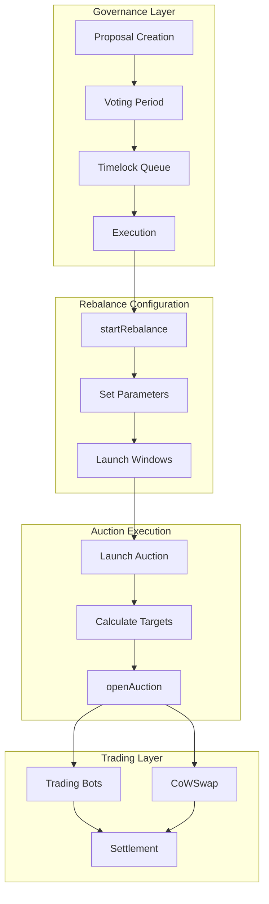

# Index DTF Rebalance v4 Specification

## Table of Contents

1. [Overview](#overview)
2. [Key Terminology](#key-terminology)
3. [Rebalance Architecture](#rebalance-architecture)
4. [Governance-to-Rebalance Flow](#governance-to-rebalance-flow)
5. [Rebalance Lifecycle](#rebalance-lifecycle)
6. [Auction Mechanism](#auction-mechanism)
7. [Price Discovery and Calculations](#price-discovery-and-calculations)
8. [Technical Implementation](#technical-implementation)
9. [Security Considerations](#security-considerations)
10. [Key Differences: v2 vs v4](#key-differences-v2-vs-v4)

## Overview

The Index DTF Rebalance v4 is a governance-driven mechanism for adjusting token basket compositions in a decentralized manner. It streamlines the rebalancing process from v2's multi-transaction approach to a single atomic execution, while introducing enhanced controls for market conditions and execution timing.

### Core Design Principles

- **Single-transaction execution**: One governance proposal executes the entire rebalance
- **Dual-window system**: Exclusive launcher period followed by permissionless access
- **Price volatility controls**: Configurable tolerance for different asset types
- **Progressive rebalancing**: Ability to partially rebalance to minimize market impact

## Key Terminology

### DTF Types

- **Tracking DTFs** (`weightControl = false`): Maintain fixed token units regardless of price changes
- **Native DTFs** (`weightControl = true`): Maintain percentage allocations, adjusting units as prices change

### Rebalance States

- **Initial Folio**: Basket composition at proposal creation time
- **Current Folio**: Present basket composition
- **Target Basket**: Desired composition after rebalancing

### Progression Metrics

- **Initial Progression**: Starting position of the rebalance on an absolute scale (>0% at start)
- **Absolute Progression**: Mathematical distance on an absolute scale from 0% (no value in correct tokens) to 100% (all value in correct tokens)
- **Relative Progression**: User-visible progress from initial progression to current state (0% at start of rebalance, 100% at completion)
- **Relative target**: User-selected target for how much of the gap to close (0-100%)
- **Target**: User-selected target on an absolute scale

### Price Formats

- **D27 Format**: BigInt prices with 27 decimal places for precision
- **Geometric Mean**: Method for calculating fair price from low/high ranges by taking the square root of the product
- **Price Volatility**: Acceptable price deviation during execution (LOW/MEDIUM/HIGH/DEGEN)

## Rebalance Architecture



### Key Contracts and Functions

```solidity
// Main rebalance functions in DTFIndexV4
function startRebalance(
    address[] tokens,              // New basket tokens
    Range[] weights,              // Target weight ranges
    PriceRange[] prices,          // Initial price ranges
    Range limits,                 // Rebalance limits
    uint256 auctionLauncherWindow, // Exclusive period
    uint256 ttl                   // Time to live
) external onlyGovernance;

function openAuction(
    uint256 rebalanceNonce,
    address[] tokens,             // Auction tokens, subset of tokens in the rebalance
    Range[] newWeights,           // New weight ranges for auction tokens, subset of weights in the rebalance
    PriceRange[] newPrices,       // New price ranges for auction tokens, either exactly equal to initial prices or a subset, depending on priceControl
    Range newLimits               // New rebalance limits for auction tokens, subset of initial limits in the rebalance
) external;
```

## Governance-to-Rebalance Flow

### 1. Proposal Creation

Users create a basket change proposal containing:

```typescript
{
  type: 'basket',
  targets: [dtfAddress],        // DTF contract to rebalance
  values: [0],                  // No ETH transfer
  calldatas: [encodedStartRebalance], // Encoded function call
  description: "Change basket composition to..."
}
```

### 2. Voting Process

1. **Submission**: Proposer must meet voting power threshold
2. **Voting Delay**: Period before voting starts
3. **Voting Period**: Token holders vote (For/Against/Abstain)
4. **Success Criteria**: Meet quorum + majority support

### 3. Execution

After timelock period, anyone can execute the proposal, which:

- Validates no active rebalance exists
- Sets rebalance parameters in contract
- Starts the auction launcher window

## Rebalance Lifecycle

### Phase 1: Configuration Storage

```typescript
interface RebalanceConfig {
  nonce: bigint // Unique identifier
  tokens: Address[] // Basket tokens
  weights: {
    // Target allocations
    low: bigint
    spot: bigint // Estimate (unused in calculations)
    high: bigint
  }[]
  initialPrices: {
    // Price snapshot at proposal
    low: bigint // D27 format
    high: bigint // D27 format
  }[]
  limits: {
    // Overall bounds
    low: bigint
    spot: bigint
    high: bigint
  }
  inRebalance: boolean // Active flag
  startedAt: bigint // Start timestamp
  restrictedUntil: bigint // End of launcher window
  availableUntil: bigint // Expiration
  priceControl: bigint // 0=fixed prices, 1=adjustable
}
```

### Phase 2: Launch Windows

1. **Auction Launcher Window** (`startedAt` to `restrictedUntil`)

   - Only designated auction launchers can start auctions
   - Allows professional market makers to optimize execution
   - Duration set in proposal (e.g., 24-48 hours)

2. **Community Window** (`restrictedUntil` to `availableUntil`)
   - Any user can launch auctions
   - Ensures decentralization if launchers fail to act
   - Can be disabled by setting to 0
   - Does not allow manipulation of weights or prices

### Phase 3: Auction Rounds

Auctions typically proceed through rounds based on rebalance complexity. Rounds are not formally defined within the onchain protocol, and rounds can repeat any number of times.

```typescript
enum AuctionRound {
  EJECT = 0, // Priority: Remove tokens from basket
  PROGRESS = 1, // Priority: Rebalance continuing tokens
  FINAL = 2, // Priority: Fine-tune to exact targets
}
```

- **EJECT**: Used when tokens are being removed
- **PROGRESS**: Standard rebalancing
- **FINAL**: Minor adjustments

### Phase 4: Trade Execution

1. **Auction Opening**: Launcher calls `openAuction` with calculated parameters
2. **Bidding**: Trading bots and CoWSwap solvers submit bids
3. **State Update**: Basket composition updates on-chain

## Auction Mechanism

### Target Basket Calculation

The system calculates target baskets differently based on DTF type:

```typescript
// For Tracking DTFs: Use current prices to maintain constant units
// For Native DTFs: Use snapshot prices to maintain constant percentages
const targetBasket = getTargetBasket(
  rebalance.weights,
  isTrackingDTF ? currentPrices : snapshotPrices,
  decimals
)
```

### Rebalance Percent Slider

The UI provides a slider (0-100%) that controls:

- **0%**: No rebalancing performed
- **50%**: Move halfway from `initialProgression` to `target`
- **100%**: Full rebalance to `target`

This enables gradual rebalancing to minimize market impact. Typically the 90% (relative) point is targeted, though this can be varied by the slider.

### Price Volatility Settings

```typescript
const AUCTION_PRICE_VOLATILITY = {
  LOW: 0.02, // 2% - For stablecoins and pegged assets
  MEDIUM: 0.05, // 5% - For major cryptocurrencies
  HIGH: 0.1, // 10% - For volatile/small-cap tokens
  DEGEN: 0.5, // 50% - For degen tokens
}
```

These settings account for potential price movements between proposal creation and execution.

## Price Discovery and Calculations

### Initial Price Calculation

Prices are calculated from the proposal's price ranges using geometric mean, and assuming nanoUSD prices:

```typescript
function calculatePriceFromRange(
  priceRange: { low: bigint; high: bigint },
  tokenDecimals: number
): number {
  // Convert nanoUSD D27 BigInt to decimal with precision
  const lowPrice = Number(formatUnits(priceRange.low, 36))
  const highPrice = Number(formatUnits(priceRange.high, 36))

  // Geometric mean for fair average
  const avgPricePerToken = Math.sqrt(lowPrice * highPrice)

  // Convert to whole token price
  return avgPricePerToken * Math.pow(10, tokenDecimals)
}
```

### Price Control Mechanism

- **priceControl = 0**: Prices fixed at proposal values
- **priceControl = 1**: `getOpenAuction()` can narrow price ranges based on current market conditions
- **priceControl = 2**: Atomic swap case, permitted to set startPrice == endPrice. Currently unused.

## Technical Implementation

### Frontend Components

```
/views/index-dtf/auctions/views/rebalance/
├── components/
│   ├── rebalance-header.tsx      // Status and proposal info
│   ├── rebalance-setup.tsx       // Percent slider control
│   ├── launch-auctions-button.tsx // Auction launcher
│   ├── rebalance-auctions.tsx    // Active auctions list
│   └── rebalance-metrics.tsx     // Progress visualization
├── hooks/
│   ├── use-rebalance-params.ts   // Fetch chain data
│   └── use-rebalance-auctions.ts // Query subgraph
└── utils/
    └── get-rebalance-open-auction.ts // Core calculations
```

### State Management

```typescript
// Core atoms for rebalance state
rebalancePercentAtom // Target percent (0-100)
rebalanceMetricsAtom // Calculated progress
rebalanceAuctionsAtom // Active auction list
currentRebalanceAtom // Active rebalance data
isAuctionOngoingAtom // Auction status
priceVolatilityAtom // Selected volatility

// Derived atoms
rebalancesByProposalAtom // Map proposals to rebalances
rebalanceTokenMapAtom // Token address lookups
```

### Data Flow

1. **Blockchain Data**: Contract reads via wagmi hooks
2. **Subgraph Data**: Auction history and bids via GraphQL
3. **Price Data**: Oracle feeds and historical snapshots
4. **UI Updates**: 30-second refresh intervals during active auctions

## Security Considerations

### Access Control

1. **Rebalance Initiation**: Only through governance proposals
2. **Auction Launching**:
   - Restricted period: Only designated launchers
   - Permissionless period: Anyone can launch
3. **Single Active Rebalance**: Mutex prevents concurrent rebalances

### Economic Security

1. **Price Bounds**: Trades must execute within configured ranges
2. **Slippage Protection**: Target < 1% price impact
3. **MEV Protection**: CoWSwap batch auctions resist frontrunning
4. **Time Bounds**: Rebalances expire at `availableUntil`

### Validation Checks

```typescript
// Proposal validation
- Token whitelist verification
- Weight sum equals 100%
- Price ranges are reasonable

// Execution validation
- No active rebalance exists
- Caller has appropriate role
- Within time windows

// Trade validation
- Price within volatility bounds
- Sufficient liquidity
- Gas optimization
```

## Key Differences: v2 vs v4

### Execution Model

| Aspect            | v2                              | v4                           |
| ----------------- | ------------------------------- | ---------------------------- |
| Proposal Type     | Multiple `approveAuction` calls | Single `startRebalance` call |
| Transaction Count | Multiple (one per auction)      | Single atomic execution      |
| Complexity        | High - coordinate multiple txs  | Low - one governance action  |

### Auction Control

| Feature             | v2                   | v4                         |
| ------------------- | -------------------- | -------------------------- |
| Launch Windows      | Single TTL parameter | Dual-window system         |
| Price Volatility    | Not configurable     | LOW/MEDIUM/HIGH presets    |
| Price Updates       | Static from proposal | Optional with priceControl |
| Partial Rebalancing | Not supported        | Rebalance percent slider   |

### User Experience

| Feature            | v2                 | v4                                    |
| ------------------ | ------------------ | ------------------------------------- |
| Interface          | Multi-step process | Unified single view                   |
| Progress Tracking  | Basic              | Real-time metrics (absolute/relative) |
| Auction Visibility | Limited            | Full bid and settlement tracking      |
| Auction Rounds     | Not categorized    | EJECT/PROGRESS/FINAL strategy         |

### Technical Improvements

| Feature            | v2                    | v4                           |
| ------------------ | --------------------- | ---------------------------- |
| State Management   | Scattered             | Centralized with Jotai atoms |
| Price Calculations | Inline                | Extracted utility function   |
| Data Fetching      | Direct contract calls | Optimized with React Query   |
| Error Handling     | Basic                 | Comprehensive with recovery  |

## Integration Points

### CoWSwap Protocol

- Decentralized solver competition
- Batch auction settlement
- Optimal price discovery
- MEV protection

### Price Oracles

- Initial prices from proposal creation
- Current prices from live feeds
- Sanity checks prevent manipulation

### Subgraph Indexing

- Real-time auction data
- Historical bid information
- Progress analytics

---

_This specification documents the Index DTF Rebalance v4 system as implemented in the Register platform, focusing specifically on the rebalance flow from governance proposal to execution._
